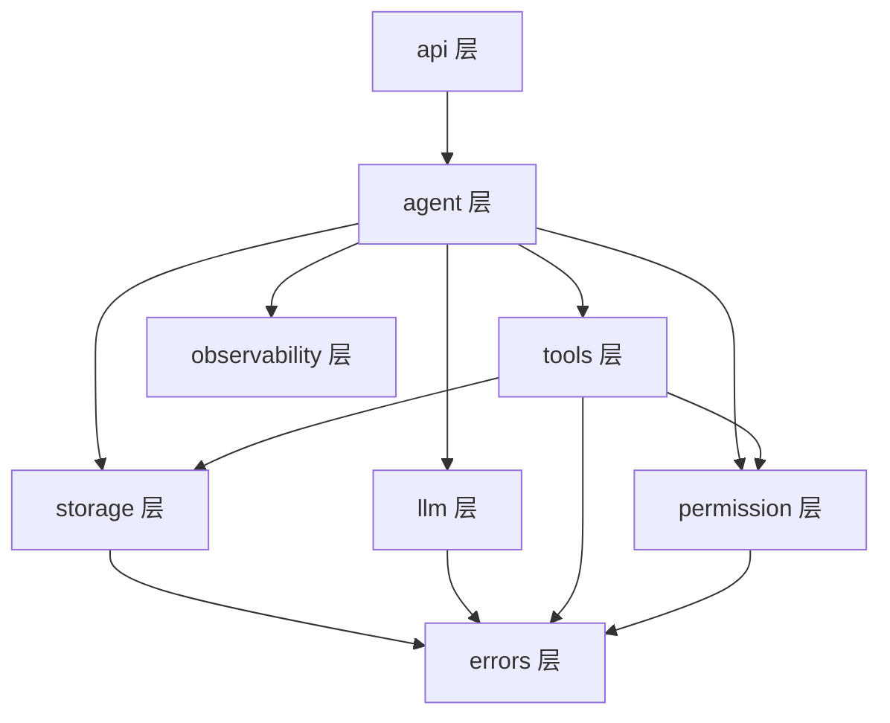

# 00 - 代码设计总览与目录结构

> 代码设计回答"具体怎么写、模块怎么分、接口长什么样"；[系统设计](../系统设计/00-首页.md)（即功能设计）已经回答了"做什么、为什么这么做"，本篇不重复论证取舍，只做工程落地。

---

## 一、文档定位

[系统设计](../系统设计/00-首页.md) 目录下的 15 篇文档是**功能设计**：定义了树形历史、Lane 分支、子 Agent、权限模型、Web UI 交互等每一处该做成什么样，以及为什么这么取舍。

本目录（**代码设计**）解决下一层问题：这些设计要落到哪些模块、哪些类、哪些方法签名、哪些接口协议里。原则是**不重复设计动机**，每一节都直接引用对应的功能设计文档编号，只补"怎么写"的部分。

阅读顺序：本文件（目录结构）→ [01-数据模型设计](01-数据模型设计.md) → [02-API设计](02-API设计.md) → [03-核心模块与类设计](03-核心模块与类设计.md)。

---

## 二、现状说明：`src/` 目前只是一个空目录模板，不是实现基础

`src/` 下目前只有 `agent/`、`context/`、`llm/`、`tools/`、`utils/` 几个空文件夹，没有任何 `.py` 实现——这是最早期随手搭的目录模板，粒度和命名都未必贴合本篇的目标设计,不代表已经有代码需要"兼容"或"迁移"。

因此，本篇给出的目录结构（第三节）和类设计（[03-核心模块与类设计](03-核心模块与类设计.md)）是**从零实现的目标结构**，不是对现有文件的重构说明。第三节里的 `storage/`、`permission/`、`errors/`、`observability/`、`api/` 等目录是按功能设计的模块边界重新划分的，与当前 `context/`、`utils/` 这两个模板目录并不是一一对应关系——实现时按第三节的结构直接新建，不需要保留 `context/`/`utils/` 这两个名字，也不需要考虑"迁移旧代码"的问题。

---

## 三、总体目录结构

```
CodeMate/
├── main.py                      # 后端入口：uvicorn 启动 FastAPI app
├── requirements.txt
├── .env.example
├── src/
│   ├── agent/
│   │   ├── agent.py              # Agent 主循环（父/子 Agent 共用）
│   │   ├── message_provider.py   # MessageProvider / TreeMessageProvider / EphemeralMessageProvider
│   │   └── state.py              # AgentState / RunContext / RunResult
│   ├── storage/
│   │   ├── session_storage.py    # SessionStorage：树形历史，JSONL 加载/写入
│   │   ├── lane_manager.py       # LaneManager：Lane 指针
│   │   └── models.py             # Entry / LanePointer 数据类
│   ├── llm/
│   │   ├── client.py             # LLMClient 统一接口 + 重试/缓存装饰
│   │   ├── providers/
│   │   │   ├── openai_provider.py
│   │   │   └── deepseek_provider.py
│   │   └── events.py             # LLMEvent / Message 数据类
│   ├── tools/
│   │   ├── base.py               # Tool 抽象基类（含 permission_level）
│   │   ├── file_tools.py         # read_file / write_file / edit_file
│   │   ├── exec_tool.py          # bash
│   │   ├── search_tools.py       # glob / grep
│   │   ├── subagent_tool.py      # delegate_task（DelegateTaskTool）
│   │   └── registry.py           # ToolRegistry
│   ├── permission/
│   │   ├── manager.py            # PermissionManager
│   │   └── rules.py              # 危险命令黑名单、路径安全检查
│   ├── errors/
│   │   └── types.py              # AgentError 体系、Result 类型
│   ├── observability/
│   │   └── logger.py             # StructuredLogger
│   ├── api/
│   │   ├── app.py                # FastAPI 实例、路由挂载
│   │   ├── routes/
│   │   │   ├── sessions.py       # /sessions 相关 REST 端点
│   │   │   └── lanes.py          # /lanes 相关 REST 端点
│   │   ├── schemas.py            # Pydantic 请求/响应模型
│   │   └── ws.py                 # WebSocket 端点与事件分发
│   └── config.py                 # AppConfig（Pydantic Settings，读 env + yaml）
├── web/                          # 前端（React + TS + React Flow），设计见 07 号文档
├── data/sessions/                 # 运行时产生的 JSONL 数据
├── logs/
├── examples/
└── tests/
```

---

## 四、模块依赖方向



**硬性约束**：箭头方向即依赖方向，不允许反向 import——`storage`/`llm`/`tools`/`permission` 互相之间以及对 `agent`/`api` 一无所知；`errors` 是最底层，被所有层依赖但不依赖任何人。这条规则保证 `MessageProvider` 抽象（见 [01](01-数据模型设计.md)）不会因为存储层偷偷 import agent 层而失效。

---

## 五、编码约定

| 事项 | 约定 | 依据 |
|---|---|---|
| 类型标注 | 所有公共方法签名必须有类型标注（含返回值），内部 dataclass 全字段标注 | 保证接口设计文档和代码同步不漂移 |
| async 使用范围 | LLM 调用、WebSocket 推送、Agent 主循环全链路 `async def`；工具执行内部若是纯 CPU/IO 阻塞操作（文件读写、`subprocess.run`）可以是同步函数，由 `ToolRegistry.execute` 用 `asyncio.to_thread` 包一层 | 避免阻塞事件循环卡住 WebSocket 推送 |
| 命名 | 模块/函数 `snake_case`，类 `PascalCase`，常量 `UPPER_SNAKE_CASE` | Python 社区惯例 |
| 错误处理 | 工具层/存储层内部用 [08-错误处理机制](../系统设计/04-支撑模块/08-错误处理机制.md) 的 `AgentError` 体系；跨层边界（API 响应）转换为统一错误 JSON（见 [02-API设计](02-API设计.md) 四节） | 复用已有设计，不重新发明错误类型 |
| 日志 | 所有关键路径调用 `StructuredLogger`，事件名遵循 [11-日志与可观测性](../系统设计/04-支撑模块/11-日志与可观测性.md) 4.1 节的事件表，不要发明新事件名前缀 | 保证日志/WebSocket/前端三处事件名字对得上 |

---

## 六、功能设计 → 代码模块映射表

| 功能设计文档 | 对应代码模块 |
|---|---|
| [02-树形对话历史系统](../系统设计/02-数据与存储层/02-树形对话历史系统.md) | `src/storage/session_storage.py`, `src/storage/models.py`（`Entry`） |
| [03-Lane分支管理系统](../系统设计/02-数据与存储层/03-Lane分支管理系统.md) | `src/storage/lane_manager.py`（`LanePointer`） |
| [12-存储层设计](../系统设计/02-数据与存储层/12-存储层设计.md) | `src/storage/session_storage.py` 的加载/写入/崩溃恢复部分 |
| [04-Agent主循环](../系统设计/03-Agent核心层/04-Agent主循环.md) | `src/agent/agent.py`, `src/agent/message_provider.py`, `src/agent/state.py` |
| [05-工具系统](../系统设计/03-Agent核心层/05-工具系统.md) | `src/tools/*` |
| [06-LLM接口层](../系统设计/03-Agent核心层/06-LLM接口层.md) | `src/llm/*` |
| [15-子Agent系统](../系统设计/03-Agent核心层/15-子Agent系统.md) | `src/tools/subagent_tool.py`（复用 `src/agent/agent.py`） |
| [08-错误处理机制](../系统设计/04-支撑模块/08-错误处理机制.md) | `src/errors/types.py` |
| [09-权限控制系统](../系统设计/04-支撑模块/09-权限控制系统.md) | `src/permission/*` |
| [10-沙箱隔离](../系统设计/04-支撑模块/10-沙箱隔离.md) | `src/tools/exec_tool.py`（进程约束）+ `src/permission/rules.py`（危险命令黑名单） |
| [11-日志与可观测性](../系统设计/04-支撑模块/11-日志与可观测性.md) | `src/observability/logger.py` |
| [07-Web-UI设计](../系统设计/05-Web-UI层/07-Web-UI设计.md) | `src/api/ws.py`（事件契约后端侧）+ `web/`（前端） |

---

**文档版本**: v0.1
**上次更新**: 2026-08-29
**关联文档**: [系统设计-00-首页](../系统设计/00-首页.md)、[01-数据模型设计](01-数据模型设计.md)、[02-API设计](02-API设计.md)、[03-核心模块与类设计](03-核心模块与类设计.md)
