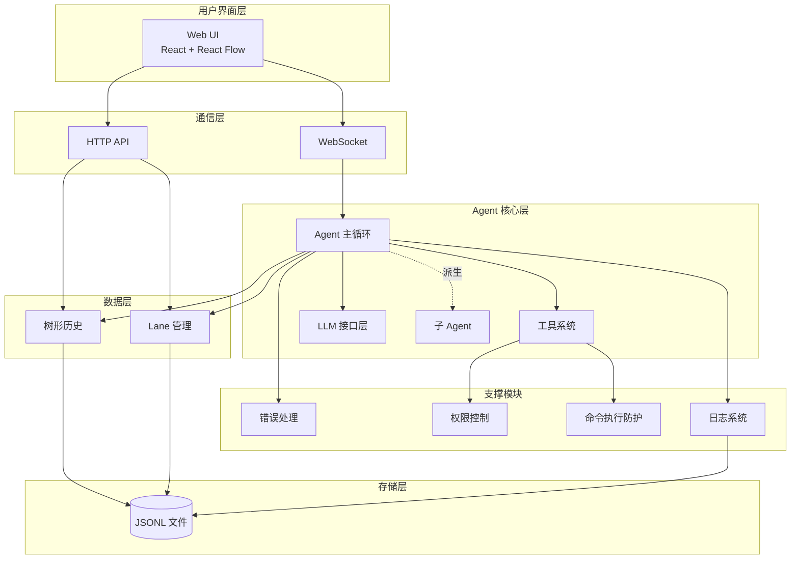

# CodeMate 系统设计文档

> 一个能自主读写文件、执行命令完成编程任务的智能体，核心亮点是像 Git 一样管理对话历史

---

## 一、项目概述

### 1.1 核心定位

CodeMate 首先是一个**编程智能体（coding agent）**：通过与大语言模型交互（tool calling），自主读写文件、编辑代码、执行命令，完成用户交给它的编程任务——定位类似简化版的 Claude Code / Codex / OpenCode。这部分能力由 Agent 主循环、工具系统、LLM 接口层三块共同支撑（详见 [04](03-Agent核心层/04-Agent主循环.md)/[05](03-Agent核心层/05-工具系统.md)/[06](03-Agent核心层/06-LLM接口层.md)），是整个项目能运转起来的地基，不是可以简化掉的配角。

在这个地基之上，CodeMate 的**差异化亮点**是**像 Git 一样管理对话历史**：传统 AI 助手的对话是线性的，走错方向后之前的尝试就丢失了。CodeMate 用树形对话历史 + Lane 分支管理，支持：

- **无损探索多个方案**：同时尝试"用缓存"和"优化算法"两种思路，互不覆盖
- **自由回溯重来**：发现走错路，直接切回分叉点
- **对比不同方案**：并排查看两个分支的差异

### 1.2 核心亮点

**自主编程能力（基础）**：Agent 主循环驱动"LLM 生成 → 工具调用 → 结果回填 → 继续或终止"的闭环；工具系统固定 6 个核心工具（`read_file`/`write_file`/`edit_file`/`bash`/`glob`/`grep`），覆盖读写文件、执行命令、代码搜索；LLM 接口层统一 OpenAI/DeepSeek 的流式 tool calling 调用。这是题目要求的硬性能力，详见 [04](03-Agent核心层/04-Agent主循环.md)/[05](03-Agent核心层/05-工具系统.md)/[06](03-Agent核心层/06-LLM接口层.md)。

**树形对话历史（差异化）**：每条消息是树中一个节点，靠 `parent` 指针连接，可以分叉、回溯。节点粒度是"一条 message"，不是"一次问答"——一次 assistant 回复并行调用多个工具时，工具结果必须打包成一条合成消息再写入树。详见 [02-树形对话历史系统](02-数据与存储层/02-树形对话历史系统.md)。

**Lane 分支管理（差异化）**：Lane 是指向树中某个叶子节点的指针，类似 Git 分支的书签隐喻。关键澄清：Lane 不携带路径信息，两个 Lane 在分叉点之前的路径是共享而非互斥的。详见 [03-Lane分支管理系统](02-数据与存储层/03-Lane分支管理系统.md)。

**强交互 Web UI**：左侧树形可视化（React Flow），右侧实时流式对话；权限确认、工具执行、子 Agent 调查都有对应的实时反馈组件。详见 [07-Web-UI设计](05-Web-UI层/07-Web-UI设计.md)。

**支撑模块**：错误处理（工具错误不中断，返回给 LLM 自我修正）、3 级权限模型（SAFE/WRITE/DANGEROUS）、命令执行防护（权限闸门 + 进程级约束，不依赖容器）、结构化日志（JSONL + WebSocket 实时推送）。

**子 Agent**：把需要多步调查才能有结论的子任务委托给独立上下文执行，只读工具集，深度限制为 1 层，只返回一段结论摘要给父 Agent。详见 [15-子Agent系统](03-Agent核心层/15-子Agent系统.md)。

---

## 二、技术架构速览

### 2.1 技术栈

**后端**：Python 3.11+、FastAPI、WebSocket、JSONL 存储

**前端**：React 18 + TypeScript、React Flow（树形可视化）、Tailwind CSS + Shadcn UI

**LLM**：OpenAI、DeepSeek（均兼容 OpenAI 协议）

**命令执行防护**：权限闸门（危险命令模式匹配 + DANGEROUS 级强制确认）+ 进程级约束（固定工作目录、超时、禁用 `shell=True`），不引入 Docker——详见 [10-沙箱隔离](04-支撑模块/10-沙箱隔离.md) 的完整论证。

### 2.2 架构分层

详细分层职责和数据流转示例见 [01-系统架构概览](01-系统架构概览.md)。

---

## 三、文档导航

### 3.1 架构设计

📖 [01 - 系统架构概览](01-系统架构概览.md) — 整体架构、模块职责边界、技术选型理由、设计决策记录

### 3.2 核心功能（差异化亮点）

🌲 [02 - 树形对话历史系统](02-数据与存储层/02-树形对话历史系统.md) — parent 指针树、节点粒度规则、内存索引查询、上下文窗口管理

🔀 [03 - Lane 分支管理系统](02-数据与存储层/03-Lane分支管理系统.md) — Lane 指针语义、创建/切换/对比、单 Lane 互斥执行模型

🎨 [07 - Web UI 设计](05-Web-UI层/07-Web-UI设计.md) — 布局与组件、树形可视化、颜色系统、WebSocket 事件契约

### 3.3 Agent 核心

🔄 [04 - Agent 主循环](03-Agent核心层/04-Agent主循环.md) — 执行流程、MessageProvider 抽象、终止条件、状态管理

🛠️ [05 - 工具系统](03-Agent核心层/05-工具系统.md) — 6 个核心工具（read_file/write_file/edit_file/bash/glob/grep）、注册机制、执行流程

🤖 [06 - LLM 接口层](03-Agent核心层/06-LLM接口层.md) — Provider 抽象（OpenAI/DeepSeek）、流式事件、重试与缓存

🧩 [15 - 子 Agent 系统](03-Agent核心层/15-子Agent系统.md) — 委托子任务、深度限制、只读工具集、双通道结果汇报

### 3.4 支撑模块

❌ [08 - 错误处理机制](04-支撑模块/08-错误处理机制.md) — Result 类型、错误分类边界、恢复策略

🔒 [09 - 权限控制系统](04-支撑模块/09-权限控制系统.md) — 3 级权限模型（SAFE/WRITE/DANGEROUS）、用户确认流程、路径与命令安全检查

🛡️ [10 - 沙箱隔离](04-支撑模块/10-沙箱隔离.md) — 权限闸门 + 进程级约束两层防线，不依赖 Docker

📊 [11 - 日志与可观测性](04-支撑模块/11-日志与可观测性.md) — 结构化日志、实时状态监控、Web UI 日志查看器

### 3.5 数据与存储

💾 [12 - 存储层设计](02-数据与存储层/12-存储层设计.md) — JSONL 存储格式、崩溃恢复、Lane 指针重放语义

### 3.6 项目管理

📋 [13 - 项目跟踪](06-项目管理/13-项目跟踪.md) — P0/P1/P2 优先级、当前进度、文档变更历史（**当前进度的唯一权威来源，本页不重复记录**）

🎯 [14 - 技术决策与取舍](06-项目管理/14-技术决策与取舍.md) — 每个简化/放弃决策的完整论证

---

## 四、快速开始

**第一次阅读**（理解核心概念）：01 → 02 → 03 → 04

**深入阅读**（准备开发）：按文档编号顺序，重点看自己负责的模块

**当前开发进度和剩余时间规划**：见 [13-项目跟踪](06-项目管理/13-项目跟踪.md)——进度和排期变化快，只在那一份文档里维护，不在首页重复。

---

## 五、设计理念

**Less is More，但不是均匀地少**：判断哪个模块该深挖、哪个该简化，标准是"是否核心差异化 / 是否题目硬性要求 / 单人时间内能否做完整"，完整框架见 [14-技术决策与取舍](06-项目管理/14-技术决策与取舍.md)。

**地基要稳，差异化要深**：Agent 主循环/工具系统/LLM 接口层是题目硬性要求的地基，必须先扎实；支撑模块（错误处理/权限/沙箱/日志）追求"闭环不遗漏边界"而非"纵深防护做到生产级"，省下的时间投入到差异化亮点——树形历史和 Lane 分支管理上。

**Web UI 是可观测性的呈现层**：强交互、强反馈体现在实时看到 Agent 在做什么，不是做一套独立的监控系统。

---

## 六、文档维护

**更新时机**：功能设计变更 → 更新对应模块文档；代码实现完成 → 在 [13-项目跟踪](06-项目管理/13-项目跟踪.md) 标记状态；遇到技术难点或范围调整 → 在对应文档末尾补充"变更说明"并更新关联文档链接。

**版本记录约定**：每份模块文档末尾维护自己的 `文档版本` / `上次更新` / `变更说明`，本页和 01 号文档只做导航和架构综述，不重复记录各模块的变更细节。

---

**文档版本**: v0.2
**上次更新**: 2026-08-29
**维护者**: 个人独立开发

