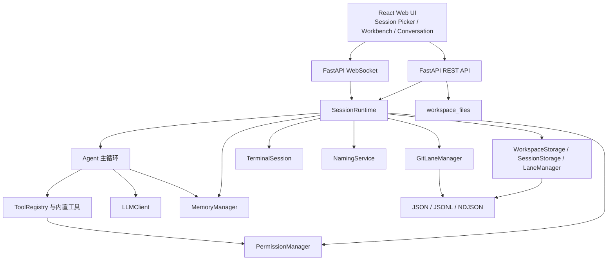

# 01 - 系统架构概览

> 当前实现基线：2026-09-02

## 一、架构目标

CodeMate 的架构围绕三个不变量展开：

1. 对话历史是以 `parent` 为唯一结构来源的树。
2. Lane 是 Session 内的活动指针；Git 可用时同时绑定代码工作目录。
3. 流式运行走 WebSocket，管理和查询走 REST；前后端都通过 Session 快照和增量事件保持一致。

## 二、分层结构

### 2.1 UI 层

前端由 React 18、TypeScript、Zustand、React Flow 和 Tailwind 组成。`App` 在没有 Session 时渲染 `SessionPicker`，有 Session 时渲染 `Workspace`。工作台采用活动栏、可调侧栏、编辑器主区、底部终端和固定对话区布局，详见 [08-VSCode 风格会话工作台](05-Web-UI层/08-VSCode风格会话工作台.md)。

### 2.2 API 与运行时层

`routes.py` 提供 Workspace、Session、文件、Lane、Git、检查点、权限和迁移接口；`ws.py` 负责 Session WebSocket 的接收循环、事件发送、Agent 运行、权限响应和终端控制。

`SessionRuntime` 是单个 Session 的装配边界，持有 SessionStorage、LaneManager、GitLaneManager、PermissionManager、MemoryManager、LLMClient、NamingService 和 Agent 运行状态。它保证同一 Session 内最多一个 Agent Run，同时允许 WebSocket 接收循环继续处理权限响应和中断消息。

### 2.3 Agent 核心层

Agent 读取当前 Lane 的上下文窗口，向 LLM 发起流式请求；若返回工具调用，就经过权限检查和工具执行，再将工具结果打包回同一棵对话树，直到模型结束、达到迭代上限或被中断。Agent 只依赖 `MessageProvider`，主 Agent 使用树形 Provider，子 Agent 使用内存 Provider。

### 2.4 存储层

WorkspaceStorage 维护 Workspace 注册表和 `SessionPaths`；SessionStorage 维护 Entry 内存索引和 JSONL；LaneManager 维护 Lane 流水和当前 Lane；GitLaneManager 维护 Lane 与 Git ref、Worktree、检查点和操作记录。存储结构详见 [01-工作区与会话管理](02-数据与存储层/01-工作区与会话管理.md) 与 [12-存储层设计](02-数据与存储层/12-存储层设计.md)。

## 三、核心边界

### 3.1 Workspace、Session、Lane

Workspace 只保存用户项目路径和 Session 归属；Session 保存对话、权限、记忆和 Lane；Lane 保存对话叶子和可选代码绑定。Session 数据目录、用户源目录、main 工作目录和其他 Lane Worktree 是不同概念。

### 3.2 对话树与 Lane

`Entry.parent` 决定路径、公共祖先和分叉关系；`Entry.lane` 只是追加时的静态标签。Lane 只有 `leaf_id` 才是路径入口，删除 Lane 不删除 Entry 树。并行工具调用的多个结果打包在一个 role=tool Entry 中，保持单 parent 结构。

### 3.3 Session 级串行执行

同一 Session 内 Agent Run 使用一把运行锁，任何时刻只有一个 Lane 执行。切换 Lane、压缩上下文、创建/删除/重命名 Lane 和代码结构操作都会检查运行状态；终端进程不等同于 Agent Run，可以独立存在，但始终绑定 Lane。

## 四、一次请求的真实路径

### 4.1 进入 Session

1. 前端从 Workspace 列表选择 Session。
2. `GET /api/sessions/{id}` 返回全量快照。
3. 前端连接 `/ws/{id}`；建连成功后再次同步快照。
4. WebSocket 事件以 `{type, data}` 信封进入 `useWebSocket`，由 Store 更新界面。

### 4.2 发送 Agent 消息

1. 前端插入临时用户气泡并发送 `send_message`。
2. WebSocket 接收循环调用 `SessionRuntime.run()`。
3. Runtime 按当前 Lane 解析实际工作目录，构建 Agent、工具注册表、权限门禁和上下文 Provider。
4. Agent 发出运行、上下文、消息、工具和状态事件；Runtime 负责附加 Session/Lane 元数据并转发。
5. 工具结果写入树，Lane 指针推进；文件变更形成独立审查元数据。
6. Run 完成后按 Git 检查点策略记录代码状态；若是无标题 Session，再异步生成标题。

### 4.3 切换或创建 Lane

切换 Lane 时，Runtime 更新当前 Lane、PermissionManager 的工作目录和前端快照；Git 启用时确保目标 Lane 的托管 Worktree 可用。创建 Lane 时可以先保存当前代码状态，再从指定 Entry 和代码基线创建新指针；Lane 名称建议通过无工具 NamingService 生成，最终仍由后端校验 slug。

## 五、失败与恢复

- JSONL 加载跳过损坏行并记录日志；Lane 流水必须重放全部记录，不能只取物理最后一行。
- Session 删除写入 Journal，Git 清理完成后才删除 Session 目录；启动时继续处理可恢复 Journal。
- 文件保存使用版本摘要，外部修改返回 409，不静默覆盖。
- WebSocket 断开时前端每 3 秒重连，后端取消无法继续的权限等待和终端资源。
- 工具失败转为 tool result 交还 LLM；AgentError 转为结构化 `run_error` 或统一错误响应。
- Git 不可用时保留对话 Lane，代码隔离、检查点、发布和代码对比返回明确降级原因。

## 六、模块职责

| 模块 | 负责 | 不负责 |
|---|---|---|
| `WorkspaceStorage` | Workspace 注册、Session 路径、迁移、删除 Journal | Agent 执行、Git 业务 |
| `SessionStorage` | Entry 持久化、父子索引、上下文窗口 | Lane 工作目录、权限 |
| `LaneManager` | Lane 指针、命名元数据、当前 Lane、对话对比 | 文件内容和 Git commit |
| `GitLaneManager` | ref、Worktree、状态、检查点、发布、集成 | 对话路径判断 |
| `SessionRuntime` | 运行时装配、生命周期协调、事件元数据 | UI 布局 |
| `Agent` | LLM↔工具循环和终止条件 | REST 路由、文件浏览器 |
| `PermissionManager` | 工具/命令风险判定、黑名单、审计、等待用户 | 执行命令本身 |
| `WorkbenchPanels` | 文件、搜索、Git、终端的用户交互 | 绕过后端安全校验 |

## 七、当前范围取舍

当前实现优先完成本地单用户工作流，不实现远程协作、远程 Git 推送、完整 IDE 语言服务、复杂 Git 历史改写、Docker 容器和独立日志查询 UI。未来新增能力必须保持上述层级与通信边界，不把临时 UI 状态写成 Session 事实数据。
