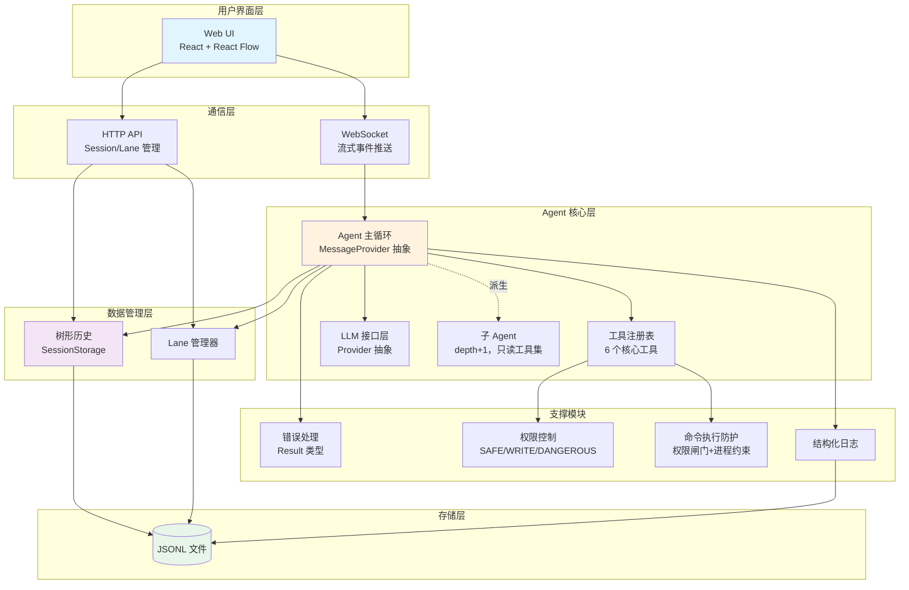
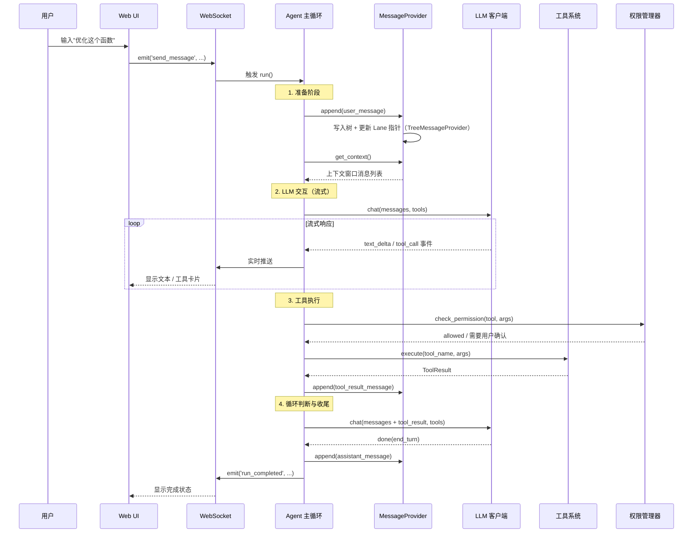
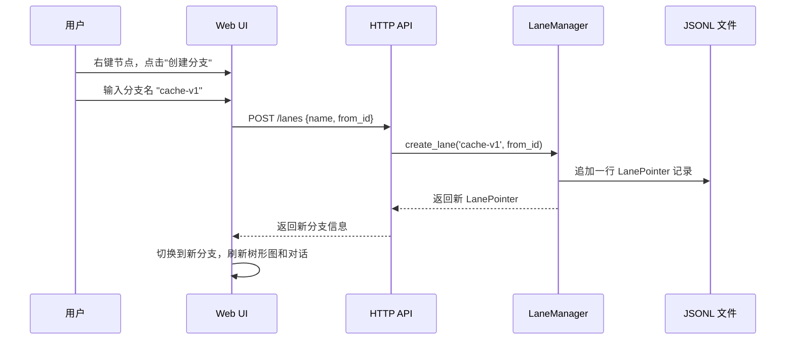

# 01 - 系统架构概览

> 整体架构设计与核心设计理念

---

## 一、设计目标

架构服务于三个目标，优先级从高到低：

1. **树形历史 + Lane 分支管理打磨到极致**——这是差异化亮点，其余模块的复杂度都要给它让路。
2. **Web UI 强交互、强可观测、强反馈**——树形结构不可视化就没有价值，UI 是评委看到的第一层。
3. **支撑模块做到"闭环但不过度设计"**——错误处理、权限控制、日志、沙箱防护每一项都要有，但只做单人 demo 场景真正需要的深度，不做团队级产品才需要的规模。

具体每一项做/不做/简化到什么程度，取舍论证在 [14-技术决策与取舍](06-项目管理/14-技术决策与取舍.md)，本文档只讲架构怎么落地。

---

## 二、整体架构

### 2.1 分层架构图

**和旧版本的关键差异**：沙箱不再是独立的"Docker 容器"模块，而是工具系统内部的"权限闸门 + 进程约束"两层防线（详见 [10-沙箱隔离](04-支撑模块/10-沙箱隔离.md)）；Agent 核心层新增子 Agent 分支，和主循环共享同一套实现，只是消息来源和工具集不同（详见第五节）。

### 2.2 各层职责

| 层次 | 职责 | 不负责 |
|---|---|---|
| 用户界面层 | 渲染树形图、对话面板、权限确认弹窗、日志面板 | 不直接调用 Agent，只通过 WS/API |
| 通信层 | WebSocket 推送流式事件；HTTP API 做 Session/Lane 的增删查 | 不包含业务逻辑 |
| Agent 核心层 | 驱动 LLM↔工具循环，管理终止条件 | 不关心存储细节、不关心 LLM Provider 差异 |
| 支撑模块 | 错误分类、权限分级、命令执行防护、结构化日志 | 不参与树形结构的正确性 |
| 数据管理层 | 维护 parent 指针树、Lane 指针 | 不关心谁在读写它（Agent 还是 API 都一样调用） |
| 存储层 | JSONL 追加写入 | 不提供索引，索引在内存里 |

---

## 三、核心设计理念

### 3.1 Less is More，但不是"越少越好"

不是所有模块都同等简化。判断标准见 [14-技术决策与取舍](06-项目管理/14-技术决策与取舍.md) 的三问框架：是否题目要求、是否行业共识、单人时间内能否做完整。落到架构上：

- 工具系统：固定 6 个核心工具（`read_file`/`write_file`/`edit_file`/`bash`/`glob`/`grep`），不做插件化、不接 MCP。
- LLM 接口层：Provider 抽象只接 OpenAI 和 DeepSeek 两家（都兼容 OpenAI 协议），不追求"支持所有模型"。
- 只做 Web UI，不做 CLI/TUI——树形图必须可视化，两套前端是单人时间下负担不起的重复投入。

### 3.2 抽象要在第一版代码就落地，不能事后补

整个架构里唯一"事前设计成本高、事后重构成本更高"的点是 [04-Agent主循环](03-Agent核心层/04-Agent主循环.md) 4.0 节的 `MessageProvider` 接口：主循环读写上下文只能通过这个抽象接口，不能直接写死调用 `SessionStorage`。这是子 Agent（[15-子Agent系统](03-Agent核心层/15-子Agent系统.md)）能够复用同一套主循环、而不用另写一套执行引擎的前提。这个决策必须在写主循环第一行代码时就定下来。

### 3.3 树形历史是核心，Lane 只是指针不是权威数据

必须遵守的两条边界（详见 [02](02-数据与存储层/02-树形对话历史系统.md)/[03](02-数据与存储层/03-Lane分支管理系统.md)）：

- **节点粒度是一条 message，不是一次问答**。一次 assistant 回复并行调用多个工具时，所有工具结果必须打包成一条合成消息再写入树，不能各自单独 append——否则会破坏"单 parent"的树定义。
- **Lane 不携带路径信息，只是指向叶子节点的指针**。两个 Lane 在分叉点之前的路径是共享的，不是互斥的；`Entry.lane` 字段只是创建时的静态标签，不能用来做路径判断。

### 3.4 支撑模块：闭环优先于纵深

四个支撑模块（错误处理/权限控制/沙箱防护/日志）共享一个取舍原则：**先保证每种情况都有明确的处理路径（不遗漏边界），再考虑要不要加深某一层的防护强度**。

例如沙箱防护没有做成 Docker 容器，而是"权限闸门（危险命令模式匹配 + DANGEROUS 级强制确认）+ 进程级约束（固定 cwd、超时、禁 shell=True）"两层——因为威胁模型是"自己的 Agent 偶尔判断失误"，不是"防护不可信第三方代码"，两层轻量防线已经闭环覆盖真实威胁，容器化是在一个发生概率低的场景上堆深度。详见 [10-沙箱隔离](04-支撑模块/10-沙箱隔离.md)。

### 3.5 Web UI 是可观测性的呈现层，不是独立的监控系统

日志系统只做 JSONL 落盘 + WebSocket 实时推送，不做类似 Grafana 的指标聚合/告警面板——UI 的"强可观测"体现在实时看到 Agent 在想什么、做什么，不是事后查询分析。详见 [07-Web-UI设计](05-Web-UI层/07-Web-UI设计.md)、[11-日志与可观测性](04-支撑模块/11-日志与可观测性.md)。

---

## 四、数据流转示例

### 4.1 用户发送消息的完整流程

**关键点**：准备阶段和收尾阶段都通过 `MessageProvider` 而不是直接调 `SessionStorage`——这一点在父 Agent 场景下看不出差异（`TreeMessageProvider` 内部确实在写树），但正是这层抽象让子 Agent 能换成 `EphemeralMessageProvider` 复用同一套循环代码。

### 4.2 创建分支的流程

---

## 五、子 Agent 如何嵌入这套架构

子 Agent（详见 [15-子Agent系统](03-Agent核心层/15-子Agent系统.md)）不是独立子系统，而是 Agent 核心层内部的一条分支路径：

- 复用同一套主循环实现，构造参数换成 `EphemeralMessageProvider`（纯内存消息列表，不落 JSONL、不碰 Lane 指针）和只读工具集（`read_file`/`glob`/`grep`）。
- `depth` 显式传参，`depth+1` 后硬限制不能再派生下一层，避免递归失控。
- 结束时只把一条打包好的结果消息（`report_result` 工具调用产出）交还父循环，父循环把它 append 成父树上的一个普通节点——子 Agent 内部走了多少轮，对父树完全不可见。

这也是为什么第三节 3.2 把 `MessageProvider` 抽象列为架构里唯一"必须提前做"的设计点：没有这层抽象，子 Agent 就要另写一套执行引擎。

---

## 六、模块职责边界

**树形历史（SessionStorage）**：维护 parent 指针树，提供 `get_history_path`/`find_common_ancestor`/`get_context_window`。所有查询走内存索引（`entries`/`children_index`/`lane_index`），绝不对 JSONL 线性扫描。不关心分支语义、不关心工具执行、不关心权限。

**Lane 管理器（LaneManager）**：维护分支指针（`leaf_id`），提供创建/切换/对比。不存储消息内容，不携带路径信息。执行模型上简化为"任意时刻只有一个 Lane 在跑"，不做完整的多 Lane 并发状态机。

**Agent 主循环**：驱动 LLM↔工具循环，通过 `MessageProvider` 读写上下文，不直接依赖存储实现。判断终止条件（`end_turn`/无工具调用/达到最大迭代）。

**工具系统**：注册表模式管理 6 个核心工具，参数校验、权限检查前置、结果统一格式化。命令执行的进程级约束是工具实现内部细节，不是独立模块。

**LLM 接口层**：统一 `chat()` 流式接口，屏蔽 OpenAI/DeepSeek 的 API 差异，处理重试和流式缓冲。

**支撑模块**（错误处理/权限控制/日志）：各自独立，通过 Agent 主循环协调调用，互不直接依赖。

---

## 七、技术选型理由

| 决策点 | 选择 | 理由 |
|---|---|---|
| 后端语言 | Python 3.11+ | AI/ML 生态成熟（OpenAI SDK、tiktoken），asyncio 原生支持流式和并发 |
| Web 框架 | FastAPI | 异步支持、WebSocket 集成、自动生成 API 文档 |
| 存储格式 | JSONL | 追加友好、崩溃恢复好、可读可演示；查询模式简单（只是遍历+索引），不需要 SQL 的灵活性。详见 [12-存储层设计](02-数据与存储层/12-存储层设计.md) |
| 树形可视化 | React Flow | 拖拽/缩放开箱即用，6 天时间内优先功能完整性而非极致定制（备选 D3.js 学习曲线更陡） |
| 命令执行防护 | 权限闸门 + 进程约束，不用 Docker | 威胁模型是"自己判断失误"而非"防护不可信代码"；Windows 环境引入 Docker Desktop/WSL2 依赖对演示反而是新风险点。详见 [10-沙箱隔离](04-支撑模块/10-沙箱隔离.md) |
| LLM Provider | OpenAI + DeepSeek | 都兼容 OpenAI 协议，验证 Provider 抽象合理即可，不追求覆盖所有模型 |
| 前端只做 Web，不做 CLI | — | 树形图必须图形化才有价值，单人时间下两套前端做不完 |

---

## 八、设计决策记录

### 决策 1：树形结构而非线性历史
线性历史无法支持"无损探索多方案"，parent 指针实现代价可控，是本项目的差异化定位。详见 [02-树形对话历史系统](02-数据与存储层/02-树形对话历史系统.md)。

### 决策 2：Web UI 优先于 CLI
树形图必须用图形界面才能体现价值；集中资源做好一个胜过两个都做一半。

### 决策 3：沙箱不做容器化，只做权限闸门 + 进程约束
详见第三节 3.4 和 [10-沙箱隔离](04-支撑模块/10-沙箱隔离.md) 的完整论证——这是主动放弃，不是能力不足。

### 决策 4：主循环通过 MessageProvider 抽象解耦存储
详见第三节 3.2。这是唯一要求"第一版代码就落地"的架构决策，事后补代价是重构所有主循环里的存储调用点。

其余决策（Lane 简化为单操作、权限固定 3 级不做规则引擎、不做 RAG/MCP/插件化等）的完整论证见 [14-技术决策与取舍](06-项目管理/14-技术决策与取舍.md)，不在此重复。

---

## 九、风险与应对

| 风险 | 等级 | 应对 |
|---|---|---|
| React Flow 学习成本 | 中 | 提前学习官方示例；最坏情况简化树形图交互深度，不砍掉树形图本身 |
| 时间不足（详见 [13-项目跟踪](06-项目管理/13-项目跟踪.md) 的进度记录） | 中高 | 严格按 P0/P1/P2 顺序开发，砍功能顺序见 [14-技术决策与取舍](06-项目管理/14-技术决策与取舍.md) 第六节 |
| 命令执行防护的边界情况遗漏 | 低 | 危险命令黑名单 + DANGEROUS 强制确认是纵深防线的第一层，不依赖单一检测点 |

---

**文档版本**: v0.2
**上次更新**: 2026-08-29
**变更说明**: 全文重写，同步 02/03/04/05/06/07/08/09/10/11/12/14/15 号文档的最终决策——移除已放弃的 Docker 沙箱方案，改为权限闸门+进程约束；补充 MessageProvider 抽象、子Agent嵌入方式、Lane 指针语义澄清等后续增补的设计要点；风险与决策记录对齐当前文档状态。
