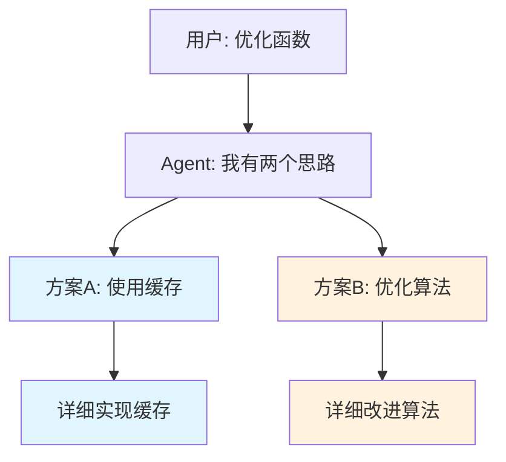
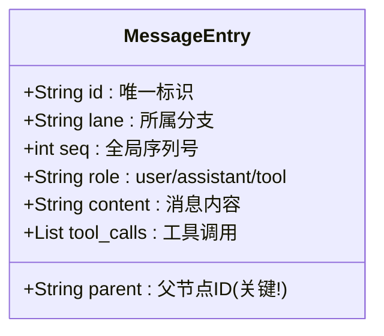
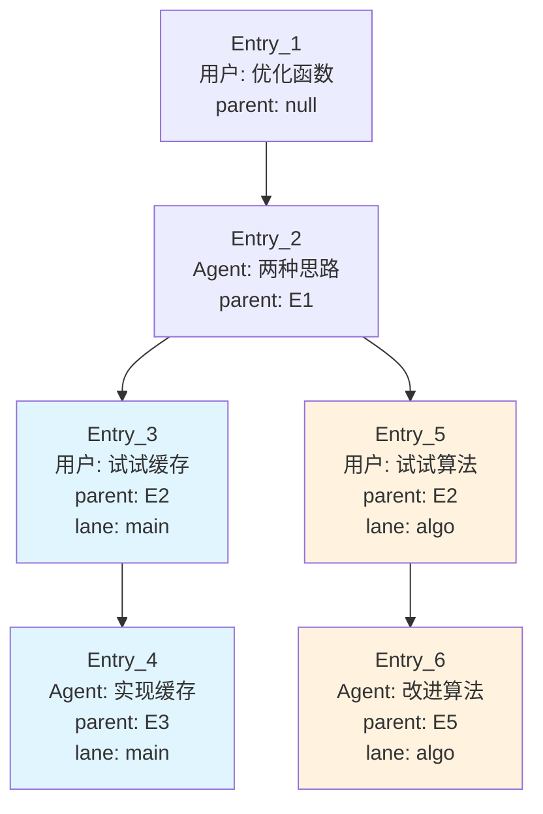
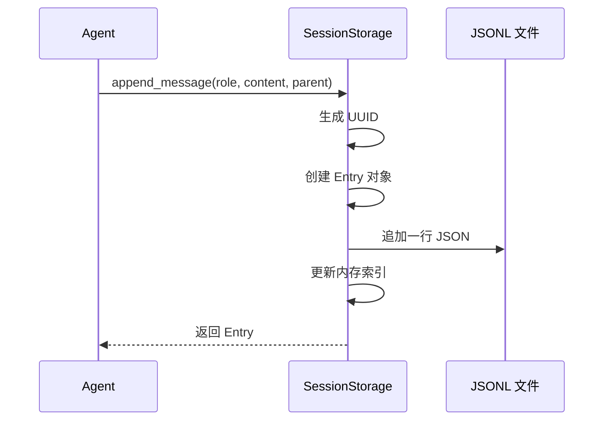
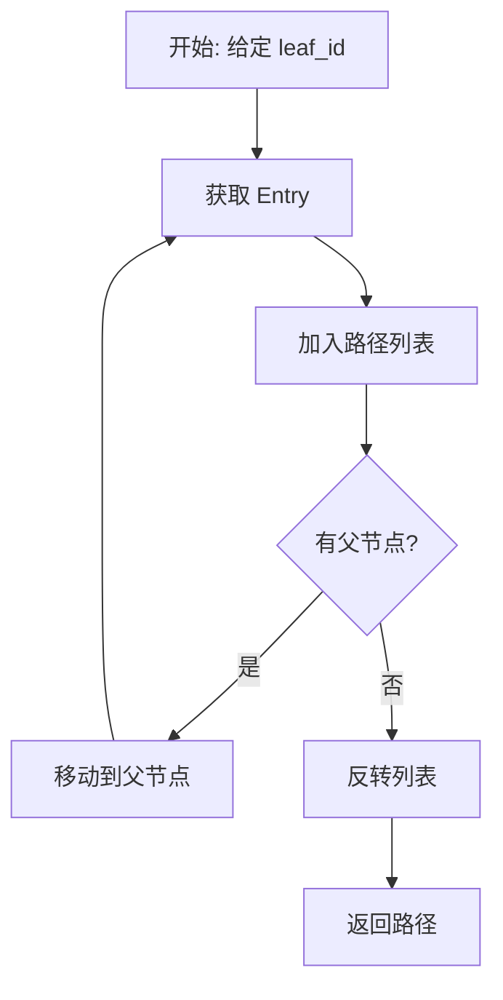
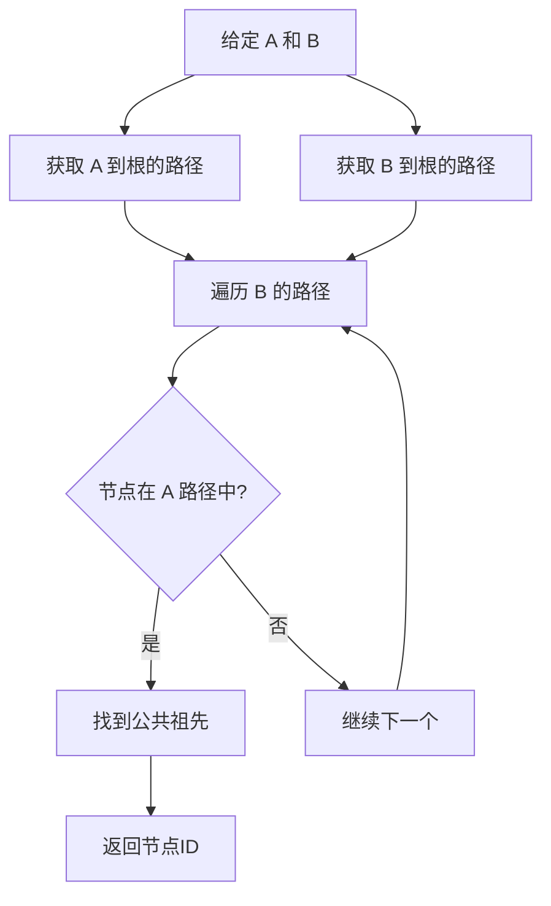
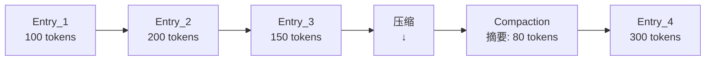
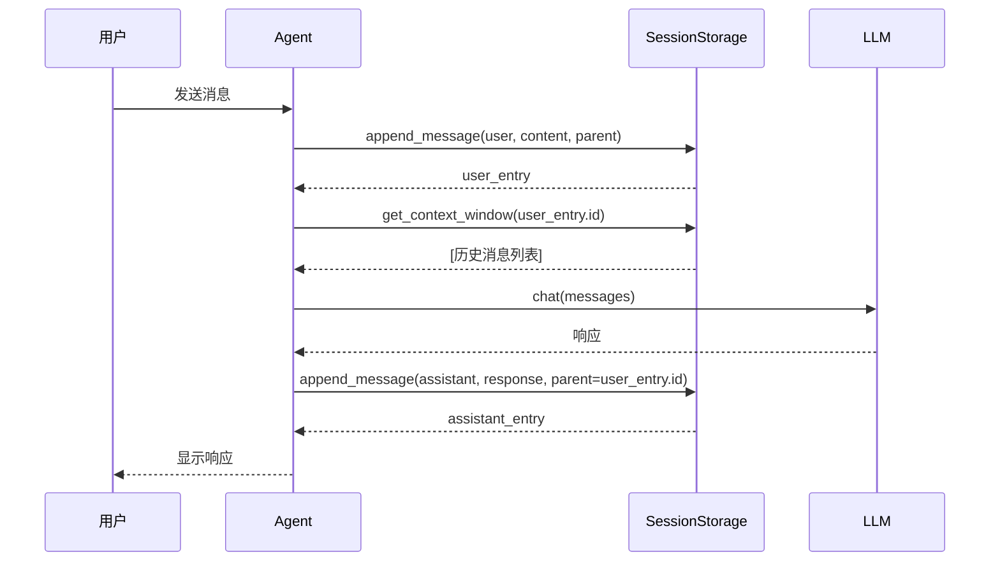
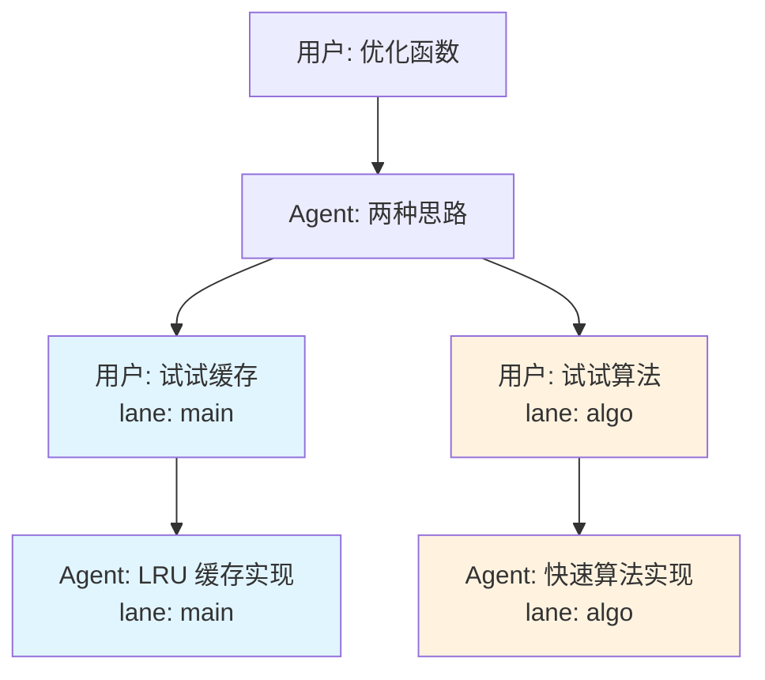

# 02 - 树形对话历史系统

> 当前实现基线：2026-09-02

> 核心亮点：像 Git 一样管理对话，支持分支和回溯

---

## 一、为什么需要树形历史？

### 1.1 传统线性对话的问题

传统 AI 助手的对话像一条链表，只能往前走：

```
用户: 优化这个函数
Agent: 建议用缓存
用户: 效果不好，换个方案
Agent: 那试试算法优化
→ 问题：缓存方案的历史被覆盖了，无法回去对比
```

**痛点**：
- 走错路后，之前的尝试丢失
- 无法对比多个方案
- 探索过程不可追溯

### 1.2 树形对话的优势

树形历史像 Git 提交树，可以分叉、回溯、对比：



**优势**：
- ✅ 无损探索：两个方案都保留
- ✅ 自由回溯：回到任意分叉点
- ✅ 清晰对比：并排查看不同方案

---

## 二、核心概念

### 2.1 Entry（历史条目）

每条消息是树中的一个节点，包含：



**关键字段说明**：

| 字段 | 作用 | 示例 |
|------|------|------|
| `id` | 唯一标识这条消息 | `"msg_abc123"` |
| `parent` | **指向父节点，形成树** | `"msg_def456"` |
| `lane` | 属于哪个分支 | `"main"` 或 `"algo-v1"` |
| `seq` | 全局递增序号（用于排序） | `1, 2, 3, ...` |
| `role` | 消息来源 | `user`, `assistant`, `tool` |

**为什么 parent 指针是关键？**

parent 指针让每个节点知道"我从哪来"，自然形成树形结构：

```
Entry_1: parent = None        (根节点)
Entry_2: parent = Entry_1     (Entry_1 的子节点)
Entry_3: parent = Entry_2     (Entry_2 的子节点)
Entry_4: parent = Entry_2     (也是 Entry_2 的子节点，形成分叉！)
```

### 2.2 节点粒度：一条 message，不是一次问答

节点不是"一次问答"，也不是"一次工具调用"单独成节点，准确的粒度是：**LLM API 的 `messages` 数组里的一条 message**。

这里有一个必须遵守的规则，否则会破坏树的单父节点结构：**一次 assistant 回复如果并行调用了多个工具，这些工具的执行结果必须打包成一条合成消息再写入树，不能各自单独 append 成多个节点**。

原因：如果 3 个并行 `tool_use` 的结果各自单独 append，父节点 A 会长出 3 个子节点，而下一条 assistant 消息又需要同时依赖这 3 个结果——要么它有 3 个 parent（打破"单 parent"的树定义），要么只能挂在其中一个下面（丢失另外两个的因果关系）。两种结果都是错的。

正确的写入节奏：

```
user: "优化这两个函数"
  ↓
assistant: [text] + [tool_use: read(a.py)] + [tool_use: read(b.py)]   ← 1 个节点
  ↓
tool: [tool_result: a.py 内容] + [tool_result: b.py 内容]  ← 打包成 1 个 role=tool Entry
  ↓
assistant: "看完了，建议..."   ← 1 个节点
```

**实现要求**：工具执行层要等一次 assistant 回复里的所有并行 `tool_use` 全部执行完，再把结果打包成一条消息传给 `SessionStorage.append_message`，不能在工具执行完成的时刻就立即各自 append。这条规则对子 Agent 并发执行同样适用（多个子任务的结果要等全部完成后打包成一条消息，见 [15-子Agent系统](../03-Agent核心层/15-子Agent系统.md) 第七节）。

一次完整问答（用户提问到最终回复）通常对应树上的**一条链**，链上有好几个节点（user → assistant(带tool_use) → tool(带tool_result) → assistant(最终文本)），不是一个节点。

### 2.3 树形结构示例

**场景**：用户尝试两种优化方案



**数据结构**：

```python
# 简化的数据结构示例
{
    "id": "E2",
    "parent": "E1",           # 指向父节点
    "lane": "main",
    "role": "assistant",
    "content": "我想到两个思路..."
}

{
    "id": "E5",
    "parent": "E2",           # 同样指向 E2，形成分叉
    "lane": "algo",
    "role": "user",
    "content": "试试算法优化"
}
```

---

## 三、核心操作

### 3.1 追加消息（Append）

**流程**：



**关键点**：
1. 每条消息生成唯一 ID
2. 指定 parent 形成树形关系
3. 追加到 JSONL 文件（不会覆盖旧数据）
4. 同时更新内存索引（加速查询）

**分叉的触发条件：本质上只有一条规则**

产品层面看到的"创建分支""重新生成""编辑重发"等操作，底层机制是同一件事：`append_message` 时指定的 `parent`，如果不是"当前该 Lane 最新的叶子"，分叉就自然发生了。不需要为这几种操作分别写判断逻辑——它们都是同一个 `append_message` 函数在不同调用场景下的结果：

| 产品场景 | parent 怎么指定 |
|---|---|
| 显式创建分支 | 用户指定某个历史节点 |
| 重新生成回复 | parent 还是原来那条 user 消息，新长出一个兄弟节点 |
| 编辑历史消息后重发 | 新消息和原消息共享同一个 parent |
| 切到旧叶子后继续对话 | parent 是一个已经长过子节点的历史叶子 |

分叉带来的好处：无损探索（换方案不覆盖旧尝试）、可对比（并排看不同方案）、可回溯（不需要"撤销"操作，撤销在树结构里不存在，只是"切换到更早的叶子"）。

**代码示例**：

```python
# 用户消息
entry1 = storage.append_message(
    role='user',
    content='优化这个函数',
    lane='main',
    parent=None  # 根节点
)

# Agent 响应
entry2 = storage.append_message(
    role='assistant',
    content='我建议使用缓存',
    lane='main',
    parent=entry1.id  # 指向用户消息
)

# 创建分支：回到 entry1，尝试另一个方案
entry3 = storage.append_message(
    role='user',
    content='试试算法优化',
    lane='algo',
    parent=entry1.id  # 同样指向 entry1，形成分叉
)
```

### 3.2 查询历史路径（Get History Path）

**目标**：从某个节点回溯到根节点，获取完整对话历史。

**算法**：



**伪代码**：

```python
def get_history_path(leaf_id):
    path = []
    current = leaf_id
    
    # 向上追溯，直到根节点（parent = None）
    while current:
        entry = get_entry(current)
        path.append(entry)
        current = entry.parent
    
    # 反转，使其从根到叶
    return reversed(path)
```

**示例**：

```
给定 Entry_4，追溯路径：
Entry_4 (parent=E3) → Entry_3 (parent=E2) → Entry_2 (parent=E1) → Entry_1 (parent=None)

结果路径：[Entry_1, Entry_2, Entry_3, Entry_4]
```

### 3.3 查找公共祖先（Find Common Ancestor）

**目标**：找到两个分支的分叉点。

**用途**：
- 分支对比：知道从哪里开始不同
- 合并分支：找到共同基础

**算法**：



**图解**：

```
        Entry_1 (根)
            │
        Entry_2
        ┌───┴───┐
    Entry_3   Entry_5
        │         │
    Entry_4   Entry_6

查找 Entry_4 和 Entry_6 的公共祖先：
- Entry_4 路径：[E1, E2, E3, E4]
- Entry_6 路径：[E1, E2, E5, E6]
- 公共祖先：Entry_2 (最后一个共同节点)
```

### 3.4 获取子节点（Get Children）

**目标**：找到某个节点的所有子节点（可能有多个，代表分叉）。

**实现**：遍历所有 Entry，找 parent 等于目标 ID 的。

```python
def get_children(parent_id):
    return [entry for entry in all_entries if entry.parent == parent_id]
```

**优化**：用索引加速

```python
# 构建父子索引（加载时）
children_index = {
    "E1": ["E2"],
    "E2": ["E3", "E5"],  # E2 有两个子节点
    "E3": ["E4"],
    "E5": ["E6"]
}

# O(1) 查询
def get_children(parent_id):
    return children_index.get(parent_id, [])
```

---

## 四、上下文窗口管理

### 4.1 为什么需要上下文窗口？

LLM 有 Token 限制（如 GPT-4 是 8k），不能把所有历史都传给它。

**策略**：从当前节点向上追溯，直到 Token 数达到限制。

### 4.2 算法流程

```mermaid
flowchart TD
    Start[开始: leaf_id, max_tokens] --> Init[初始化: path=[], tokens=0]
    Init --> GetEntry[获取当前 Entry]
    GetEntry --> EstTokens[估算 Entry 的 Token 数]
    EstTokens --> Check{tokens + entry_tokens > max?}
    Check -->|是| Stop[停止加载]
    Check -->|否| Add[加入 path]
    Add --> UpdateTokens[更新 tokens 计数]
    UpdateTokens --> HasParent{有父节点?}
    HasParent -->|是| MoveUp[移动到父节点]
    MoveUp --> GetEntry
    HasParent -->|否| Reverse[反转 path]
    Stop --> Reverse
    Reverse --> Return[返回上下文窗口]
```

**Token 估算**：

简化方法：
```python
token_count ≈ len(content) / 4  # 1 Token 约 4 个字符
```

精确方法：
```python
import tiktoken
encoder = tiktoken.encoding_for_model("gpt-4")
token_count = len(encoder.encode(content))
```

### 4.3 示例

```
历史：Entry_1 → Entry_2 → Entry_3 → Entry_4 → Entry_5
Token: 100      200      150      300      250

max_tokens = 600

从 Entry_5 向上加载：
- Entry_5: 250 tokens (累计 250)
- Entry_4: 300 tokens (累计 550)
- Entry_3: 150 tokens (累计 700) → 超出限制！

最终窗口：[Entry_4, Entry_5]
```

### 4.4 压缩策略（可选）

当历史过长时，可以压缩旧消息：



**压缩方法**：
1. 选择压缩范围（如 Entry_1 到 Entry_3）
2. 调用 LLM 生成摘要
3. 创建 CompactionEntry，替代原始消息
4. 后续加载时用摘要代替

---

## 五、存储格式：JSONL

### 5.1 为什么选择 JSONL？

**JSONL** = JSON Lines，一行一条 JSON 记录。

**优势**：
- ✅ **追加友好**：新消息直接 append，不需要重写整个文件
- ✅ **崩溃恢复**：部分写入不会损坏已有数据
- ✅ **易于调试**：文本格式，直接打开查看
- ✅ **演示友好**：可以在视频中展示文件内容

**对比其他方案**：

| 方案 | 优势 | 劣势 |
|------|------|------|
| **JSONL** | 简单、追加友好、易读 | 查询慢（需遍历） |
| **SQLite** | 查询快、事务支持 | 复杂、难以演示 |
| **JSON** | 易读 | 追加需重写整个文件 |

### 5.2 文件结构

**新文件路径**：`data/workspaces/{workspace_id}/sessions/{session_id}/conversation/entries.jsonl`。

旧版本的 `data/sessions/{session_id}.jsonl` 只由显式迁移器读取。

**示例内容**：

```jsonl
{"id":"e1","parent":null,"lane":"main","seq":1,"role":"user","content":"优化函数"}
{"id":"e2","parent":"e1","lane":"main","seq":2,"role":"assistant","content":"建议缓存"}
{"id":"e3","parent":"e2","lane":"main","seq":3,"role":"user","content":"实现一下"}
{"id":"e4","parent":"e2","lane":"algo","seq":4,"role":"user","content":"换个方案"}
```

**每行是一个完整的 Entry**，包含所有字段。

### 5.3 加载策略

**方案 1：全量加载**（默认）

```python
# 启动时一次性加载所有 Entry 到内存
entries = {}
with open(file_path, 'r') as f:
    for line in f:
        entry = json.loads(line)
        entries[entry['id']] = entry
```

**优势**：查询快（O(1)）  
**劣势**：内存占用（但单个 Session 通常不大）

**方案 2：延迟加载**（可选）

按需从文件加载 Entry，适合超大历史。

---

## 六、性能优化

### 6.1 内存索引

为了加速查询，构建多个索引：

```python
# ID → Entry
entries = {"e1": Entry(...), "e2": Entry(...)}

# Parent → Children (父子关系)
children_index = {"e1": ["e2"], "e2": ["e3", "e4"]}

# Lane → Entries (分支索引)
lane_index = {"main": ["e1", "e2", "e3"], "algo": ["e4"]}
```

**查询时间复杂度**：
- `get_entry(id)`: O(1)
- `get_children(id)`: O(1)
- `get_lane_entries(lane)`: O(1)

> ⚠️ **实现约束**：JSONL 是 append-only 的，本身没有索引，`find_common_ancestor`、`get_history_path` 等所有树查询**必须**只走上面这套内存索引，绝不能对 JSONL 文件做线性扫描。这个约束要在 `SessionStorage` 设计第一天就落地——启动时一次性把整个 session 读进内存建好 `entries`/`children_index`/`lane_index`，之后所有查询都不再碰文件，文件只在追加新消息时被写入。比赛场景数据量小，即使偷懒线性扫描也能跑，但这是一个明显的设计缺陷，面试被问"树查询的时间复杂度"会站不住脚。

> ⚠️ **并发写入约束**：多个 Lane 如果真的支持并发生成，多个 asyncio 任务同时向同一个 JSONL 文件 append 会有交错写入风险。本项目主动简化为"任意时刻只有一个 Lane 在跑"，用一个全局锁/信号量序列化写操作，不实现完整的多 Lane 并发状态机，详见 [03-Lane分支管理系统](03-Lane分支管理系统.md) 7.3 节。

### 6.2 文件追加优化

使用追加模式，避免重写整个文件：

```python
# 追加新 Entry
with open(file_path, 'a') as f:
    f.write(json.dumps(entry) + '\n')
```

**优势**：
- 写入快（直接追加）
- 崩溃安全（已写入的不会丢失）

---

## 七、与 Agent 集成

### 7.1 Agent 如何使用树形历史



**关键点**：
1. 每次用户输入，追加一个 user Entry
2. 从树中加载上下文窗口
3. 调用 LLM 生成响应
4. 追加 assistant Entry
5. 所有 Entry 通过 parent 指针连接

### 7.2 切换分支时的处理

```python
# 当前在 main 分支的 Entry_4
current_leaf = "e4"

# 切换到 algo 分支的 Entry_6
new_leaf = "e6"

# 加载新分支的历史
history = storage.get_history_path(new_leaf)
# 结果：[Entry_1, Entry_2, Entry_5, Entry_6]

# 继续对话时，parent 指向 new_leaf
next_entry = storage.append_message(
    role='user',
    content='继续优化',
    lane='algo',
    parent=new_leaf  # 接在 Entry_6 后面
)
```

---

## 八、实际案例

### 案例：探索两种代码优化方案

**场景**：用户要优化一个函数，Agent 建议两种方案。

**流程**：

1. **用户提问**
```python
e1 = storage.append_message('user', '优化 compute() 函数', 'main', None)
```

2. **Agent 建议两种方案**
```python
e2 = storage.append_message(
    'assistant',
    '我有两个思路：\n1. 使用缓存\n2. 改进算法',
    'main',
    e1.id
)
```

3. **用户选择方案A（缓存）**
```python
e3 = storage.append_message('user', '试试缓存', 'main', e2.id)
e4 = storage.append_message('assistant', '实现了 LRU 缓存...', 'main', e3.id)
```

4. **用户回溯，尝试方案B（算法）**
```python
# 创建新分支，parent 指向 e2（分叉点）
e5 = storage.append_message('user', '试试算法优化', 'algo', e2.id)
e6 = storage.append_message('assistant', '改用快速算法...', 'algo', e5.id)
```

5. **对比两个方案**
```python
# 找到分叉点
ancestor = storage.find_common_ancestor(e4.id, e6.id)  # 返回 e2

# 获取两条分支的路径
path_cache = storage.get_history_path(e4.id)  # [e1, e2, e3, e4]
path_algo = storage.get_history_path(e6.id)   # [e1, e2, e5, e6]

# 展示给用户对比
```

**树形结构**：



---

## 九、总结

### 核心要点

1. **parent 指针是关键**：每个 Entry 知道"我从哪来"，自然形成树
2. **JSONL 追加友好**：新消息直接 append，不覆盖旧数据
3. **内存索引加速查询**：ID/Parent/Lane 索引，O(1) 查询
4. **上下文窗口管理**：从叶节点向上追溯，控制 Token 数
5. **与 Agent 无缝集成**：每次对话追加 Entry，通过 parent 连接

### 为什么这个设计好？

- ✅ **简单直观**：树形结构人人都懂
- ✅ **易于实现**：不需要复杂的数据库
- ✅ **易于调试**：JSONL 文件直接打开查看
- ✅ **扩展性强**：可以轻松添加压缩、延迟加载等优化
- ✅ **演示友好**：评委能看懂树形结构的价值

---

**文档版本**: v0.3
**上次更新**: 2026-08-29
**变更说明**: 新增 2.2 节明确节点粒度（一条 message，并说明并行工具调用结果必须打包成一条合成消息，避免破坏单父节点结构）；3.1 节补充分叉触发条件的统一规则表；6.1 节补充内存索引与并发写入的实现约束说明。
**关联文档**: [实现难点-以dsh为参考](../../草稿/实现难点-以dsh为参考.md)、[03-Lane分支管理系统](03-Lane分支管理系统.md)、[04-Agent主循环](../03-Agent核心层/04-Agent主循环.md)
