# 03 - Lane 分支管理系统

> 当前实现基线：2026-09-02
>
> Lane 同时承载对话树指针和（Git 可用时）代码工作区绑定。纯对话语义仍由本文说明，代码生命周期见 [16-Lane 与 Git 融合分支管理方案](16-Lane与Git融合分支管理方案.md)。

---

## 一、什么是 Lane？

### 1.1 Lane 的概念

**Lane**（泳道/分支）是一个指针，指向树中的某个节点，代表一条独立的对话路径。

类比 Git：
- **Git 分支**：指向某个 commit
- **Lane**：指向某个 Entry（消息节点）

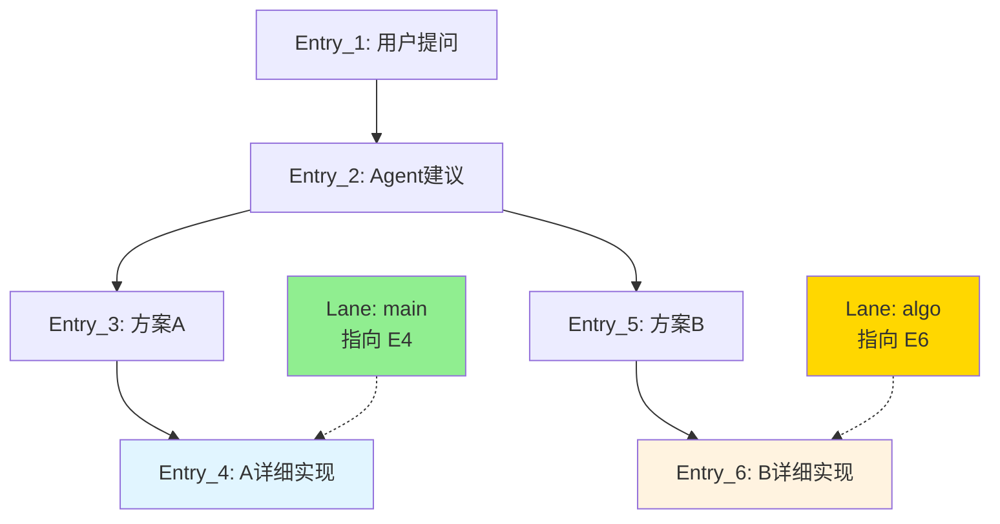

**Lane 就是书签**：
- `main` Lane 指向 Entry_4，代表"缓存方案"这条路径
- `algo` Lane 指向 Entry_6，代表"算法优化"这条路径

### 1.2 为什么需要 Lane？

**问题**：树形历史有很多分支，用户如何管理？

**解决**：用 Lane 给重要的路径"命名"，方便切换和对比。

**类比**：
- 没有 Lane = 只有树，但不知道当前在哪
- 有 Lane = 树 + 书签，随时知道位置，快速切换

---

## 一.5、关键语义澄清：Lane 只是指针，不携带树结构信息

这是实现前必须想清楚的一点，否则查询算法和前端高亮逻辑都会写错。

### 1.5.1 Lane 不含路径信息

Lane **不是**边、不是路径本身，就是一个**指向某个叶子节点的指针**。它自己只有 `leaf_id` 一个核心字段，不携带任何树结构信息。拿掉所有 Lane，树依然完整存在（所有 Entry 和 parent 指针都还在）——Lane 纯粹是 UX 层的书签，不参与树的完整性判断。

### 1.5.2 公共祖先段"属于"哪个 Lane？—— 不排他地属于任何一个

两个 Lane 的路径在分叉点之前的部分是**共享的**，不是互斥的：

```
E1 → E2 → E3(main) → E4(main)
      └→ E5(algo) → E6(algo)
```

- Lane `main` 路径（从 E4 往上）= [E1, E2, E3, E4]
- Lane `algo` 路径（从 E6 往上）= [E1, E2, E5, E6]

E1、E2 **同时出现在两条路径里**，这不是 bug，是分叉的本质。

这里要拆开两个完全不同的关系，实现时容易混用：

| 关系 | 含义 | 特性 |
|---|---|---|
| **路径可达性**（动态） | "这个节点是不是 Lane X 当前叶子的祖先" | 每次都要用 parent 链实时算，一个节点可能同时是好几个 Lane 路径的一部分，**没有排他性** |
| **创建归属标签**（静态） | Entry 的 `lane` 字段，记的是"这条消息被追加时，当前活跃的是哪个 Lane" | 写入时打的固定标签，之后不变，**只有一个值** |

E1、E2 是在 `algo` 还不存在时创建的，`Entry.lane` 字段是 `"main"`，但这跟"algo 的路径要不要经过它们"完全无关。

**对实现的直接影响**：
1. `get_history_path(leaf_id)` 只依赖 `parent` 指针，**不能用 `Entry.lane` 字段做路径判断**——按 `Entry.lane == 'algo'` 去筛选节点是错的，E1、E2 的 lane 字段是 main，但它们明明也在 algo 的路径上。
2. 前端画树高亮"当前 Lane 路径"时（见 [07-Web-UI设计](../05-Web-UI层/07-Web-UI设计.md)），分叉点之前的公共段应该体现为"多条颜色的交集"，不能简单按 `Entry.lane` 字段单色渲染。
3. `Entry.lane` 字段的真正用途仅仅是展示层面的溯源标注（比如按创建者分组），树的正确性只依赖 `parent` 一个字段，不依赖这个标签。

### 1.5.3 Lane 需要标记根节点吗？—— 不需要

从叶子往上走 `parent` 指针，`parent` 为 `None` 时自然停止，这个过程本身就走到了根，不需要 Lane 额外记录 root 在哪：

```python
def get_history_path(leaf_id):
    path = []
    current = leaf_id
    while current:              # parent 为 None 时自然停止，到达根
        entry = get_entry(current)
        path.append(entry)
        current = entry.parent
    return reversed(path)
```

前提：**本项目每个 session 只有一棵树、一个根**（第一条用户消息，`parent=None`）。只要这个前提成立，Lane 就不需要记录 root。（如果未来要支持一个 session 内多棵互不相关的独立树，Lane 才需要额外记一个 `tree_id` 区分归属，但这不是本项目的场景。）

`created_from` 字段的作用不是"标记根"，是记录"这条 Lane 是从哪个节点分叉出来的"，纯粹用于展示血缘信息，和树的完整性/查询算法无关。

### 1.5.4 边界情况：两个 Lane 指向同一叶子

如果两个 Lane 同时指向同一个叶子（比如刚创建分支还没写新内容），它们的路径完全重合，`compare_lanes` 应该返回"无差异"，不该硬造出一个空的对比视图。判断方法：如果公共祖先算法返回的祖先就是两个 `leaf_id` 本身，说明路径完全重合。

---

## 二、Lane 的数据结构

### 2.1 LanePointer（分支指针）

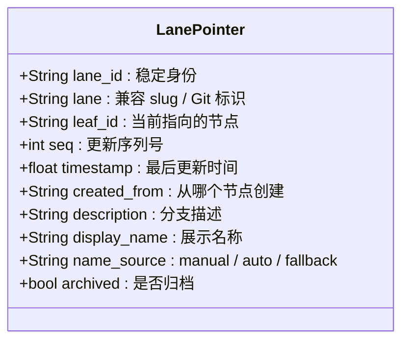

**字段说明**：

| 字段 | 作用 | 示例 |
|------|------|------|
| `lane` | 分支名称（唯一） | `"main"`, `"cache-v1"`, `"algo-approach"` |
| `leaf_id` | **指向的节点ID** | `"e4"` |
| `seq` | 更新序号（每次更新递增） | `1, 2, 3, ...` |
| `created_from` | 从哪个节点创建的 | `"e2"` |
| `description` | 分支描述 | `"尝试缓存优化"` |
| `lane_id` | 稳定 Lane 身份；重命名时保持不变 | UUID |
| `display_name` | 用户可读名称，可包含中文 | `缓存优化方案` |
| `name_source` | 名称来源 | `manual` / `auto` / `fallback` |
| `archived` | 是否归档 | `true` / `false` |

### 2.2 存储格式

**新文件路径**：`data/workspaces/{workspace_id}/sessions/{session_id}/lanes.jsonl`。

旧版本的 `data/sessions/{session_id}_lanes.jsonl` 只由显式迁移器读取。

**示例内容**：

```jsonl
{"lane":"main","leaf_id":"e4","seq":3,"timestamp":1234567890.0,"created_from":null,"description":"主分支"}
{"lane":"algo","leaf_id":"e6","seq":2,"timestamp":1234567891.0,"created_from":"e2","description":"算法优化方案"}
{"lane":"cache-v2","leaf_id":"e8","seq":1,"timestamp":1234567892.0,"created_from":"e4","description":"缓存方案改进"}
```

**每行是一个 Lane 的当前状态**（每次更新时追加一行）。

---

## 三、核心操作

### 3.1 创建分支（Create Lane）

**流程**：

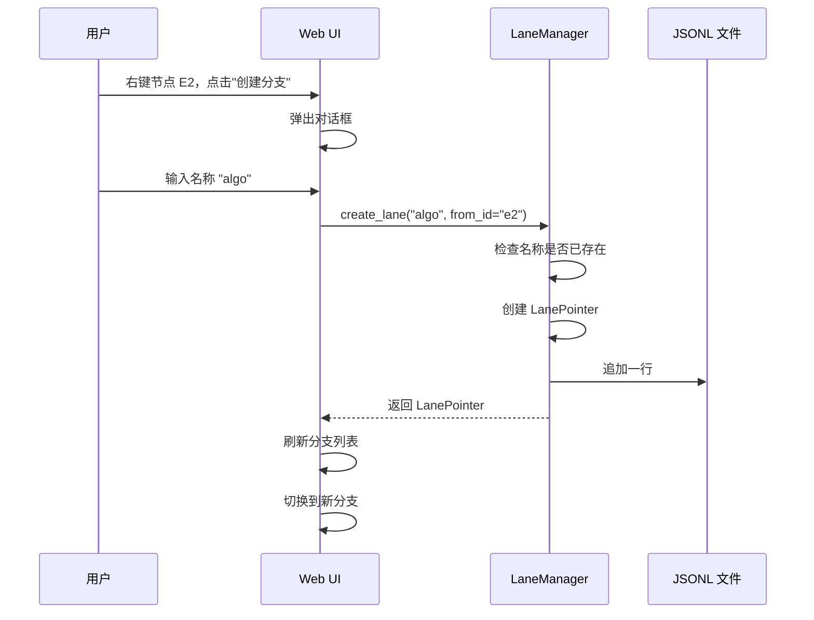

**参数**：
- `name`: 分支名称（用户输入）
- `from_id`: 从哪个节点创建（可选，默认当前节点）
- `description`: 分支描述（可选）

**代码示例**：

```python
# 从 Entry_2 创建新分支
lane = manager.create_lane(
    name='algo',
    from_id='e2',
    description='尝试算法优化方案'
)
# 结果：lane.leaf_id = 'e2'
```

**创建后的状态**：

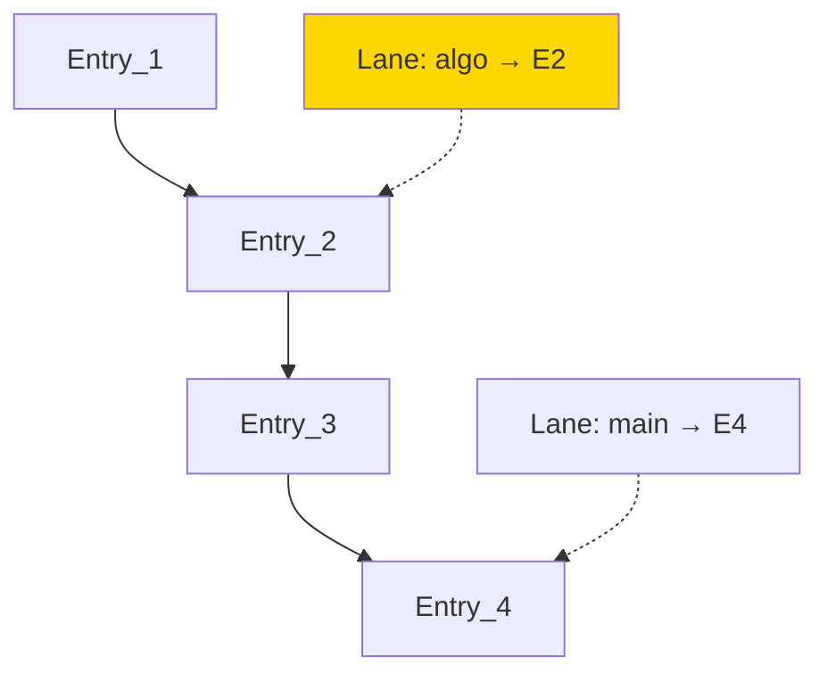

### 3.2 切换分支（Switch Lane）

**目的**：将当前工作切换到另一个分支。

**流程**：

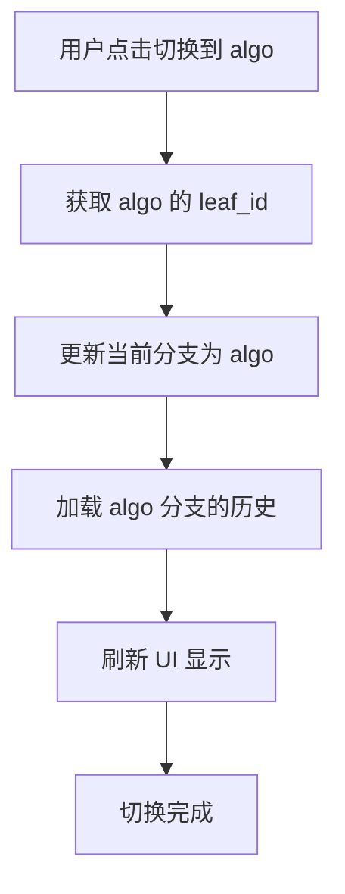

**代码示例**：

```python
# 切换到 algo 分支
manager.switch_lane('algo')

# 获取当前分支的历史
history = storage.get_history_path(manager.current_lane.leaf_id)
# 结果：[Entry_1, Entry_2] （algo 分支的历史）

# 继续对话时，新消息追加到 algo 分支
new_entry = storage.append_message(
    role='user',
    content='继续优化',
    lane='algo',
    parent=manager.current_lane.leaf_id  # 接在 algo 的叶节点后
)
```

**切换前后对比**：

```
切换前（main 分支）：
  当前位置：Entry_4
  历史路径：[Entry_1, Entry_2, Entry_3, Entry_4]

切换后（algo 分支）：
  当前位置：Entry_2
  历史路径：[Entry_1, Entry_2]
```

### 3.3 更新分支指针（Update Lane）

**时机**：每次追加新消息时，更新当前 Lane 的 leaf_id。

**流程**：

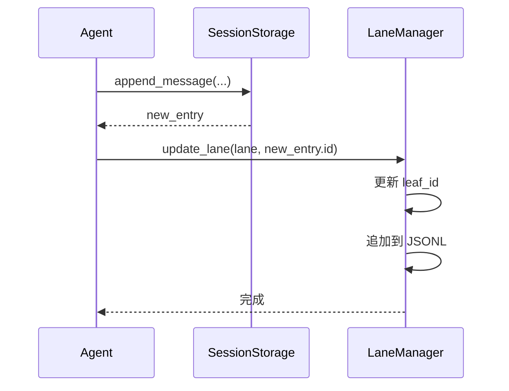

**代码示例**：

```python
# 用户发送消息
entry = storage.append_message('user', '继续', 'main', parent=current_leaf)

# 更新 main 分支指针
manager.update_lane('main', entry.id)

# 现在 main 指向新节点
assert manager.get_lane('main').leaf_id == entry.id
```

### 3.4 删除分支（Delete Lane）

**注意**：删除 Lane 不会删除树中的节点，只是移除书签。

**流程**：

```python
# 删除 algo 分支
manager.delete_lane('algo')

# 节点 Entry_5、Entry_6 仍然在树中
# 只是没有 Lane 指向它们了
```

**保护机制**：
- 不能删除 `main` 分支
- 不能删除当前正在使用的分支

---

## 四、分支对比（Compare）

### 4.1 对比流程

**目标**：找出两个分支的差异部分。

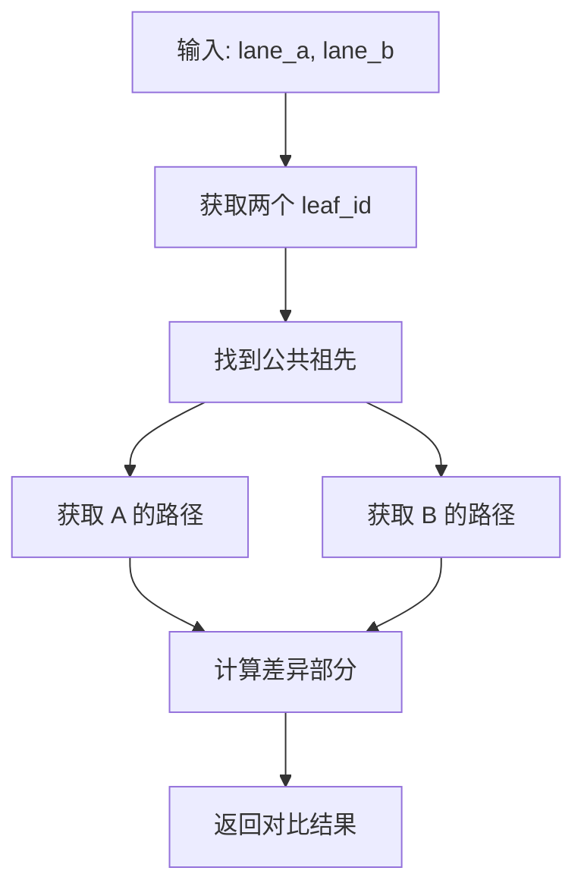

**算法步骤**：

1. 获取两个 Lane 的 leaf_id
2. 找到它们的**公共祖先**（分叉点）
3. 分别获取从祖先到叶子的路径
4. 展示差异部分

**图解**：

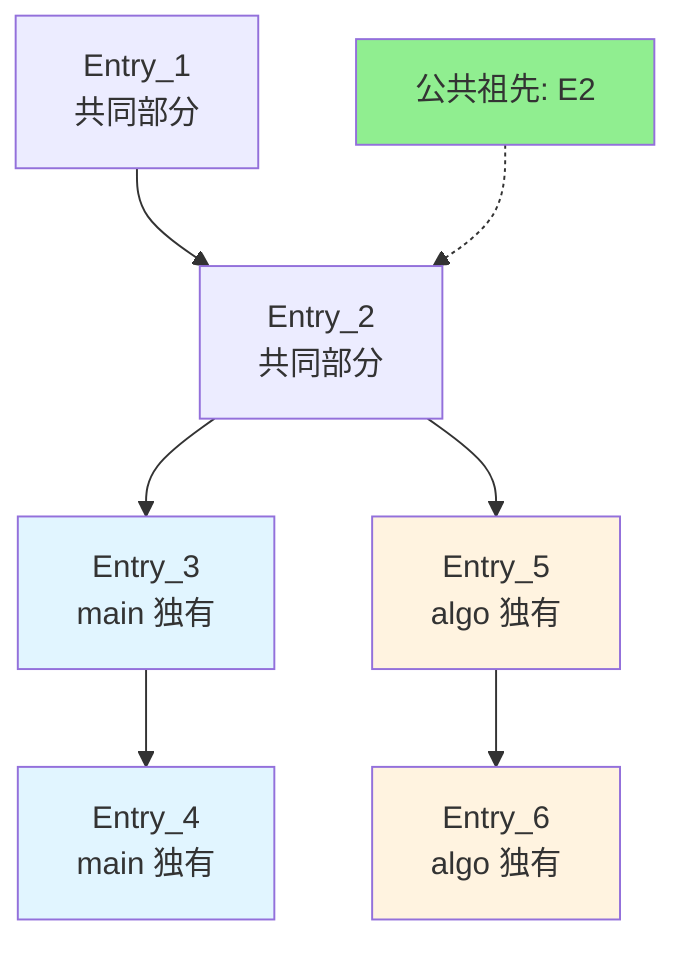

**代码示例**：

```python
# 对比 main 和 algo 分支
result = manager.compare_lanes('main', 'algo')

print(result)
# {
#     'common_ancestor': 'e2',
#     'lane_a_diff': ['e3', 'e4'],  # main 独有
#     'lane_b_diff': ['e5', 'e6'],  # algo 独有
#     'lane_a_entries': [Entry_3, Entry_4],
#     'lane_b_entries': [Entry_5, Entry_6]
# }
```

### 4.2 对比视图（Web UI）

**左右分屏对比**：

```
┌─────────────────────────────────────────────────────────┐
│  分支对比: main vs algo                                  │
├───────────────────────────┬─────────────────────────────┤
│  main 分支                │  algo 分支                   │
├───────────────────────────┼─────────────────────────────┤
│  [共同部分]               │  [共同部分]                  │
│  Entry_1: 用户提问        │  Entry_1: 用户提问           │
│  Entry_2: Agent建议       │  Entry_2: Agent建议          │
├───────────────────────────┼─────────────────────────────┤
│  [差异部分]               │  [差异部分]                  │
│  Entry_3: 试试缓存        │  Entry_5: 试试算法           │
│  Entry_4: LRU 缓存实现    │  Entry_6: 快速算法实现       │
└───────────────────────────┴─────────────────────────────┘
```

---

## 五、智能分支命名

### 5.1 自动建议分支名

**目标**：根据对话内容，自动建议有意义的分支名。

**方法**：
1. 提取用户的第一条消息内容
2. 用 LLM 生成简短的分支名

**流程**：

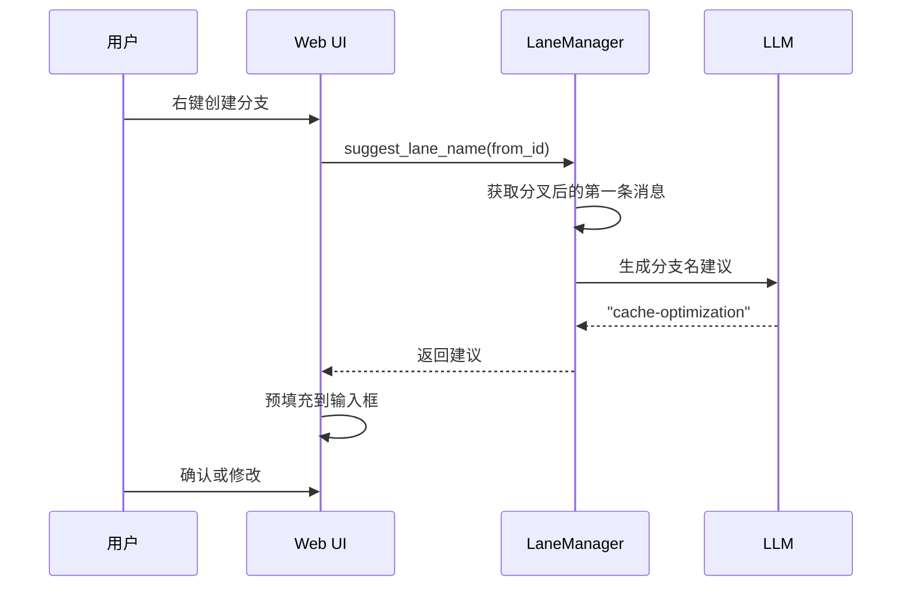

**Prompt 示例**：

```
根据以下对话内容，生成一个简短的分支名（2-3个单词，kebab-case）：

用户: 试试使用缓存优化
Agent: 好的，我将实现 LRU 缓存...

分支名：
```

**LLM 输出**：`cache-optimization`

**代码示例**：

```python
async def suggest_lane_name(from_id: str) -> str:
    # 获取分叉后的第一条消息
    children = storage.get_children(from_id)
    if not children:
        return "new-branch"
    
    first_message = children[0].content
    
    # 调用 LLM
    prompt = f"根据以下内容，生成简短分支名：\n{first_message}\n分支名："
    suggestion = await llm.generate(prompt, max_tokens=10)
    
    return suggestion.strip()
```

### 5.2 分支命名规范

**推荐格式**：kebab-case（短横线分隔）

**好的命名**：
- ✅ `cache-optimization`
- ✅ `algo-approach`
- ✅ `refactor-v2`
- ✅ `bug-fix-auth`

**不好的命名**：
- ❌ `branch1`, `test`, `new` （无意义）
- ❌ `CacheOptimization` （驼峰，不统一）
- ❌ `this is my branch` （有空格）

---

## 六、Lane 的高级功能

### 6.1 分支统计信息

**目标**：展示每个分支的活跃度。

**统计指标**：

```python
{
    'lane': 'main',
    'leaf_id': 'e4',
    'message_count': 4,          # 分支上的消息数
    'last_updated': '2026-08-28 10:30:00',
    'created_at': '2026-08-28 09:00:00',
    'duration': '1h 30m'         # 分支存在时长
}
```

**实现**：

```python
def get_lane_stats(lane_name: str) -> dict:
    lane = manager.get_lane(lane_name)
    
    # 获取分支的所有消息
    entries = storage.get_branch_entries(lane_name)
    
    return {
        'lane': lane_name,
        'message_count': len(entries),
        'last_updated': datetime.fromtimestamp(lane.timestamp),
        'created_at': datetime.fromtimestamp(lane.created_at)
    }
```

### 6.2 分支合并（可选）

**场景**：在一个分支上完成实验后，想合并到 main。

**简化方案**：不做真正的合并，而是"切换"。

```python
# "合并" algo 到 main（实际是更新 main 指针）
manager.update_lane('main', algo_lane.leaf_id)

# 现在 main 也指向 algo 的位置了
```

**完整方案**（复杂）：
- 创建新的 Entry，内容是两个分支的合并结果
- parent 指向两个分支的 leaf_id（多父节点）
- 更新 main Lane 指向新节点

**注**：完整方案较复杂，比赛时可以不做。

### 6.3 分支可视化标签

**在树形图中展示 Lane**：

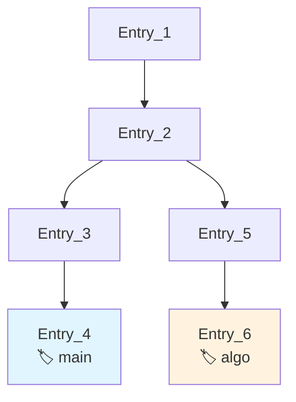

**实现**：在 React Flow 节点上添加 Badge。

```tsx
{lanes.map(lane => (
  lane.leaf_id === node.id && (
    <Badge key={lane.name} variant="secondary">
      {lane.name}
    </Badge>
  )
))}
```

---

## 七、与 Agent 的集成

### 7.1 Agent 如何使用 Lane

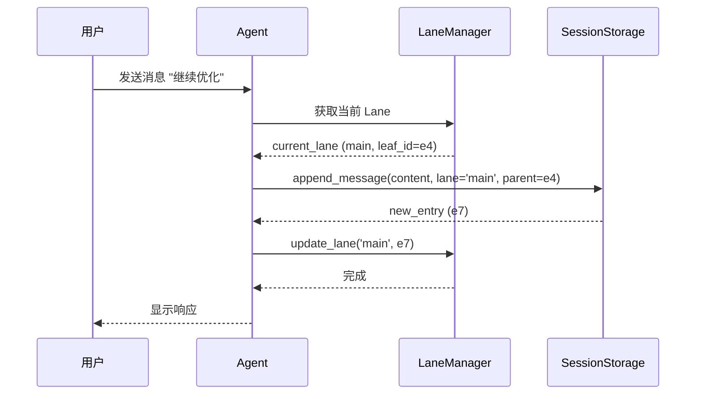

**关键点**：
1. Agent 始终从当前 Lane 获取 leaf_id
2. 新消息追加时，parent 设为当前 leaf_id
3. 追加后，更新 Lane 指针

### 7.2 切换分支后的对话

```python
# 在 main 分支上
agent.current_lane = 'main'
agent.run("继续缓存优化")
# 新消息追加到 main 分支

# 切换到 algo 分支
agent.switch_lane('algo')

# 继续对话
agent.run("继续算法改进")
# 新消息追加到 algo 分支

# main 和 algo 各自独立发展
```

### 7.3 执行模型：单 Lane 互斥，不做完整的并发状态机

**范围决策**：dsh 参考项目里，同一个 Lane 不能并发执行、不同 Lane 可以并发执行，靠一套 Operation 状态机（`null → running → completed/suspended/aborting`）保证。这套机制是给多用户/生产场景设计的，本项目**主动简化**：

- **任意时刻只有一个 Lane 在跑**：不区分"同 Lane 互斥、跨 Lane 并发"，而是全局只允许一个 Run 在执行
- 当前 Lane 正在执行时：
  - 不允许切换到另一个 Lane（`switch_lane` 应拒绝或排队）
  - 不允许在当前 Lane 上发起新的 `run`（防止同一 Lane 的两次追加交错写入 JSONL）
- 执行结束后，Lane 指针正常更新，用户可以自由切换/创建分支

**为什么这样简化**：
- 单人 demo 场景不需要真正的多 Lane 并发生成，省掉整个 Operation 状态机能把时间留给分支对比、智能命名等更能体现"打磨"的功能
- 避免了多个 asyncio 任务同时向同一个 JSONL 文件 append 导致交错写入的正确性问题

**不做的部分**：中断（abort）语义——用户中途打断 Agent 生成，涉及 asyncio 任务取消 + 把不完整的 tool_call 正确落成"已中断"状态写回树，边界情况较多，作为时间允许再做的加分项，不是初期必须项。

---

## 八、实际案例

### 案例：探索多个性能优化方案

**场景**：用户的函数性能不佳，想尝试多种优化方式。

**操作流程**：

**1. 初始对话**

```python
# main 分支
e1 = storage.append_message('user', '函数太慢了', 'main', None)
e2 = storage.append_message('assistant', '我有几个思路', 'main', e1.id)

manager.update_lane('main', e2.id)
```

**2. 尝试方案A：缓存**

```python
e3 = storage.append_message('user', '试试缓存', 'main', e2.id)
e4 = storage.append_message('assistant', '实现了 LRU 缓存', 'main', e3.id)

manager.update_lane('main', e4.id)
```

**3. 回溯，尝试方案B：算法**

```python
# 创建新分支
manager.create_lane('algo', from_id=e2.id, description='算法优化')

# 切换到 algo 分支
manager.switch_lane('algo')

# 继续对话
e5 = storage.append_message('user', '试试改进算法', 'algo', e2.id)
e6 = storage.append_message('assistant', '用了快速算法', 'algo', e5.id)

manager.update_lane('algo', e6.id)
```

**4. 又想到方案C：并行**

```python
# 再创建一个分支
manager.create_lane('parallel', from_id=e2.id, description='并行计算')

manager.switch_lane('parallel')

e7 = storage.append_message('user', '试试并行计算', 'parallel', e2.id)
e8 = storage.append_message('assistant', '用多线程加速', 'parallel', e7.id)

manager.update_lane('parallel', e8.id)
```

**5. 对比三个方案**

```python
# 对比 main 和 algo
diff_1 = manager.compare_lanes('main', 'algo')

# 对比 algo 和 parallel
diff_2 = manager.compare_lanes('algo', 'parallel')

# 展示给用户，选择最优方案
```

**最终树形结构**：

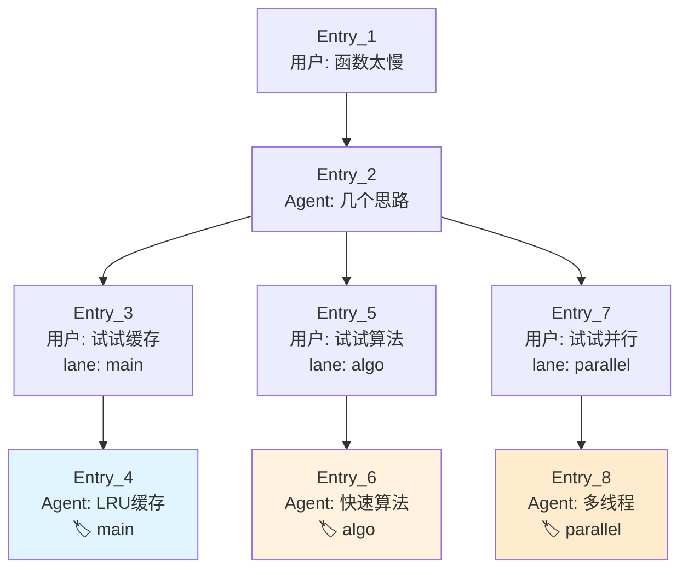

**用户视角**：
- 三个分支并存，可以随时切换
- 对比不同方案的效果
- 选择最优方案继续深入

---

## 九、与树形历史的配合

### 9.1 分工明确

**树形历史系统**：
- 负责存储所有消息（Entry）
- 提供树形结构查询（parent 指针）
- 不关心分支逻辑

**Lane 管理系统**：
- 负责管理分支指针
- 提供分支切换、对比功能
- 不存储消息内容

### 9.2 协作流程

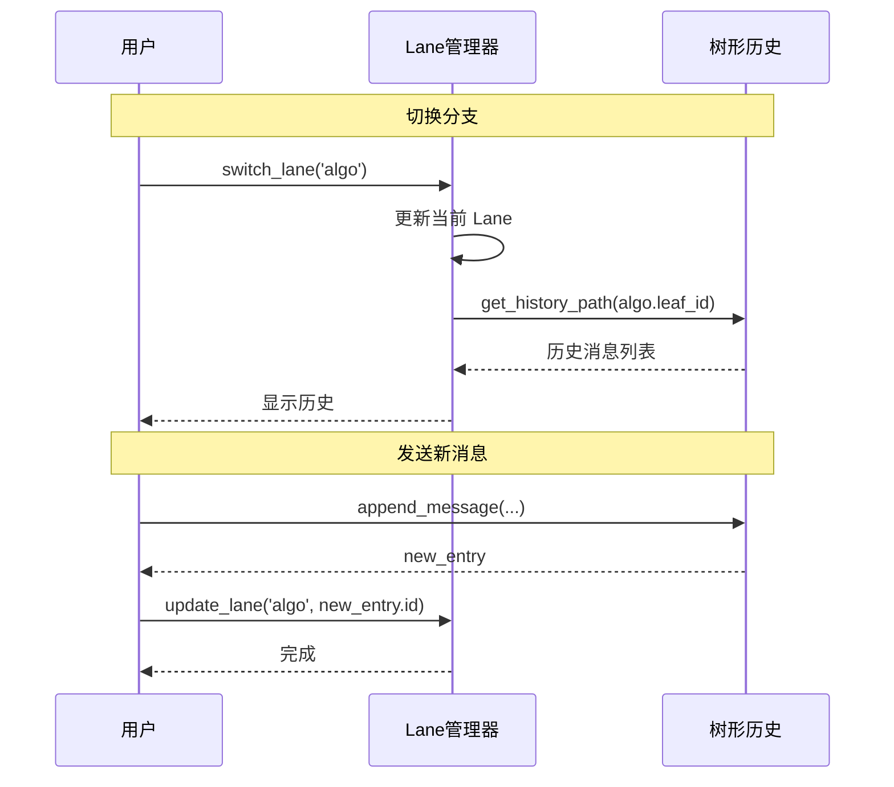

**关键点**：
- Lane 只管"指针"（当前在哪）
- 树形历史管"数据"（所有消息）
- 两者配合，实现完整的分支管理

---

## 十、总结

### 核心要点

1. **Lane 是指针**：指向树中的某个节点，代表一条路径
2. **书签隐喻**：Lane 像书签，方便切换和管理
3. **独立存储**：Lane 和消息分开存储（lanes.jsonl 和 messages.jsonl）
4. **无损切换**：切换分支不会丢失任何数据
5. **对比友好**：找到公共祖先，展示差异部分

### Lane 的价值

**对用户**：
- ✅ 可以同时探索多个方案
- ✅ 随时切换，不丢失进度
- ✅ 对比不同方案，选择最优

**对系统**：
- ✅ 简单直观的数据结构
- ✅ 易于实现和调试
- ✅ 演示效果好

### 实现优先级

**P0（必须）**：
- 创建、切换、删除分支
- 更新分支指针
- 基本的对比功能

**P1（重要）**：
- 智能分支命名
- 分支统计信息
- Web UI 的分支管理面板

**P2（加分）**：
- 分支合并
- 时间旅行调试
- 分支可视化标签

---

**文档版本**: v0.3
**上次更新**: 2026-08-29
**变更说明**: 新增 1.5 节"关键语义澄清"（Lane 只是指针不含路径信息、公共祖先段不排他地属于任何一个 Lane、路径可达性与创建归属标签的区分、根节点不需要标记的原因、两个 Lane 指向同一叶子的边界情况）；新增 7.3 节"执行模型"，明确单 Lane 互斥执行的范围简化决策，不做完整 Operation 状态机，不做中断语义。
**关联文档**: [实现难点-以dsh为参考](../../草稿/实现难点-以dsh为参考.md)、[02-树形对话历史系统](02-树形对话历史系统.md)、[04-Agent主循环](../03-Agent核心层/04-Agent主循环.md)
