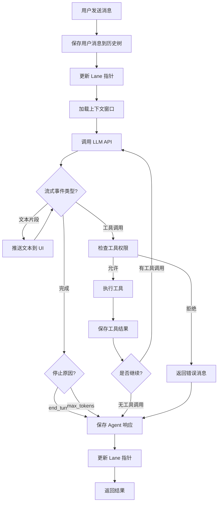
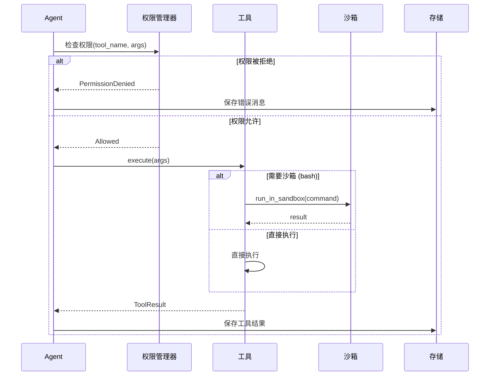
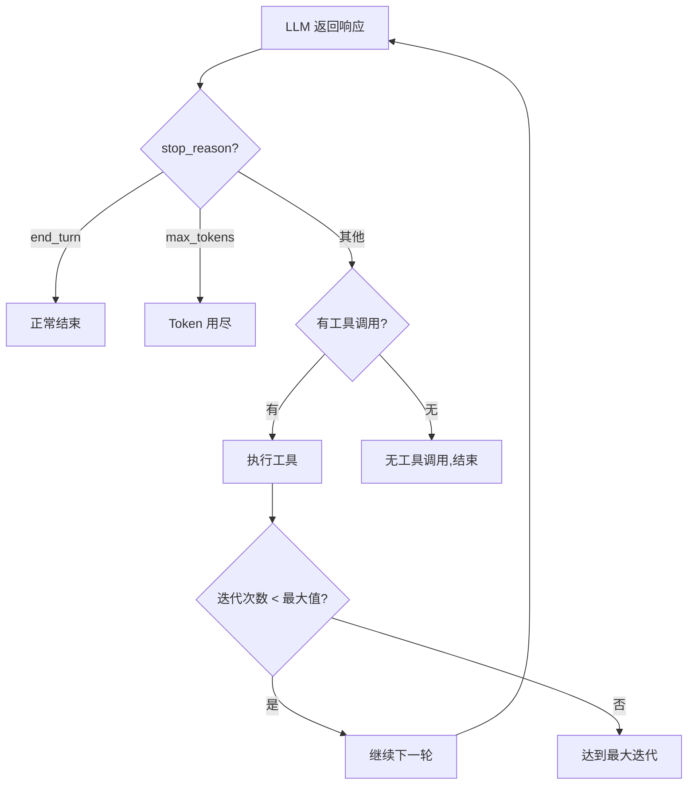
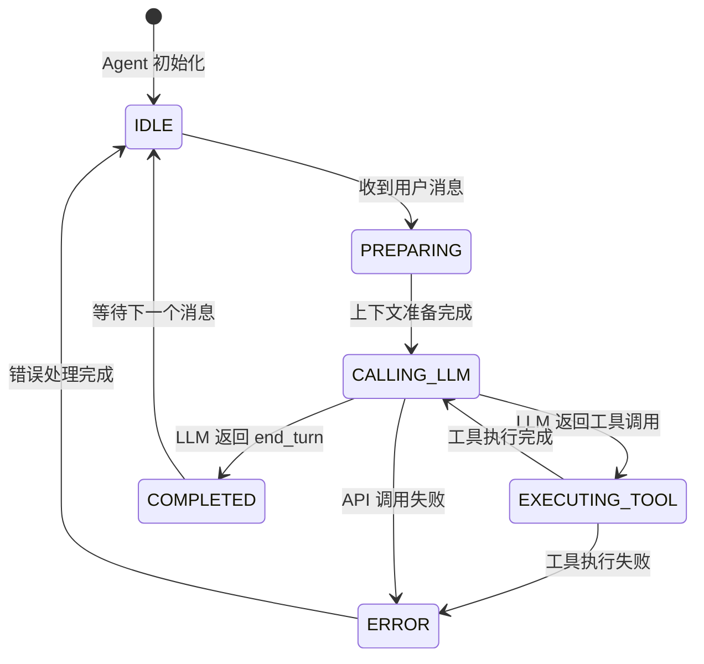
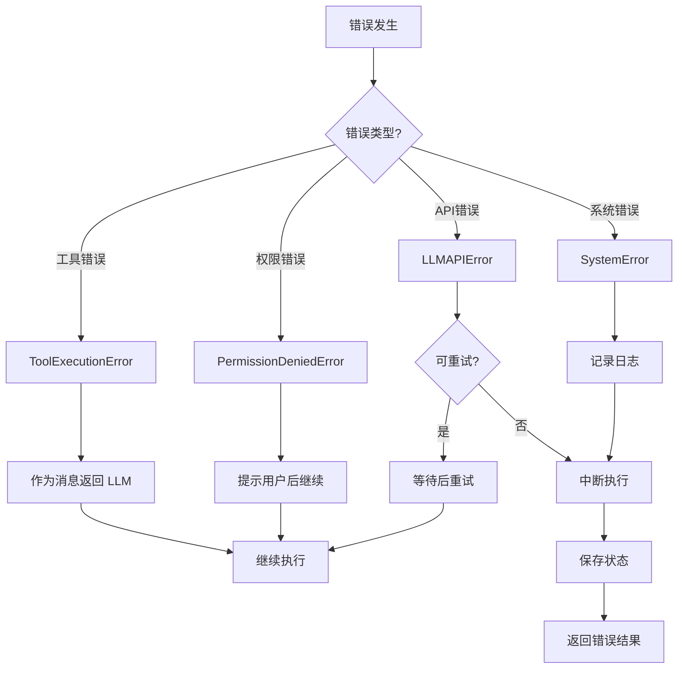

# 04 - Agent 主循环

> Agent 核心执行流程：驱动整个对话的引擎

---

## 一、设计目标

Agent 主循环是整个系统的核心引擎，负责：
- **协调各个组件**：连接 LLM、工具、存储、权限等模块
- **驱动执行流程**：从用户输入到最终响应的完整流程
- **管理执行状态**：跟踪当前执行阶段，支持暂停/恢复
- **错误恢复**：处理各类异常情况

---

## 二、整体执行流程

### 2.1 流程图



### 2.2 核心阶段说明

**阶段 1：准备阶段**
- 保存用户消息到树形历史中
- 更新当前 Lane 的 leaf_id
- 从历史中加载上下文窗口（考虑 Token 限制）

**阶段 2：LLM 交互**
- 构建 LLM 请求（消息历史 + 工具定义）
- 流式接收 LLM 响应
- 实时推送文本增量到 Web UI

**阶段 3：工具执行**
- 解析 LLM 返回的工具调用
- 权限检查（SAFE/WRITE/DANGEROUS）
- 在沙箱中执行工具（如果是 bash）
- 保存工具结果到历史

**阶段 4：循环判断**
- 如果有工具调用结果，继续下一轮 LLM
- 如果 LLM 返回 `end_turn`，结束循环
- 如果达到最大迭代次数，强制结束

**阶段 5：收尾**
- 保存最终响应
- 更新 Lane 指针
- 返回执行摘要

---

## 三、核心数据结构

### 3.1 Agent 状态

```python
from enum import Enum
from dataclasses import dataclass
from typing import Optional

class AgentState(Enum):
    """Agent 执行状态"""
    IDLE = "idle"              # 空闲
    PREPARING = "preparing"    # 准备上下文
    CALLING_LLM = "calling_llm"  # 调用 LLM
    EXECUTING_TOOL = "executing_tool"  # 执行工具
    COMPLETED = "completed"    # 已完成
    ERROR = "error"           # 错误状态

@dataclass
class RunContext:
    """单次执行的上下文"""
    run_id: str                    # 执行 ID
    lane: str                      # 所在 Lane
    user_message_id: str           # 触发本次执行的用户消息 ID
    state: AgentState              # 当前状态
    iteration: int = 0             # 当前迭代次数
    total_tokens: int = 0          # 累计 Token 数
    tool_calls: list = None        # 工具调用记录
    
    def __post_init__(self):
        if self.tool_calls is None:
            self.tool_calls = []
```

### 3.2 执行结果

```python
@dataclass
class RunResult:
    """执行结果"""
    run_id: str
    status: str                    # 'completed' | 'error' | 'aborted'
    final_message_id: str          # 最终消息 ID
    iterations: int                # 迭代次数
    total_tokens: int              # Token 使用量
    duration: float                # 执行时长（秒）
    error: Optional[str] = None    # 错误信息（如果有）
```

---

## 四、Agent 类设计

### 4.0 关键架构决策：消息来源要抽象，不能硬编码依赖树形存储

这是整个项目里最值得在动手写代码前就想清楚的一个接口设计点：**主循环读写上下文的方式，必须通过一个抽象接口，不能直接写死调用 `SessionStorage`**。

原因：[15-子Agent系统](15-子Agent系统.md) 里的子 Agent 要复用同一套 Agent 主循环实现，但子 Agent 跑的时候用的是纯内存的临时消息列表，完全不能碰父树（不落 JSONL，不影响 Lane 指针）。如果主循环的代码里到处直接调用 `self.storage.append_message(...)`，后续为了支持子 Agent 就必须把这些调用点全部抠出来重构一遍——这是一次完全可以提前避免的返工。

**做法**：定义一个最小的消息提供者接口，父 Agent 和子 Agent 分别实现，主循环只依赖这个接口：

```python
from typing import Protocol

class MessageProvider(Protocol):
    """主循环读写上下文的抽象接口，不关心具体是树还是内存列表"""
    def get_context(self) -> list[Message]: ...
    def append(self, message: Message) -> None: ...

class TreeMessageProvider:
    """父 Agent 用：读写真实的 JSONL 树 + Lane 指针"""
    def __init__(self, storage: SessionStorage, lane_manager: LaneManager, lane: str):
        self.storage = storage
        self.lane_manager = lane_manager
        self.lane = lane

    def get_context(self) -> list[Message]:
        leaf_id = self.lane_manager.get_lane(self.lane).leaf_id
        return self.storage.get_context_window(leaf_id)

    def append(self, message: Message) -> None:
        leaf_id = self.lane_manager.get_lane(self.lane).leaf_id
        entry = self.storage.append_message(message, parent=leaf_id, lane=self.lane)
        self.lane_manager.update_lane(self.lane, entry.id)

class EphemeralMessageProvider:
    """子 Agent 用：纯内存 list，生灭随对象，不落盘，不碰父树"""
    def __init__(self, seed_task: str):
        self._messages = [Message(role="user", content=seed_task)]

    def get_context(self) -> list[Message]:
        return self._messages

    def append(self, message: Message) -> None:
        self._messages.append(message)
```

主循环（`AgentLoop` / `Agent.run`）内部只调用 `provider.get_context()` 和 `provider.append(...)`，完全不知道背后是树还是内存列表。父 Agent 构造时传 `TreeMessageProvider`，子 Agent 构造时传 `EphemeralMessageProvider`——**同一套循环代码，两种消息来源**，不需要为子 Agent 另外写一套执行引擎。

这个决策要在写主循环第一版代码时就落地，不要等到实现子 Agent 时才回头改。

### 4.1 核心接口

Agent 类是整个主循环的封装，对外提供简洁的接口：

```python
class Agent:
    """AI Agent 主类"""
    
    def __init__(self, session_id: str, config: dict,
                 provider: Optional[MessageProvider] = None, depth: int = 0):
        """
        初始化 Agent

        参数:
            session_id: 会话 ID
            config: 配置字典（LLM、工具、权限等）
            provider: 消息来源，默认构造 TreeMessageProvider（父 Agent 用）；
                      子 Agent 由 delegate_task 工具传入 EphemeralMessageProvider
            depth: 当前递归深度，父 Agent 为 0，子 Agent 由调用方 +1 传入。
                   显式传参而不是隐式的线程局部变量，保证并发场景下互不污染，
                   也方便测试（见 15-子Agent系统.md 第四节的深度限制）
        """
        self.session_id = session_id
        self.storage = SessionStorage(session_id)
        self.lane_manager = LaneManager(session_id)
        self.llm_client = create_llm_client(config['llm'])
        self.tool_registry = ToolRegistry()
        self.permission_manager = PermissionManager(config.get('permissions', {}))
        self.logger = StructuredLogger(session_id)

        self.current_lane = 'main'
        self.max_iterations = config.get('max_iterations', 20)
        self.depth = depth
        self.provider = provider or TreeMessageProvider(
            self.storage, self.lane_manager, self.current_lane
        )
    
    async def run(self, user_message: str) -> RunResult:
        """
        执行一次完整的 Agent 循环
        
        参数:
            user_message: 用户输入
        
        返回:
            RunResult: 执行结果
        """
        # 主循环实现（见下文）
        pass
    
    def switch_lane(self, lane_name: str):
        """切换到指定 Lane"""
        pass
    
    def create_branch(self, name: str, from_id: Optional[str] = None):
        """创建新分支"""
        pass
```

### 4.2 主循环实现逻辑

主循环的核心逻辑分为以下步骤：

#### 步骤 1: 准备阶段

```
1. 创建 RunContext（记录本次执行的上下文）
2. 保存用户消息到 SessionStorage
   - 获取当前 Lane 的 leaf_id 作为 parent
   - 创建新的 MessageEntry
3. 更新 Lane 的 leaf_id 指向新消息
4. 记录日志：run_started
```

#### 步骤 2: 主循环

```
循环条件：iteration < max_iterations

每次迭代：
  2.1 加载上下文
      - 从当前 leaf_id 向上遍历历史
      - 控制总 Token 数在窗口限制内
      - 转换为 LLM API 格式
  
  2.2 调用 LLM
      - 构建请求（消息 + 工具定义）
      - 流式接收响应
      - 处理三种事件：
        a) text_delta：文本片段 → 推送到 UI
        b) tool_call：工具调用 → 进入工具执行
        c) done：完成 → 检查停止原因
  
  2.3 处理工具调用（如果有）
      For each tool_call:
        - 权限检查（可能需要用户确认）
        - 执行工具
        - 保存工具结果到历史
        - 记录到 RunContext.tool_calls
  
  2.4 判断是否继续
      If stop_reason == 'end_turn':
          break  # LLM 主动结束
      
      If no tool_calls:
          break  # 没有工具调用，结束
      
      If iteration >= max_iterations:
          break  # 达到最大迭代次数
      
      继续下一轮（将工具结果传给 LLM）
```

#### 步骤 3: 收尾

```
1. 保存 Agent 的最终响应到历史
2. 更新 Lane 的 leaf_id
3. 记录日志：run_completed
4. 返回 RunResult
```

---

## 五、关键算法详解

### 5.1 上下文窗口加载算法

**目标**：从历史树中选择合适的消息，既保留重要上下文，又不超出 Token 限制。

**算法流程**：

```mermaid
flowchart TD
    Start[开始] --> GetLeaf[获取当前 leaf_id]
    GetLeaf --> InitVars[初始化: messages=[], tokens=0]
    InitVars --> Loop{当前节点存在?}
    
    Loop -->|是| GetEntry[获取节点 Entry]
    GetEntry --> CalcTokens[估算 Entry 的 Token 数]
    CalcTokens --> CheckLimit{tokens + entry_tokens > limit?}
    
    CheckLimit -->|否| AddEntry[添加 Entry 到 messages]
    AddEntry --> UpdateTokens[更新 tokens 计数]
    UpdateTokens --> MoveParent[移动到父节点]
    MoveParent --> Loop
    
    CheckLimit -->|是| CheckCompaction{是否启用压缩?}
    CheckCompaction -->|是| Compress[触发历史压缩]
    CheckCompaction -->|否| Stop[停止加载]
    
    Loop -->|否| Reverse[反转 messages 顺序]
    Compress --> Reverse
    Stop --> Reverse
    Reverse --> Return[返回 messages]
```

**Token 估算**：
- 简化方法：`token_count ≈ len(content) / 4`
- 精确方法：使用 tiktoken 库

**压缩策略**（可选）：
- 当历史过长时，将旧消息压缩为摘要
- 调用 LLM 生成摘要，创建 CompactionEntry
- 后续加载时，摘要替代原始消息

### 5.2 工具执行流程

**流程图**：



**关键点**：
1. **权限检查前置**：工具执行前必须通过权限检查
2. **沙箱隔离**：危险工具（bash）必须在沙箱中执行
3. **错误传递**：工具错误不中断循环，而是作为消息返回给 LLM

### 5.3 终止条件判断

Agent 循环有多种终止条件：



**各种终止场景**：

| 终止原因 | 状态 | 说明 |
|---------|------|------|
| `end_turn` | ✅ 正常 | LLM 主动表示完成 |
| 无工具调用 | ✅ 正常 | LLM 没有调用工具，对话结束 |
| 达到最大迭代 | ⚠️ 警告 | 可能陷入循环，强制结束 |
| 用户中断 | ⚠️ 中断 | 用户手动停止 |
| API 错误 | ❌ 错误 | LLM API 调用失败 |
| 系统错误 | ❌ 错误 | 其他系统错误 |

---

## 六、状态管理

### 6.1 状态转换图



### 6.2 状态持久化

为了支持长时间运行和崩溃恢复，Agent 的状态需要持久化：

**存储内容**：
- 当前执行的 `RunContext`
- 已完成的迭代次数
- 累计 Token 数
- 工具调用记录

**恢复策略**：
- Agent 启动时检查是否有未完成的 Run
- 如果有，提示用户是否继续或放弃
- 继续时从上次中断的地方恢复

---

## 七、错误处理策略

### 7.1 错误分类



### 7.2 错误恢复原则

**工具错误**：
- 不中断主循环
- 将错误信息作为工具结果返回给 LLM
- LLM 可以自我修正（如修改命令重试）

**API 错误**：
- 可重试错误（rate_limit, timeout）：指数退避重试
- 不可重试错误（invalid_request）：中断执行

**权限错误**：
- 提示用户确认
- 用户拒绝：返回错误消息给 LLM
- 用户允许：继续执行

**系统错误**：
- 记录详细日志
- 中断执行，返回错误给用户

---

## 八、性能优化

### 8.1 并行化机会

虽然 Agent 主循环本身是串行的，但有些操作可以并行：

**场景 1：多工具并行执行**
```
如果 LLM 返回多个独立的工具调用：
  [read_file(a.py), read_file(b.py), read_file(c.py)]

可以并行执行：
  results = await asyncio.gather(
      tool.execute('read', {'path': 'a.py'}),
      tool.execute('read', {'path': 'b.py'}),
      tool.execute('read', {'path': 'c.py'})
  )
```

> ⚠️ **写回树时的关键约束**：`asyncio.gather` 并行执行没有问题，但等所有结果都返回之后，**必须打包成一条合成消息**再调用 `provider.append(...)`，不能每个工具结果单独 append 一次。原因见 [02-树形对话历史系统](../02-数据与存储层/02-树形对话历史系统.md) 2.2 节——如果 3 个并行工具结果各自单独写入，会让同一个 assistant 节点长出 3 个子节点，而下一条 assistant 消息又同时依赖这 3 个结果，无论挂在哪个下面都会破坏树的单父节点结构。这条规则在子 Agent 并发执行时同样适用（见 [15-子Agent系统](15-子Agent系统.md) 第七节）。

**场景 2：UI 推送与工具执行并行**
```
不等待 UI 推送完成：
  asyncio.create_task(emit_to_ui(text_delta))
  # 立即继续处理下一个事件
```

### 8.2 缓存策略

**LLM 响应缓存**：
- 相同的 (消息历史, 工具定义) → 缓存结果
- 适用于确定性任务（如代码分析）

**上下文窗口缓存**：
- 缓存 leaf_id → messages 的映射
- 避免重复遍历历史树

---

## 九、监控与调试

### 9.1 日志记录

在关键节点记录结构化日志：

```
run_started
  ├─ run_id, lane, user_message
  
context_loaded
  ├─ message_count, total_tokens
  
llm_request
  ├─ provider, model, input_tokens
  
llm_response
  ├─ stop_reason, output_tokens
  
tool_execution_start
  ├─ tool_name, args
  
tool_execution_end
  ├─ duration, success, result_preview
  
run_completed
  ├─ iterations, total_tokens, duration
```

### 9.2 调试模式

开发时可以启用详细日志：

```python
agent = Agent(
    session_id='...',
    config={
        'debug': True,  # 启用调试模式
        'log_level': 'DEBUG'
    }
)
```

调试模式下会记录：
- 每次 LLM 请求的完整输入
- 每个工具调用的完整参数
- 上下文窗口的具体内容

---

## 十、使用示例

### 10.1 基本使用

```python
# 创建 Agent
agent = Agent(
    session_id='sess_001',
    config={
        'llm': {
            'provider': 'openai',
            'model': 'gpt-4',
            'api_key': 'sk-...'
        },
        'max_iterations': 20
    }
)

# 执行用户请求
result = await agent.run("优化 main.py 中的性能问题")

print(f"执行完成: {result.iterations} 次迭代")
print(f"Token 使用: {result.total_tokens}")
```

### 10.2 切换分支

```python
# 在 main 分支上尝试方案A
await agent.run("使用缓存优化")

# 创建新分支尝试方案B
agent.create_branch('algo-approach', from_id=...)
await agent.run("使用更好的算法优化")

# 对比两个分支
comparison = agent.compare_branches('main', 'algo-approach')
print(comparison)
```

---

---

**变更说明**: 新增 4.0 节"关键架构决策"，明确主循环的消息读写必须通过抽象的 `MessageProvider` 接口（`TreeMessageProvider`/`EphemeralMessageProvider`），不能硬编码依赖 `SessionStorage`，这是支持子 Agent 复用主循环的前提；`Agent.__init__` 补充 `provider`/`depth` 参数；8.1 节补充并行工具执行结果写回树时必须打包成一条合成消息的约束。
**关联文档**: [实现难点-以dsh为参考](../../草稿/实现难点-以dsh为参考.md)、[02-树形对话历史系统](../02-数据与存储层/02-树形对话历史系统.md)、[15-子Agent系统](15-子Agent系统.md)

**上次更新**: 2026-08-29
**文档版本**: v0.2
