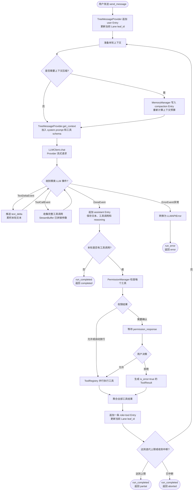

# Agent 主循环

> 当前实现基线：2026-09-02

---

## 一、当前实现

主循环负责把一次用户输入推进成一轮或多轮的 LLM 调用、工具调用和结果回写。

当前状态机：

- `preparing`
- `calling_llm`
- `executing_tool`
- `waiting_permission`
- `idle`
- `error`

`completed` 只作为 `RunResult.status` 和运行结束事件中的结果，不作为常驻前端状态；成功结束后状态回到 `idle`。

状态通过 `status_update` 推给前端，前端只需要监听这一条就能刷新状态栏。

---

## 二、一次 run 的真实流程

### 2.1 LLM—工具循环

下面的图展示一次 `run` 内部最重要的循环。主 Agent 每次调用 LLM 前都会根据当前 Lane 重新构建上下文；LLM 返回工具调用后，工具结果会聚合成一条 `role=tool` 消息写回树，再进入下一次 LLM 调用。没有工具调用时，本轮直接收尾。



图中的 `TreeMessageProvider` 是父 Agent 的消息来源；子 Agent 使用 `EphemeralMessageProvider`，但仍复用同一套 LLM—工具循环。子 Agent 的中间消息不写入父 Session 的 Entry 树。

```text
run_started
  -> preparing
  -> context_loaded
  -> calling_llm
  -> llm_request
  -> llm_response
  -> tool_call_start / tool_call_end
  -> executing_tool
  -> waiting_permission (仅非 SAFE 工具)
  -> ...循环
  -> run_completed
  -> idle
```

如果出错，则走：

```text
run_error
  -> error
```

---

### 2.2 事件路径摘要

Agent 主循环直接产生的核心事件如下：

- `run_started`
- `context_loaded`
- `llm_request`
- `llm_response`
- `message_start`
- `text_delta`
- `message_end`
- `tool_call_start`
- `tool_call_end`
- `permission_request`
- `run_completed`
- `run_error`
- `status_update`

`SessionRuntime` 和 WebSocket 层还会补充 `node_added`、`permission_resolved`、`lane_*`、`lane_checkpoint_created`、`compaction_*`、`session_title_updated`、文件审查和终端事件；完整前端契约见 [07-Web UI 设计基础](../05-Web-UI层/07-Web-UI设计.md)。

---

## 四、工具调用

工具调用分两步：

1. 先在 `_check_permission()` 里过权限门禁
2. 再在 `ToolRegistry.execute()` 里做参数校验和真实执行

非 SAFE 工具进入 `waiting_permission`，拿到用户决策后再回到 `executing_tool`。

并行工具调用会一起执行，但结果必须打包成一条 `tool` 消息回写树，不会拆成多条节点。工具调用参数和结果通过事件流实时展示，最终仍以 Entry JSONL 为事实记录。

---

## 五、错误处理

主循环对两类异常分支处理：

- `AgentError`：进入 `run_error`，返回 `RunResult(status="error")`
- 未预期异常：同样进入 `run_error`，错误码为 `INTERNAL_ERROR`

普通工具失败不会立刻炸掉整个 run，而是以 `ToolResult` 的形式返回给 LLM，让模型自己修正。

Run 被中断时返回 `aborted` 结果并推送结束事件；Session 运行锁和活动任务状态同时清理，之后才允许新的 Run。

成功 Run 在 Git 启用时交给 `SessionRuntime` 的检查点策略：先记录待检查点 Run 和变更文件，满足空闲窗口、最大等待时间、Run 数或文件数阈值后再合并提交。检查点失败不改变 Agent 的成功结果，只影响代码持久化状态。

---

## 六、状态栏语义

`status_update` 当前带三个核心字段：

- `state`
- `current_lane`
- `current_operation`

其中 `current_operation` 只是一层用户友好文本，不参与决策。

成功结束后当前代码回到 `idle`，不是额外保留一个常驻的 `completed` 状态。

## 七、上下文与自动标题

每轮开始前由 `MemoryManager` 计算当前 Lane 的有效上下文和 token 预算，必要时先写入 `compaction` Entry；上下文加载事件包含估算用量和压缩状态。Session 没有手动标题时，成功 Run 释放运行锁后异步调用无工具 `NamingService` 生成标题，失败则本地降级，不阻塞当前 Run。
