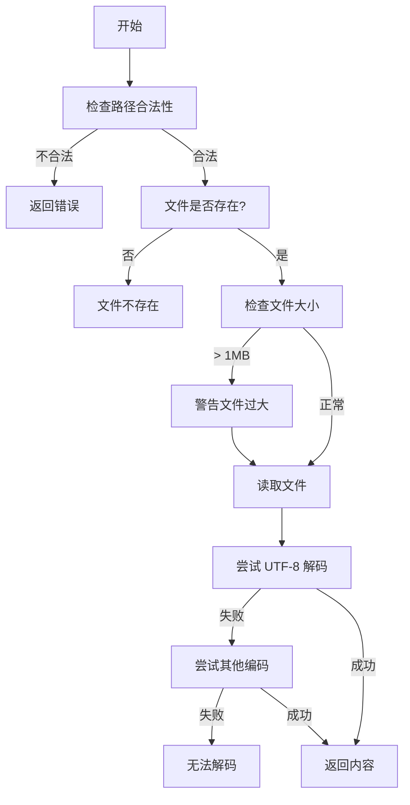
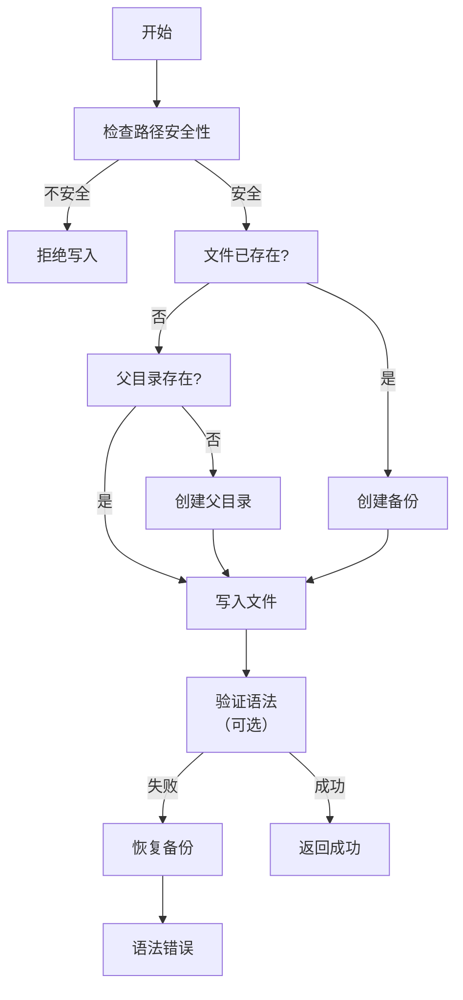
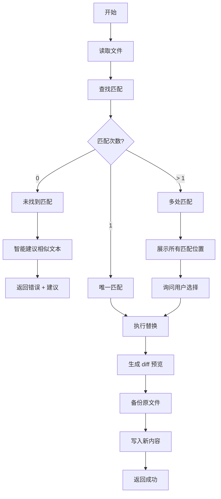
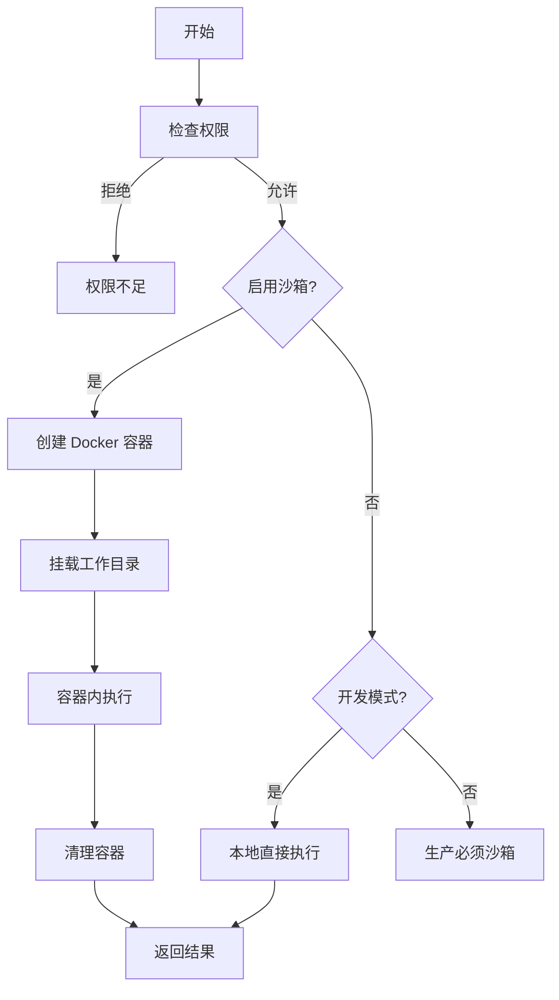
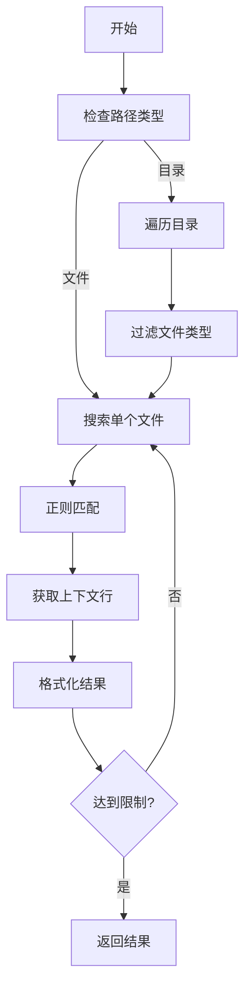
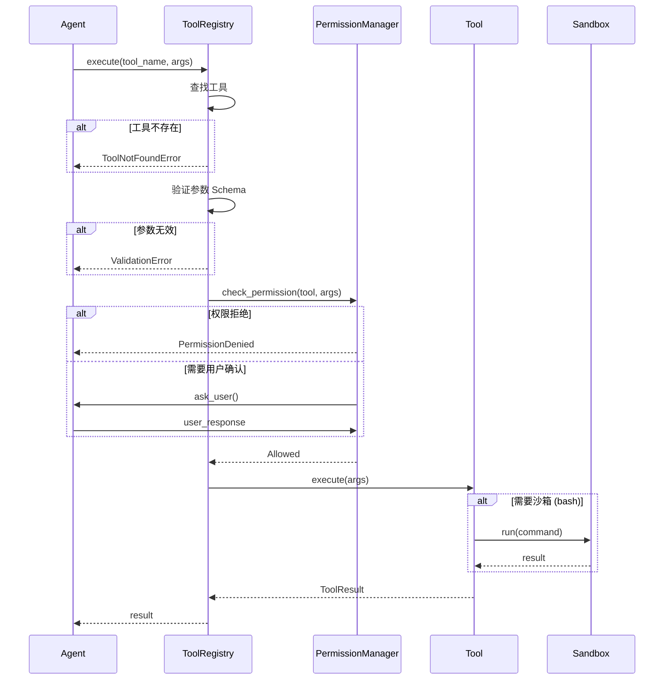

# 05 - 工具系统

> 工具定义、注册与执行：赋予 Agent 与外界交互的能力

---

## 一、设计目标

工具系统是 Agent 的"手和脚"，让 AI 能够：
- **读取文件**：理解代码库结构
- **编辑文件**：修改代码、修复 Bug
- **执行命令**：运行测试、编译代码
- **搜索信息**：查找文件、grep 代码

**设计原则**：
- **少而精**：3-4 个核心工具，每个打磨到极致
- **安全第一**：权限控制、沙箱隔离
- **易于扩展**：清晰的接口，方便添加新工具
- **友好提示**：错误时给出有用的建议

---

## 二、工具注册机制

### 2.1 工具定义格式

每个工具需要提供：
1. **名称**：工具的唯一标识
2. **描述**：告诉 LLM 这个工具做什么
3. **参数 Schema**：JSON Schema 格式，定义输入参数
4. **权限级别**：SAFE / WRITE / DANGEROUS
5. **执行函数**：实际的执行逻辑

**工具定义示例**：

```python
{
    "name": "read_file",
    "description": "读取文件内容。返回文件的完整文本内容。",
    "parameters": {
        "type": "object",
        "properties": {
            "path": {
                "type": "string",
                "description": "文件路径（相对于工作目录）"
            }
        },
        "required": ["path"]
    },
    "permission_level": "SAFE"
}
```

### 2.2 工具注册流程


**核心类：ToolRegistry**

```python
class ToolRegistry:
    """工具注册表"""
    
    def __init__(self):
        self._tools: Dict[str, Tool] = {}
    
    def register(self, tool: Tool):
        """注册工具"""
        self._tools[tool.name] = tool
    
    def get_tool(self, name: str) -> Optional[Tool]:
        """获取工具"""
        return self._tools.get(name)
    
    def list_tools(self) -> List[Tool]:
        """列出所有工具"""
        return list(self._tools.values())
    
    def to_llm_format(self) -> List[dict]:
        """转换为 LLM API 格式（OpenAI Tool 格式）"""
        return [
            {
                "type": "function",
                "function": {
                    "name": tool.name,
                    "description": tool.description,
                    "parameters": tool.parameters
                }
            }
            for tool in self._tools.values()
        ]
```

---

## 三、核心工具设计

### 3.1 read_file - 文件读取

**功能**：读取文件内容

**参数**：
- `path`: 文件路径（相对于工作目录）

**返回**：
- `content`: 文件文本内容
- `lines`: 总行数
- `size`: 文件大小（字节）

**实现要点**：



**安全措施**：
- 限制文件大小（默认 1MB，可配置）
- 只能读取工作目录内的文件
- 自动检测文本编码
- 二进制文件返回提示而非内容

**智能提示**：
```
错误：文件不存在 /path/to/file.py

建议：
  1. 检查路径是否正确
  2. 使用 glob 工具查找文件：glob(pattern="**/*.py")
  3. 使用 bash 工具列出目录：bash(command="ls -la")
```

---

### 3.2 write_file - 文件写入

**功能**：写入文件（创建或覆盖）

**参数**：
- `path`: 文件路径
- `content`: 文件内容
- `create_dirs`: 是否自动创建父目录（默认 true）

**返回**：
- `success`: 是否成功
- `created`: 是否是新创建的文件

**实现要点**：



**安全措施**：
- 不能写入系统关键路径（`/etc/`, `~/.ssh/` 等）
- 自动备份已存在的文件
- 可选的语法验证（Python 文件）
- 原子操作（失败时恢复）

---

### 3.3 edit_file - 精确编辑

**功能**：精确替换文件中的文本（old_string → new_string）

**参数**：
- `path`: 文件路径
- `old_string`: 要替换的文本
- `new_string`: 替换后的文本

**返回**：
- `success`: 是否成功
- `changes`: 修改的行数
- `preview`: 修改预览（diff 格式）

**实现要点**：



**核心算法：模糊匹配**

当 `old_string` 无法精确匹配时，使用模糊匹配找到相似文本：

```
1. 去除空白字符差异
2. 计算编辑距离（Levenshtein）
3. 找到最相似的文本块
4. 展示给用户确认
```

**智能提示**：
```
错误：未找到匹配文本

你要查找的：
  def calculate(x, y):
      return x + y

最相似的内容（第 15 行）：
  def calculate(a, b):
      return a + b

建议：
  - 检查参数名是否正确（x,y vs a,b）
  - 使用 grep 工具先搜索函数定义
```

---

### 3.4 bash - 命令执行

**功能**：执行 shell 命令

**参数**：
- `command`: 要执行的命令
- `timeout`: 超时时间（秒，默认 30）
- `workspace`: 工作目录（默认当前目录）

**返回**：
- `stdout`: 标准输出
- `stderr`: 标准错误
- `exit_code`: 退出码
- `timed_out`: 是否超时

**实现要点**：



**沙箱配置**：
```
Docker 容器限制：
  - 内存: 512MB
  - CPU: 50% 单核
  - 网络: 禁用（network_mode='none'）
  - 时间: 30 秒超时
  - 文件系统: 只挂载工作目录
```

**安全措施**：
- 生产环境强制沙箱
- 超时自动终止
- 禁止交互式命令（需要输入的）
- 敏感命令检测（`rm -rf /`, `:(){ :|:& };:`）

**错误处理**：
```
exit_code != 0 时：
  1. 返回 stderr 内容
  2. 分析常见错误给出建议
     - "command not found" → 提示安装工具
     - "Permission denied" → 提示权限问题
     - "No such file" → 提示路径错误
```

---

### 3.5 glob - 文件查找

**功能**：使用 glob 模式查找文件

**参数**：
- `pattern`: glob 模式（如 `**/*.py`）
- `limit`: 最大返回数量（默认 100）

**返回**：
- `files`: 匹配的文件列表
- `total`: 总匹配数
- `truncated`: 是否被截断

**模式语法**：
```
*          - 匹配任意字符（不跨目录）
**         - 匹配任意目录层级
?          - 匹配单个字符
[abc]      - 匹配 a, b, c 中的一个
[!abc]     - 不匹配 a, b, c

示例：
  **/*.py           - 所有 Python 文件
  src/**/*.test.js  - src 下所有测试文件
  *.{py,js}         - 所有 Python 和 JS 文件
```

**实现优化**：
- 忽略 `.git/`, `node_modules/`, `__pycache__/` 等
- 按修改时间排序（最新的优先）
- 限制结果数量防止爆炸

---

### 3.6 grep - 文本搜索

**功能**：在文件中搜索文本

**参数**：
- `pattern`: 搜索模式（支持正则）
- `path`: 搜索路径（文件或目录）
- `context`: 上下文行数（默认 2）

**返回**：
- `matches`: 匹配结果列表
  - `file`: 文件路径
  - `line`: 行号
  - `content`: 匹配行内容
  - `context`: 上下文

**实现要点**：


**智能建议**：
```
无匹配结果时：
  1. 提示检查拼写
  2. 建议去掉大小写敏感
  3. 推荐使用更宽泛的模式
  
匹配过多时：
  1. 提示缩小搜索范围
  2. 建议更精确的模式
  3. 展示文件分布统计
```

---

## 四、工具执行流程

### 4.1 完整执行流程



### 4.2 参数验证

使用 JSON Schema 验证参数：

```python
def validate_args(schema: dict, args: dict) -> List[str]:
    """
    验证工具参数
    
    返回错误列表（空列表表示通过）
    """
    errors = []
    
    # 检查必需参数
    required = schema.get('required', [])
    for field in required:
        if field not in args:
            errors.append(f"缺少必需参数: {field}")
    
    # 检查参数类型
    properties = schema.get('properties', {})
    for key, value in args.items():
        if key not in properties:
            errors.append(f"未知参数: {key}")
            continue
        
        expected_type = properties[key].get('type')
        actual_type = type(value).__name__
        
        # 类型映射
        type_map = {
            'string': 'str',
            'number': ['int', 'float'],
            'boolean': 'bool',
            'array': 'list',
            'object': 'dict'
        }
        
        valid_types = type_map.get(expected_type, [])
        if isinstance(valid_types, str):
            valid_types = [valid_types]
        
        if actual_type not in valid_types:
            errors.append(
                f"参数 {key} 类型错误: "
                f"期望 {expected_type}, 实际 {actual_type}"
            )
    
    return errors
```

---

## 五、工具结果格式

### 5.1 成功结果

```python
@dataclass
class ToolResult:
    """工具执行结果"""
    success: bool = True
    content: str | dict = ""      # 主要内容
    metadata: dict = None          # 额外信息
    
    def to_llm_format(self) -> dict:
        """转换为 LLM API 格式"""
        return {
            "type": "text",
            "text": self._format_content()
        }
    
    def _format_content(self) -> str:
        """格式化内容为文本"""
        if isinstance(self.content, str):
            return self.content
        
        if isinstance(self.content, dict):
            # 结构化数据转为可读文本
            lines = []
            for key, value in self.content.items():
                lines.append(f"{key}: {value}")
            return "\n".join(lines)
```

**示例**：

```
read_file 成功：
{
    "success": true,
    "content": "def hello():\n    print('Hello')\n",
    "metadata": {
        "lines": 2,
        "size": 35,
        "encoding": "utf-8"
    }
}

bash 成功：
{
    "success": true,
    "content": {
        "stdout": "test_main.py\ntest_utils.py\n",
        "stderr": "",
        "exit_code": 0
    },
    "metadata": {
        "duration": 0.12,
        "timed_out": false
    }
}
```

### 5.2 错误结果

```python
@dataclass
class ToolError:
    """工具错误"""
    success: bool = False
    error: str = ""               # 错误消息
    error_code: str = ""          # 错误代码
    suggestions: List[str] = None  # 建议操作
    
    def to_llm_format(self) -> dict:
        return {
            "type": "text",
            "text": self._format_error()
        }
    
    def _format_error(self) -> str:
        lines = [f"错误: {self.error}"]
        
        if self.suggestions:
            lines.append("\n建议:")
            for i, suggestion in enumerate(self.suggestions, 1):
                lines.append(f"  {i}. {suggestion}")
        
        return "\n".join(lines)
```

**示例**：

```
read_file 错误：
{
    "success": false,
    "error": "文件不存在: src/main.py",
    "error_code": "FILE_NOT_FOUND",
    "suggestions": [
        "检查路径拼写是否正确",
        "使用 glob 工具查找文件: glob(pattern='**/*.py')",
        "使用 bash 工具列出目录: bash(command='ls -la src/')"
    ]
}
```

---

## 六、工具扩展指南

### 6.1 添加新工具的步骤

**步骤 1：定义工具类**

```python
class MyTool(Tool):
    name = "my_tool"
    description = "工具描述"
    parameters = {
        "type": "object",
        "properties": {
            "param1": {
                "type": "string",
                "description": "参数描述"
            }
        },
        "required": ["param1"]
    }
    permission_level = PermissionLevel.SAFE
    
    async def execute(self, **kwargs) -> ToolResult:
        """执行逻辑"""
        param1 = kwargs['param1']
        
        # 实现工具功能
        result = do_something(param1)
        
        return ToolResult(
            success=True,
            content=result
        )
```

**步骤 2：注册工具**

```python
registry = ToolRegistry()
registry.register(MyTool())
```

**步骤 3：编写测试**

```python
@pytest.mark.asyncio
async def test_my_tool():
    tool = MyTool()
    result = await tool.execute(param1="test")
    
    assert result.success
    assert result.content == expected_value
```

### 6.2 工具开发最佳实践

**1. 描述要清晰**
```
❌ 不好: "处理文件"
✅ 好: "读取指定路径的文件，返回文本内容。支持 UTF-8 编码。"
```

**2. 参数要详细**
```python
{
    "path": {
        "type": "string",
        "description": "文件路径（相对于工作目录）。示例: src/main.py"
    }
}
```

**3. 错误要友好**
```python
# 不只是抛异常
raise FileNotFoundError(path)

# 而是返回有用的错误
return ToolError(
    error=f"文件不存在: {path}",
    suggestions=[
        "检查路径拼写",
        "使用 glob 查找文件"
    ]
)
```

**4. 边界要检查**
```python
# 检查文件大小
if size > MAX_FILE_SIZE:
    return ToolError(
        error=f"文件过大: {size} bytes",
        suggestions=["文件大小限制为 1MB"]
    )
```

---

## 七、工具性能优化

### 7.1 缓存策略

**文件内容缓存**：
```python
class ReadFileTool:
    def __init__(self):
        self._cache = {}  # path -> (content, mtime)
    
    async def execute(self, path: str):
        # 检查缓存
        current_mtime = os.path.getmtime(path)
        
        if path in self._cache:
            content, cached_mtime = self._cache[path]
            if cached_mtime == current_mtime:
                return ToolResult(content=content)
        
        # 读取并缓存
        content = read_file(path)
        self._cache[path] = (content, current_mtime)
        
        return ToolResult(content=content)
```

### 7.2 并行执行

```python
# 并行读取多个文件
async def read_multiple_files(paths: List[str]):
    tasks = [
        read_file_tool.execute(path=p)
        for p in paths
    ]
    results = await asyncio.gather(*tasks)
    return results
```

---

## 八、监控与调试

### 8.1 工具调用日志

记录每次工具调用：

```json
{
  "timestamp": "2026-08-28T10:30:00",
  "event": "tool_execution",
  "tool": "read_file",
  "args": {"path": "src/main.py"},
  "duration_ms": 12,
  "success": true,
  "result_size": 1024
}
```

### 8.2 统计分析

```python
# 工具使用统计
{
    "read_file": {
        "count": 42,
        "avg_duration": 0.015,
        "success_rate": 0.95
    },
    "bash": {
        "count": 8,
        "avg_duration": 1.2,
        "success_rate": 0.75
    }
}
```

---

**上次更新**: 2026-08-28  
**文档版本**: v0.1
