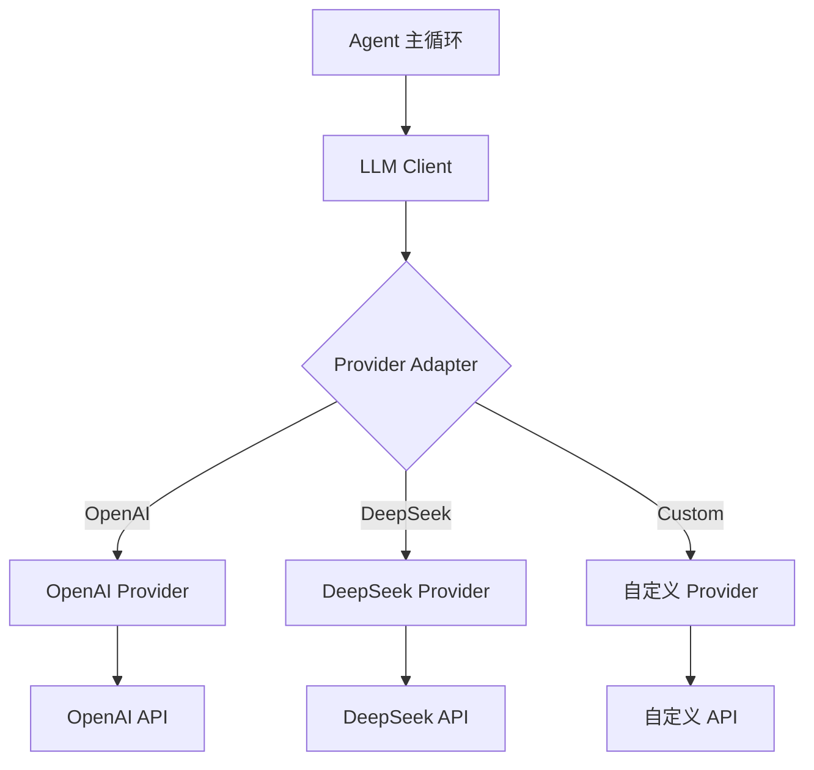
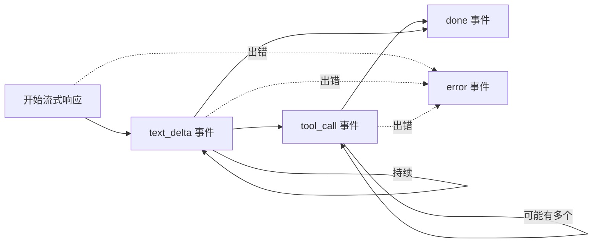
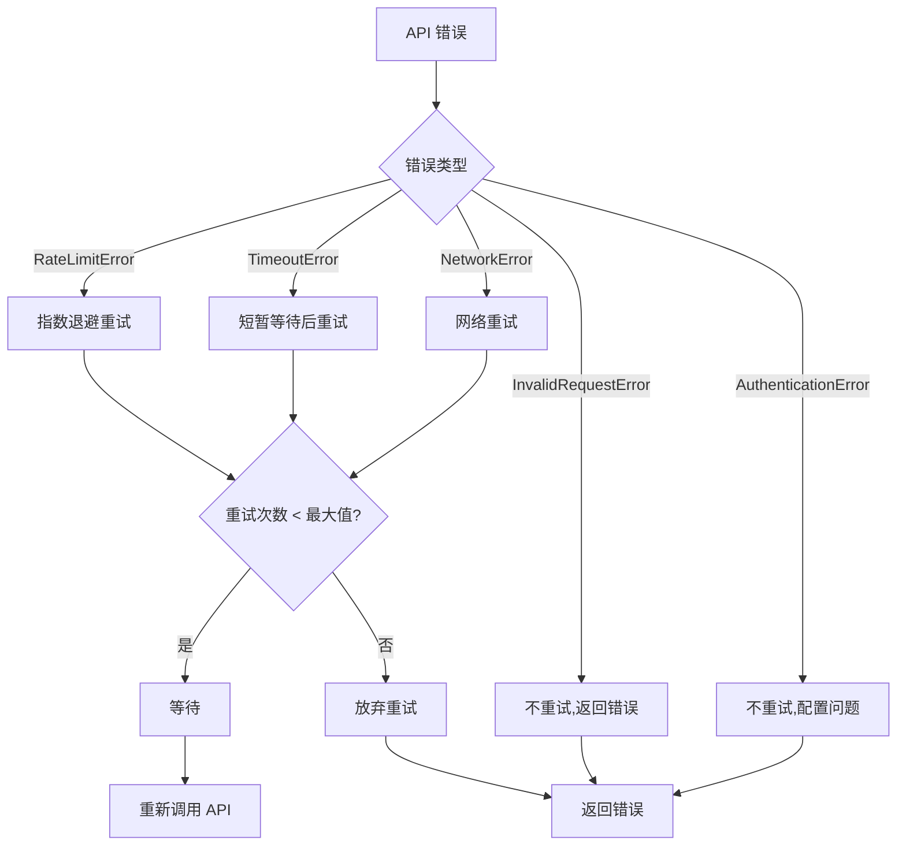
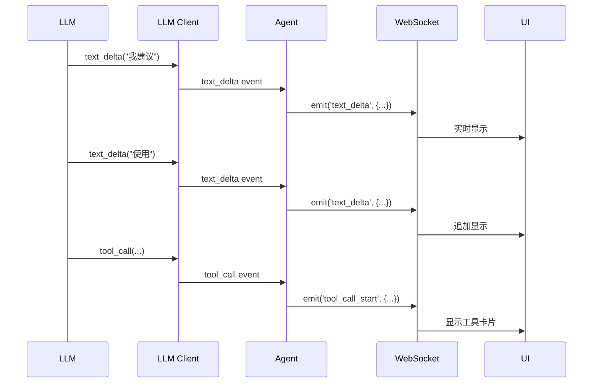

# 06 - LLM 接口层

> LLM Provider 抽象与流式输出处理：统一的 AI 调用接口

---

## 一、设计目标

LLM 接口层是 Agent 与 AI 模型之间的桥梁，负责：
- **统一接口**：屏蔽不同 Provider 的 API 差异
- **流式处理**：实时接收和处理 LLM 输出
- **错误处理**：重试、降级、错误恢复
- **性能优化**：缓存、并发控制

**支持的 Provider**：
- OpenAI（GPT-4, GPT-3.5）
- DeepSeek（DeepSeek-V3）
- 其他兼容 OpenAI API 的服务

---

## 二、架构设计

### 2.1 分层架构



**职责划分**：

| 层次 | 职责 |
|------|------|
| **Agent** | 业务逻辑，不关心 LLM 细节 |
| **LLM Client** | 统一接口、重试、缓存 |
| **Provider Adapter** | 适配具体 API 格式 |
| **Provider API** | 实际的 HTTP 调用 |

---

## 三、核心接口设计

### 3.1 统一的 LLM Client 接口

```python
from typing import AsyncIterator, List, Dict
from dataclasses import dataclass

@dataclass
class Message:
    """统一的消息格式"""
    role: str  # 'user' | 'assistant' | 'system' | 'tool'
    content: str | List[dict]  # 文本或多模态内容
    tool_calls: List[dict] = None  # 工具调用（仅 assistant）
    tool_call_id: str = None  # 工具调用 ID（仅 tool）

@dataclass
class LLMEvent:
    """LLM 流式事件"""
    type: str  # 'text_delta' | 'tool_call' | 'done' | 'error'
    data: dict  # 事件数据

class LLMClient:
    """LLM 客户端统一接口"""
    
    async def chat(
        self,
        messages: List[Message],
        tools: List[dict] = None,
        **kwargs
    ) -> AsyncIterator[LLMEvent]:
        """
        发送聊天请求，流式返回结果
        
        参数:
            messages: 对话历史
            tools: 可用工具列表
            **kwargs: 其他参数（temperature, max_tokens 等）
        
        生成:
            LLMEvent: 流式事件
        """
        raise NotImplementedError
```

### 3.2 事件类型



**事件详解**：

**1. text_delta** - 文本片段
```python
LLMEvent(
    type='text_delta',
    data={
        'text': '我建议',  # 新增的文本
        'index': 0  # 片段索引
    }
)
```

**2. tool_call** - 工具调用
```python
LLMEvent(
    type='tool_call',
    data={
        'id': 'call_abc123',
        'name': 'read_file',
        'arguments': {'path': 'main.py'}  # 已解析为 dict
    }
)
```

**3. done** - 完成
```python
LLMEvent(
    type='done',
    data={
        'stop_reason': 'end_turn',  # 或 'max_tokens', 'tool_calls'
        'usage': {
            'prompt_tokens': 150,
            'completion_tokens': 80,
            'total_tokens': 230
        }
    }
)
```

**4. error** - 错误
```python
LLMEvent(
    type='error',
    data={
        'error': 'RateLimitError',
        'message': 'Rate limit exceeded',
        'retryable': True
    }
)
```

---

## 四、Provider 实现

### 4.1 OpenAI Provider

```python
import openai
from openai import AsyncOpenAI

class OpenAIProvider:
    """OpenAI API Provider"""
    
    def __init__(self, api_key: str, model: str = 'gpt-4'):
        self.client = AsyncOpenAI(api_key=api_key)
        self.model = model
    
    async def chat(
        self,
        messages: List[Message],
        tools: List[dict] = None,
        **kwargs
    ) -> AsyncIterator[LLMEvent]:
        """流式聊天"""
        
        # 转换消息格式
        openai_messages = [
            self._to_openai_message(msg)
            for msg in messages
        ]
        
        # 构建请求参数
        params = {
            'model': self.model,
            'messages': openai_messages,
            'stream': True,
            **kwargs
        }
        
        if tools:
            params['tools'] = tools
            params['tool_choice'] = 'auto'
        
        try:
            # 流式请求
            stream = await self.client.chat.completions.create(**params)
            
            # 解析流式响应
            async for chunk in stream:
                for event in self._parse_chunk(chunk):
                    yield event
        
        except openai.RateLimitError as e:
            yield LLMEvent(
                type='error',
                data={
                    'error': 'RateLimitError',
                    'message': str(e),
                    'retryable': True
                }
            )
        
        except openai.APIError as e:
            yield LLMEvent(
                type='error',
                data={
                    'error': 'APIError',
                    'message': str(e),
                    'retryable': False
                }
            )
    
    def _to_openai_message(self, msg: Message) -> dict:
        """转换为 OpenAI 消息格式"""
        result = {
            'role': msg.role,
            'content': msg.content
        }
        
        if msg.tool_calls:
            result['tool_calls'] = msg.tool_calls
        
        if msg.tool_call_id:
            result['tool_call_id'] = msg.tool_call_id
        
        return result
    
    def _parse_chunk(self, chunk) -> List[LLMEvent]:
        """解析流式响应块"""
        events = []
        
        delta = chunk.choices[0].delta
        
        # 文本增量
        if delta.content:
            events.append(LLMEvent(
                type='text_delta',
                data={'text': delta.content}
            ))
        
        # 工具调用
        if delta.tool_calls:
            for tool_call in delta.tool_calls:
                if tool_call.function:
                    events.append(LLMEvent(
                        type='tool_call',
                        data={
                            'id': tool_call.id,
                            'name': tool_call.function.name,
                            'arguments': json.loads(
                                tool_call.function.arguments
                            )
                        }
                    ))
        
        # 完成
        if chunk.choices[0].finish_reason:
            events.append(LLMEvent(
                type='done',
                data={
                    'stop_reason': chunk.choices[0].finish_reason,
                    'usage': chunk.usage._asdict() if chunk.usage else {}
                }
            ))
        
        return events
```

### 4.2 DeepSeek Provider

```python
class DeepSeekProvider:
    """DeepSeek API Provider（兼容 OpenAI 格式）"""
    
    def __init__(self, api_key: str, model: str = 'deepseek-chat'):
        self.client = AsyncOpenAI(
            api_key=api_key,
            base_url='https://api.deepseek.com'  # DeepSeek 端点
        )
        self.model = model
    
    async def chat(self, messages, tools=None, **kwargs):
        """实现与 OpenAI 相同"""
        # 可以复用 OpenAIProvider 的逻辑
        # 或者针对 DeepSeek 的特性做定制
        pass
```

---

## 五、错误处理与重试

### 5.1 错误分类



### 5.2 重试策略

```python
import asyncio
from typing import Optional

class RetryPolicy:
    """重试策略"""
    
    def __init__(
        self,
        max_retries: int = 3,
        base_delay: float = 1.0,
        max_delay: float = 60.0
    ):
        self.max_retries = max_retries
        self.base_delay = base_delay
        self.max_delay = max_delay
    
    def should_retry(self, error: Exception, attempt: int) -> bool:
        """判断是否应该重试"""
        
        # 超过最大重试次数
        if attempt >= self.max_retries:
            return False
        
        # 可重试的错误类型
        retryable_errors = (
            'RateLimitError',
            'TimeoutError',
            'NetworkError',
            'ServiceUnavailable'
        )
        
        return error.__class__.__name__ in retryable_errors
    
    def get_delay(self, attempt: int) -> float:
        """计算延迟时间（指数退避）"""
        delay = self.base_delay * (2 ** attempt)
        return min(delay, self.max_delay)

class LLMClientWithRetry:
    """带重试的 LLM 客户端"""
    
    def __init__(self, provider, retry_policy: RetryPolicy):
        self.provider = provider
        self.retry_policy = retry_policy
    
    async def chat(self, messages, tools=None, **kwargs):
        """带重试的聊天"""
        attempt = 0
        
        while True:
            try:
                async for event in self.provider.chat(
                    messages, tools, **kwargs
                ):
                    # 检查是否是错误事件
                    if event.type == 'error':
                        error_data = event.data
                        
                        # 判断是否可重试
                        if (error_data.get('retryable') and
                            attempt < self.retry_policy.max_retries):
                            
                            # 计算延迟
                            delay = self.retry_policy.get_delay(attempt)
                            
                            # 记录日志
                            logger.warning(
                                f"LLM 调用失败，{delay}秒后重试 "
                                f"(尝试 {attempt + 1}/{self.retry_policy.max_retries})"
                            )
                            
                            await asyncio.sleep(delay)
                            attempt += 1
                            break  # 跳出 for，重新进入 while
                        else:
                            # 不可重试，直接返回错误
                            yield event
                            return
                    else:
                        # 正常事件，直接 yield
                        yield event
                
                # 成功完成，退出 while
                return
                
            except Exception as e:
                # 捕获意外异常
                if self.retry_policy.should_retry(e, attempt):
                    delay = self.retry_policy.get_delay(attempt)
                    await asyncio.sleep(delay)
                    attempt += 1
                else:
                    yield LLMEvent(
                        type='error',
                        data={
                            'error': e.__class__.__name__,
                            'message': str(e),
                            'retryable': False
                        }
                    )
                    return
```

---

## 六、响应缓存

### 6.1 缓存策略

对于相同的输入，可以缓存 LLM 响应：

```python
import hashlib
import json
from typing import Optional

class LLMCache:
    """LLM 响应缓存"""
    
    def __init__(self, ttl: int = 3600):
        self._cache = {}  # key -> (response, timestamp)
        self.ttl = ttl  # 缓存有效期（秒）
    
    def _compute_key(
        self,
        messages: List[Message],
        tools: List[dict],
        **kwargs
    ) -> str:
        """计算缓存键"""
        # 序列化输入
        cache_input = {
            'messages': [
                {'role': m.role, 'content': m.content}
                for m in messages
            ],
            'tools': tools,
            'params': kwargs
        }
        
        # 计算哈希
        json_str = json.dumps(cache_input, sort_keys=True)
        return hashlib.sha256(json_str.encode()).hexdigest()
    
    def get(self, key: str) -> Optional[List[LLMEvent]]:
        """获取缓存"""
        if key not in self._cache:
            return None
        
        events, timestamp = self._cache[key]
        
        # 检查是否过期
        if time.time() - timestamp > self.ttl:
            del self._cache[key]
            return None
        
        return events
    
    def set(self, key: str, events: List[LLMEvent]):
        """设置缓存"""
        self._cache[key] = (events, time.time())

class CachedLLMClient:
    """带缓存的 LLM 客户端"""
    
    def __init__(self, provider, cache: LLMCache):
        self.provider = provider
        self.cache = cache
    
    async def chat(self, messages, tools=None, **kwargs):
        # 计算缓存键
        cache_key = self.cache._compute_key(messages, tools, **kwargs)
        
        # 检查缓存
        cached = self.cache.get(cache_key)
        if cached:
            logger.info("使用缓存的 LLM 响应")
            for event in cached:
                yield event
            return
        
        # 调用 API 并缓存
        events = []
        async for event in self.provider.chat(messages, tools, **kwargs):
            events.append(event)
            yield event
        
        # 保存到缓存
        self.cache.set(cache_key, events)
```

### 6.2 何时使用缓存

**适合缓存**：
- ✅ 代码分析任务（相同代码，相同问题）
- ✅ 确定性任务（数学计算、格式转换）
- ✅ 重复的查询

**不适合缓存**：
- ❌ 创意生成任务
- ❌ 带随机性的任务（temperature > 0）
- ❌ 时效性强的任务

---

## 七、流式处理优化

### 7.1 流式缓冲

对于工具调用，需要完整解析 JSON 后才能执行：

```python
class StreamBuffer:
    """流式缓冲器"""
    
    def __init__(self):
        self._text_buffer = ""
        self._tool_calls = {}  # id -> partial tool call
    
    def add_text_delta(self, text: str):
        """添加文本片段"""
        self._text_buffer += text
    
    def add_tool_call_delta(self, tool_call_id: str, delta: dict):
        """添加工具调用片段"""
        if tool_call_id not in self._tool_calls:
            self._tool_calls[tool_call_id] = {
                'id': tool_call_id,
                'name': '',
                'arguments': ''
            }
        
        call = self._tool_calls[tool_call_id]
        
        if 'name' in delta:
            call['name'] += delta['name']
        
        if 'arguments' in delta:
            call['arguments'] += delta['arguments']
    
    def get_complete_tool_calls(self) -> List[dict]:
        """获取完整的工具调用"""
        complete = []
        
        for call in self._tool_calls.values():
            # 检查是否完整
            if call['name'] and call['arguments']:
                try:
                    # 解析 JSON
                    args = json.loads(call['arguments'])
                    complete.append({
                        'id': call['id'],
                        'name': call['name'],
                        'arguments': args
                    })
                except json.JSONDecodeError:
                    # JSON 不完整，继续等待
                    pass
        
        return complete
    
    def clear(self):
        """清空缓冲"""
        self._text_buffer = ""
        self._tool_calls.clear()
```

### 7.2 增量推送

实时推送文本增量到 UI：



---

## 八、配置管理

### 8.1 配置文件格式

```yaml
# llm_config.yaml
llm:
  provider: openai  # 或 deepseek
  
  # OpenAI 配置
  openai:
    api_key: ${OPENAI_API_KEY}  # 从环境变量读取
    model: gpt-4
    temperature: 0.7
    max_tokens: 2000
  
  # DeepSeek 配置
  deepseek:
    api_key: ${DEEPSEEK_API_KEY}
    model: deepseek-chat
    temperature: 0.7
    max_tokens: 4000
  
  # 重试配置
  retry:
    max_retries: 3
    base_delay: 1.0
    max_delay: 60.0
  
  # 缓存配置
  cache:
    enabled: true
    ttl: 3600  # 1小时
```

### 8.2 配置加载

```python
import yaml
import os

def load_llm_config(config_path: str = 'llm_config.yaml') -> dict:
    """加载 LLM 配置"""
    
    with open(config_path) as f:
        config = yaml.safe_load(f)
    
    # 解析环境变量
    config = _resolve_env_vars(config)
    
    return config

def _resolve_env_vars(config: dict) -> dict:
    """解析配置中的环境变量"""
    
    if isinstance(config, dict):
        return {
            k: _resolve_env_vars(v)
            for k, v in config.items()
        }
    
    if isinstance(config, str) and config.startswith('${'):
        # 提取环境变量名
        env_var = config[2:-1]  # 去掉 ${ 和 }
        value = os.getenv(env_var)
        
        if value is None:
            raise ValueError(f"环境变量未设置: {env_var}")
        
        return value
    
    return config
```

---

## 九、监控与调试

### 9.1 日志记录

记录 LLM 交互的关键信息：

```python
# 请求日志
logger.info('llm_request', extra={
    'provider': 'openai',
    'model': 'gpt-4',
    'message_count': len(messages),
    'tool_count': len(tools) if tools else 0,
    'input_tokens': estimate_tokens(messages)
})

# 响应日志
logger.info('llm_response', extra={
    'stop_reason': 'end_turn',
    'output_tokens': usage.completion_tokens,
    'total_tokens': usage.total_tokens,
    'duration_ms': duration * 1000
})

# 工具调用日志
logger.info('llm_tool_call', extra={
    'tool_name': tool_call['name'],
    'tool_args': tool_call['arguments']
})
```

### 9.2 性能统计

```python
class LLMMetrics:
    """LLM 性能指标"""
    
    def __init__(self):
        self.total_requests = 0
        self.total_tokens = 0
        self.total_duration = 0.0
        self.error_count = 0
        self.retry_count = 0
    
    def record_request(self, duration: float, tokens: int, success: bool):
        """记录一次请求"""
        self.total_requests += 1
        self.total_tokens += tokens
        self.total_duration += duration
        
        if not success:
            self.error_count += 1
    
    def get_stats(self) -> dict:
        """获取统计信息"""
        return {
            'total_requests': self.total_requests,
            'total_tokens': self.total_tokens,
            'avg_tokens_per_request': (
                self.total_tokens / self.total_requests
                if self.total_requests > 0 else 0
            ),
            'avg_duration': (
                self.total_duration / self.total_requests
                if self.total_requests > 0 else 0
            ),
            'error_rate': (
                self.error_count / self.total_requests
                if self.total_requests > 0 else 0
            ),
            'retry_rate': (
                self.retry_count / self.total_requests
                if self.total_requests > 0 else 0
            )
        }
```

---

## 十、使用示例

### 10.1 基本使用

```python
# 创建 Provider
provider = OpenAIProvider(
    api_key='sk-...',
    model='gpt-4'
)

# 创建客户端（带重试和缓存）
client = CachedLLMClient(
    provider=LLMClientWithRetry(
        provider=provider,
        retry_policy=RetryPolicy(max_retries=3)
    ),
    cache=LLMCache(ttl=3600)
)

# 调用
messages = [
    Message(role='user', content='优化这个函数')
]

tools = [
    {
        "type": "function",
        "function": {
            "name": "read_file",
            "description": "读取文件",
            "parameters": {...}
        }
    }
]

async for event in client.chat(messages, tools):
    if event.type == 'text_delta':
        print(event.data['text'], end='', flush=True)
    
    elif event.type == 'tool_call':
        print(f"\n调用工具: {event.data['name']}")
    
    elif event.type == 'done':
        print(f"\n完成，Token: {event.data['usage']['total_tokens']}")
```

### 10.2 切换 Provider

```python
# 配置多个 Provider
providers = {
    'openai': OpenAIProvider(api_key='...', model='gpt-4'),
    'deepseek': DeepSeekProvider(api_key='...', model='deepseek-chat')
}

# 动态选择
current_provider = providers[config['llm']['provider']]
client = LLMClient(provider=current_provider)
```

---

**上次更新**: 2026-08-28  
**文档版本**: v0.1
