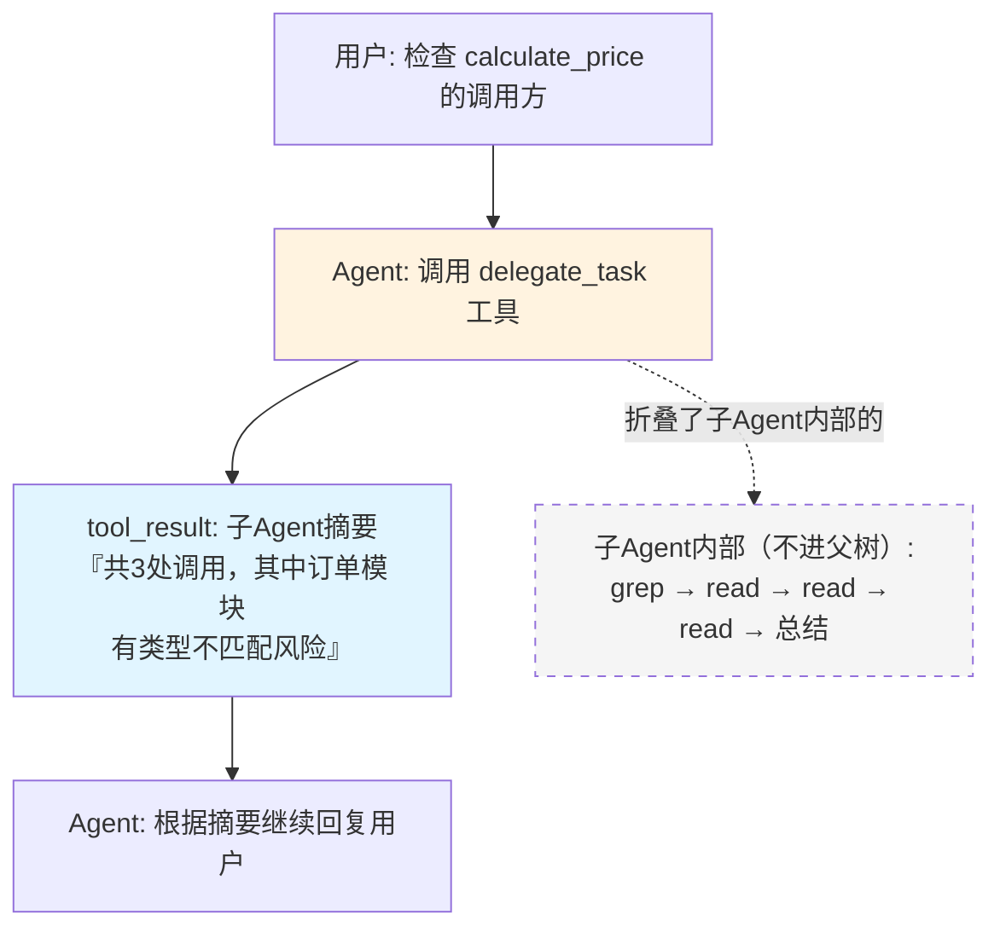
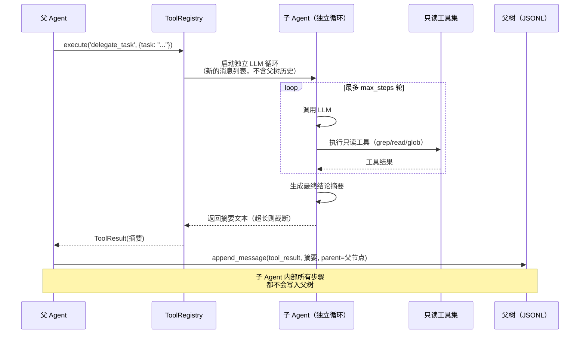

# 15 - 子 Agent 系统

> 委托子任务：开一个独立的大脑去干脏活，只要结果，不要中间过程

---

## 一、为什么要做子 Agent

Agent 主循环适合"我自己一步步查、一步步做"的任务。但有一类任务本质不一样：**任务本身需要大量试错性的中间步骤，而用户只关心最后的结论**。

典型场景：

> "帮我确认一下 `calculate_price` 这个函数还有没有别的地方在调用，调用的地方有没有传错参数类型的风险。"

如果让主 Agent 自己做这件事，它要 `grep` 出所有调用点，一个个 `read_file` 确认上下文，可能还要反复调整搜索模式——这些过程加起来可能是十几条工具调用记录。全部堆进主线的树里，会带来两个问题：

1. **主线上下文被稀释**：用户回头看树形图，看到的是一堆和"当前真正在讨论的事"无关的 grep/read 节点。
2. **Token 浪费**：下一轮对话还要把这些中间过程重新载入上下文，但它们本身不构成决策依据，只有结论有用。

子 Agent 解决的正是这个问题：**开一个独立的、临时的 LLM 循环去处理这类任务，内部走多少步都跟主线无关，只把最后一句结论汇报回来**。

---

## 二、和树形历史 / Lane 的关系：不是替代品，是一种新的节点类型

这是最容易被误解的一点，需要先说清楚：**子 Agent 和 Lane 分支管理解决的是完全不同层面的问题，两者不冲突，而且天然可以组合。**

| | Lane 分支管理 | 子 Agent |
|---|---|---|
| 解决什么问题 | 同一个 Agent，跨多轮对话的记忆怎么分叉保留 | 单次任务怎么委托给独立上下文去做 |
| 生命周期 | 长期存在，用户可见，可随时切换回看 | 短期存在，执行完就结束，只留一条摘要 |
| 对用户的意义 | "我想同时试试方案 A 和方案 B" | "这件琢磨清楚的事交给你去查，别烦我" |

子 Agent 调用在父 Agent 的树上**只占一个节点**：一条 `tool_call(delegate_task)`，紧跟一条 `tool_result(摘要)`。子 Agent 内部走了多少轮、调用了哪些工具，全部折叠在这一个节点里，不会展开到父树的可视化里——这跟调用 `read_file` 在数据结构上没有本质区别，只是这个"工具"内部偷偷跑了一整个独立的 LLM 循环。



**Lane 依然按原设计工作**：如果用户在这条对话线上创建了新分支去探索别的方案，子 Agent 节点也会跟着树的其余部分一起被那个分支继承或分叉，处理方式和其他任何节点完全一致。子 Agent 不需要 Lane 系统做任何特殊适配。

---

## 三、参考依据

判断"子 Agent 值得做、能做多大"，来自对 5 个参考项目源码的直接调研（不是猜测）：

| 项目 | 是否有子 Agent | 关键设计 |
|------|---------------|---------|
| **deepseek-harness** | ✅ 最完整 | 独立包 `tool-subagent`；`maxDepth` 限制递归深度（默认 3）；`toolFilter` 限制子 Agent 可用工具；父 Agent **只拿到子 Agent 的最终 output，看不到中间过程** |
| **opencode-dev** | ✅ 核心内置 | `TaskTool` + 独立 sub-session；前端有专门的子 Agent 状态展示组件，是产品级功能 |
| **pi** | ⚠️ 核心不做，但官方给了扩展示例 | 扩展示例里每个子 Agent 是独立子进程，支持并行（上限 8 个、4 并发），结果截断到 50KB 再返回给父模型 |
| **claw-code** | ⚠️ 弱化版 | 只支持顺序执行多个子 Agent，不支持并发，且是独立辅助工具，不在核心 runtime 里 |
| **claude-code** | ❌ 本仓库无源码 | Task tool 本体闭源，只有 agent persona 的 markdown 定义 |

**结论**：子 Agent 是有真实工程依据的能力，不是凭空造。但完整版（deepseek-harness、opencode-dev 那种独立 session 管理 + 多种运行模式 + 前端专属展示）对工期太重。

**参考归属要分层说清楚，不能笼统说"都参考 dsh"**——三处参考各自对应不同的决策点，且作用在不同层面（隔离规则 / 数据格式 / 并发规模），互不冲突：

| 决策点 | 参考项目 | 具体依据 |
|---|---|---|
| 上下文隔离、深度限制、工具受限、只回结论不回中间过程 | **deepseek-harness** | `tool-subagent` 的 `maxDepth`/`toolFilter`/父 Agent 只拿最终 output，是调研确认过的原始设计 |
| 结果汇报的双通道格式（`content` 给 LLM、`details` 给 UI） | **opencode-dev** | `AgentToolResult{content, details}` 模式 |
| 并发规模与截断策略 | **pi** | 扩展示例的并行上限 8、并发 4、结果截断到 50KB；本项目按工期收缩为并行上限 3 |

这三处参考对应的是三个独立的设计维度，讨论子 Agent 的实现依据时要按维度拆开引用，不能笼统归为"都参考 dsh"。

---

## 四、设计范围：明确简化到什么程度

**做的部分**：

- 子 Agent 作为工具系统里的一个特殊工具注册进来（`delegate_task`），不单独起一套调用协议
- **上下文隔离**：子 Agent 有自己独立的、临时的消息列表，看不到父 Agent 树上的其他分支，只带着任务描述和必要的初始上下文启动
- **深度限制**：`max_depth = 1`——子 Agent 内部不能再派生子子 Agent，避免递归失控，这是能力上的硬限制，不是配置项
- **结果聚合**：子 Agent 结束后只返回一段摘要文本给父 Agent，长度超过阈值（比如 2000 字）会被截断
- **工具受限**：子 Agent 默认只能用只读工具（`read_file` / `glob` / `grep`），不下放 `write_file` / `bash`——把子 Agent 定位成"侦察兵"而不是"执行者"，这样即使无人盯着它跑，风险也天然可控
- **小规模并发**：如果父 Agent 一次派发多个独立子任务，最多同时跑 3 个，用 `asyncio.gather`，超过则排队

**不做的部分**（避免过度设计）：

- 不做 background / continuable 模式（子 Agent 必须同步跑完、返回结果，父 Agent 才能继续）——这是 deepseek-harness 的高级功能，对比赛场景没有必要
- 不做独立的子 Agent 会话持久化（子 Agent 的完整过程可以选择性写入调试日志，但不进入 JSONL 树，重启后不需要恢复子 Agent 的执行状态）
- 不做前端专属的"子 Agent 运行面板"（opencode-dev 那种），子 Agent 调用在树形图里就是一个普通节点，展开可以看到摘要

---

## 五、工具定义

子 Agent 以工具的形式注册，和 `read_file`、`bash` 等工具在同一个 `ToolRegistry` 里，遵循相同的权限检查流程。

```python
{
    "name": "delegate_task",
    "description": (
        "把一个需要多步调查才能有结论的子任务委托给独立的子 Agent 去做。"
        "子 Agent 只能使用只读工具（读文件、搜索），完成后只返回一段结论摘要，"
        "不会把中间过程带回来。适合『帮我确认 XXX』『帮我调查 XXX 有没有问题』这类任务。"
    ),
    "parameters": {
        "type": "object",
        "properties": {
            "task": {
                "type": "string",
                "description": "交给子 Agent 的任务描述，要包含足够的背景信息"
            },
            "max_steps": {
                "type": "integer",
                "description": "子 Agent 最多执行的工具调用轮数，默认 8"
            }
        },
        "required": ["task"]
    },
    "permission_level": "SAFE"
}
```

权限级别为 `SAFE`，因为子 Agent 默认被限制为只读工具集——它本身不会对文件系统或外部环境产生副作用。如果未来需要让子 Agent 具备写权限（当前版本不做），权限级别应升级为对应的 `WRITE`/`DANGEROUS`。

---

## 六、执行流程



**关键点**：

1. 子 Agent 的 LLM 循环和父 Agent 主循环复用**同一套 Agent 主循环实现**，只是初始消息列表不同（不带父树历史，只带任务描述）、工具集不同（只读子集）——不需要为子 Agent 另外写一套执行引擎。
2. 子 Agent 内部产生的所有消息（LLM 输出、工具调用、工具结果）都留在子 Agent 自己的临时消息列表里，循环结束即释放，不落进 `SessionStorage`。
3. 父 Agent 视角里，`delegate_task` 就是一个耗时略长的工具调用，用法和 `read_file` 没有区别。

### 6.1 实现基础：复用 04-Agent主循环 的 MessageProvider 抽象

上面这套流程能落地，前提是主循环从一开始就没有硬编码依赖树形存储——这正是 [04-Agent主循环](04-Agent主循环.md) 4.0 节定的架构决策：主循环只依赖一个抽象的 `MessageProvider` 接口，不直接调用 `SessionStorage`。

`delegate_task` 工具的实现，本质就是"new 一个 `Agent`，传入 `EphemeralMessageProvider`，`depth+1`，跑完拿结果"：

```python
class DelegateTaskTool(Tool):
    permission_level = SAFE  # 只读工具集天然是 SAFE，不触发用户确认

    async def execute(self, args, context: ToolContext):
        if context.depth >= MAX_DEPTH:  # 硬限制 depth=1
            return ToolResult(is_error=True, content="子 Agent 不允许递归派生")

        sub_agent = Agent(
            session_id=context.session_id,          # 仅用于日志标识，不读写树
            config=context.config,
            provider=EphemeralMessageProvider(seed_task=args["task"]),
            depth=context.depth + 1,
        )
        sub_agent.tool_registry = READONLY_TOOL_REGISTRY  # 只读工具集
        result = await sub_agent.run(max_steps=args.get("max_steps", 8))
        return package_result(result)  # 见第七节
```

`depth` 显式作为构造参数传递，不用隐式的线程局部变量或上下文变量——这样即使以后并发跑多个子 Agent，每个任务的 depth 也不会互相污染，深度不依赖调用栈推断，可测试性好。

### 6.2 生命周期：五个阶段，尤其要设计"预算耗尽时"怎么收尾

子 Agent 的生命周期和父 Agent 主循环并列但独立，分五个阶段：

1. **Spawn（派生）**：父循环执行到 `tool_use: delegate_task` 时触发，先过权限检查（SAFE，自动通过，因为工具集本身就是只读的）。构造 depth+1、全新临时消息列表（只种入 task 描述）、只读工具集、`max_steps` 预算。

2. **Running（内循环）**：子 Agent 跑自己的 LLM↔工具循环，和父循环用同一套代码，但完全自包含。这一步产生的中间事件（LLM 输出、工具调用）**要走一个和 JSONL 树完全分开的通道**——可以推给 WebSocket 展示"子 Agent 调查中..."（见第九节的前端协同），也可以选择性写进调试日志文件，但绝对不进父树。这是子 Agent 存在的意义所在，实现时不能图省事直接复用主树的写入路径。

3. **Termination（终止）**，要覆盖四种情况，不能只考虑"正常结束"：
   - **正常结束**：LLM 不再产生 tool_call，自然停止
   - **步数预算耗尽**：不能简单把耗尽时刻的半截文本切下来当结论——更好的做法是耗尽时**强制追加一轮 `tool_choice=none` 的收尾调用**，明确提示"现在给出你的最终结论"，让子 Agent 自己总结，而不是硬切一段可能没说完的话
   - **超时（wall-clock，不只是步数）**：步数预算不能防止单步本身耗时过长（比如一次工具调用卡住），并发场景下尤其需要 `asyncio.wait_for` 包一层超时，否则一个子 Agent 卡死会拖垂整个 `gather`（见第七节）
   - **异常/崩溃**：必须在子 Agent 内部捕获，转换成失败结果返回，不能让未捕获异常往上传播

4. **Result extraction（结果提取）**：见第七节的双通道汇报机制

5. **Cleanup（清理/汇报）**：临时消息列表直接丢弃（或写调试日志），把打包好的摘要作为**唯一一条** `tool_result` 交还父循环，父循环把它 append 成父树上的一个节点。

---

## 七、结果汇报格式与并发处理

### 7.1 双通道汇报：不是甩一段原始文本

如果只把子 Agent 最后一句话原样甩给父 Agent，质量不可控（可能啰嗦、夹杂"我现在要做什么"这类元叙述）。更稳的做法是拆成两条通道（**参考 opencode-dev 的 `AgentToolResult{content, details}` 模式**）：

- **`content`（喂给父 LLM 的）**：纯文本结论，简洁，会占用父 Agent 的上下文 token。建议至少包含 `status`（`completed` / `partial` / `error`）和 `findings`（结论本身）——`status` 让父 LLM 知道这个结论是不是因为预算耗尽而"没查完"，该不该谨慎采信。
- **`details`（只给前端 UI 用，不进父 LLM 上下文）**：轻量元数据，比如用了几次工具、读了哪些文件、耗时多久。这些数字不需要占父 LLM 的 token 去"思考"，纯粹是给人看的（对应第六节的前端子 Agent 状态卡片）。

```python
def package_result(result: LoopResult) -> ToolResult:
    summary = result.final_text[:SUMMARY_LIMIT]      # 截断策略参考 pi
    return ToolResult(
        content=f"[{result.status}] {summary}",           # 给父 LLM
        details={"tool_calls": result.step_count,          # 给前端 UI
                  "files_touched": result.touched_paths},
    )
```

### 7.2 并发处理：两层并发要分清，异常隔离是关键陷阱

**第一层**：父循环对单个子 Agent 是同步阻塞的——发出 `delegate_task` 后等它跑完才继续，不做 background/continuable（dsh 有这个高级模式，本项目明确不做，见第八节）。

**第二层**：同一轮父消息里如果并行派了多个独立子任务，才是真并发，**并发规模参考 pi 的扩展示例（原始上限 8、并发 4，本项目按工期收缩为上限 3）**：

```python
async def run_parallel(tasks: list[str], depth: int) -> list[ToolResult]:
    semaphore = asyncio.Semaphore(3)   # 并行上限，参考 pi 但收缩规模

    async def run_one(task: str):
        async with semaphore:
            try:
                return await asyncio.wait_for(
                    DelegateTaskTool().execute({"task": task}, ...),
                    timeout=120,  # wall-clock 兜底，步数预算防不住单步卡死
                )
            except Exception as e:
                return ToolResult(is_error=True, content=str(e))

    return await asyncio.gather(*(run_one(t) for t in tasks))
    # 注意：每个协程内部已经 try/except 兜底，
    # 不能依赖 gather(return_exceptions=True) ——
    # 默认行为下一个任务抛异常会取消其他还在跑的协程，这是常见的坑
```

几个容易漏的细节：

- **异常隔离必须在每个协程内部做**，不能指望 `gather` 的 `return_exceptions=True`，理由见上面代码注释——建议专门写一个"其中一个子任务故意抛异常"的测试用例。
- **权限系统在并发场景下反而更省心**：子 Agent 只读工具天然 SAFE，不会触发用户确认弹窗——否则 3 个子 Agent 同时弹 3 个确认框，UI 很难处理。这是"子 Agent 默认只读"这个约束除了安全性外，额外带来的并发友好性好处。
- **文件系统读取不需要加锁**：没有写工具，多个子 Agent 并发读天然无冲突。
- **落回父树时必须等所有并发子任务全部结束，一次性打包成一条合成消息写进树**——直接呼应 [02-树形对话历史系统](../02-数据与存储层/02-树形对话历史系统.md) 2.2 节"并行工具调用不能产生菱形节点"的规则：3 个并行 `delegate_task` 的 3 个 `tool_result`，必须打包成 1 个节点，不能各自单独 append 出 3 个子节点。
- **前端事件要带 `subagent_id` 标签**：并发跑 3 个子 Agent 时，事件流要能区分是哪个子任务在报告进度，否则前端没法同时渲染多张独立的状态卡片。

---

## 八、和权限系统的关系

子 Agent 内部的每一次工具调用，仍然要经过和父 Agent **同一个** `PermissionManager` 实例。也就是说：

- 子 Agent 默认只有只读工具，天然落在 SAFE 级别，不会触发用户确认
- 如果之后放开子 Agent 的工具权限（比如允许它调用 `bash`），那次调用依然会按正常的 DANGEROUS 规则弹出用户确认——**不能因为套了一层子 Agent 就绕开权限检查**，这是设计上的硬约束，不因为调用方是子 Agent 而特殊处理

这一点直接呼应 [09-权限控制系统](../04-支撑模块/09-权限控制系统.md) 里"权限与工具绑定"的设计：权限检查发生在工具执行入口，谁调用不影响判断逻辑。

---

## 九、实现优先级

子 Agent 定位为**第三个亮点，但排在树形历史和 Lane 之后**，按最小可行版本先做通，再考虑并发：

| 阶段 | 内容 | 优先级 |
|------|------|--------|
| 最小版本 | 单个子 Agent、只读工具、同步等待结果、结果截断 | P1 |
| 加分版本 | 多个独立子任务并行派发（上限 3 个） | P2 |
| 不做 | background/continuable 模式、子 Agent 持久化会话、递归子 Agent、前端专属展示面板 | 放弃 |

如果按 [14-技术决策与取舍](../06-项目管理/14-技术决策与取舍.md) 第六节的砍功能顺序，子 Agent 的并行版本（P2）应该排在"Lane 分支对比可视化"之后、"日志实时推送"之前被优先砍掉——最小版本（单个、只读、同步）本身实现量不大（复用现有 Agent 主循环 + 工具系统 + 权限系统，只是多注册一个工具），值得保留。

---


**文档版本**: v0.2
**上次更新**: 2026-08-29
**变更说明**: 补充 6.1 实现基础（复用 04-Agent主循环 的 MessageProvider 抽象，含 DelegateTaskTool 代码示例）；补充 6.2 五阶段生命周期（尤其步数耗尽时的强制收尾轮、超时与异常处理）；新增第七节"结果汇报格式与并发处理"（双通道汇报机制 + 并发的信号量/超时/异常隔离具体写法）；原第七、八、九节顺延为第八、九、十节；第三节补充参考归属拆分表格，明确隔离机制/汇报格式/并发规模分别对应 dsh/opencode-dev/pi 三个来源。
**关联文档**: [实现难点-以dsh为参考](../../草稿/实现难点-以dsh为参考.md)、[04-Agent主循环](04-Agent主循环.md)、[02-树形对话历史系统](../02-数据与存储层/02-树形对话历史系统.md)、[09-权限控制系统](../04-支撑模块/09-权限控制系统.md)
