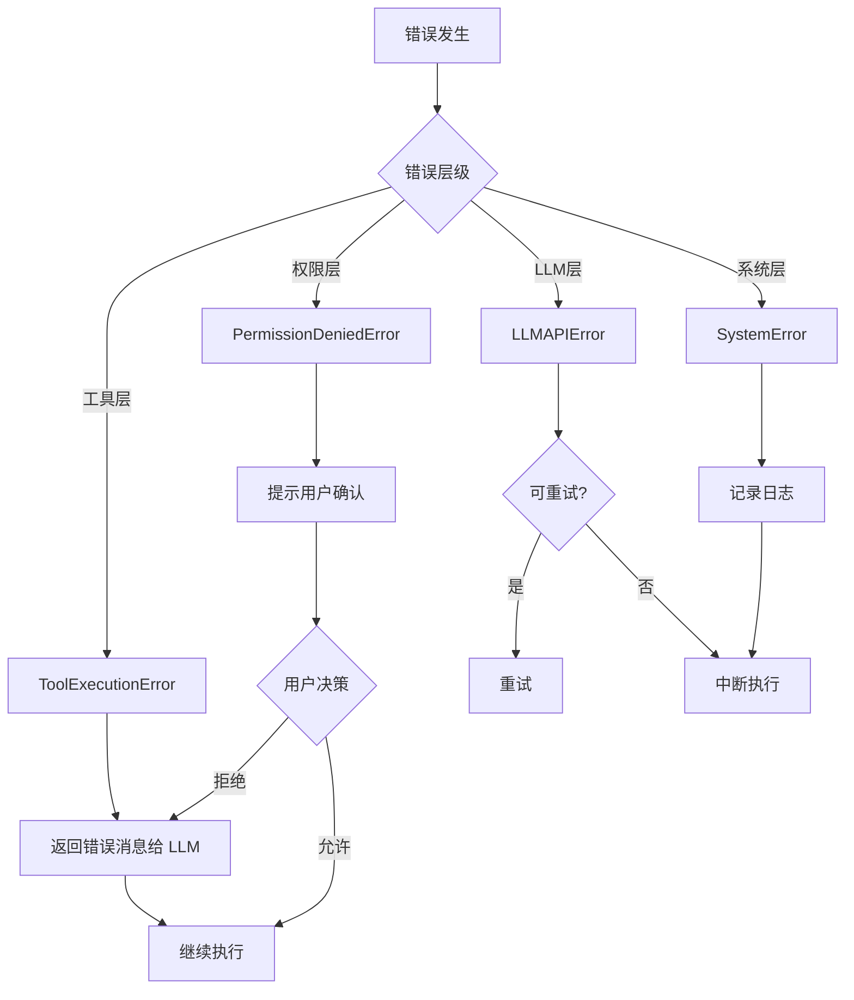
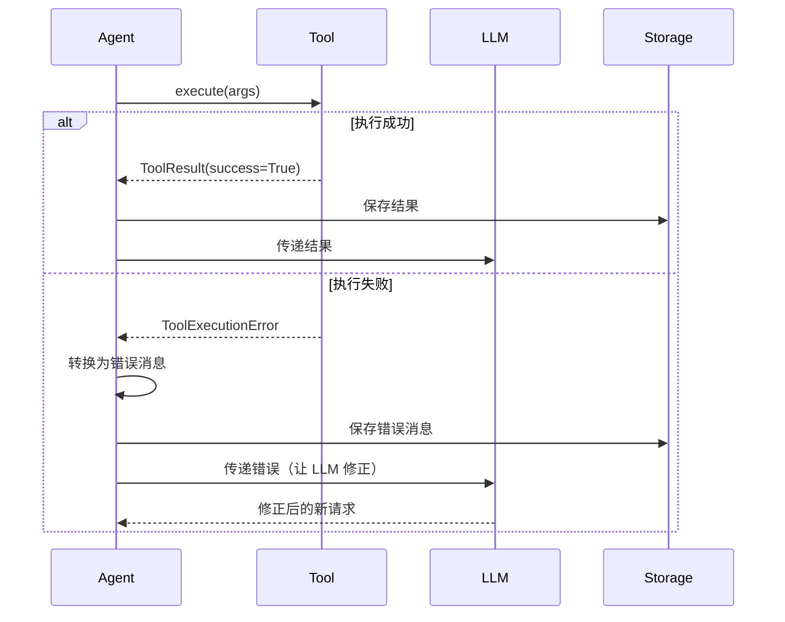
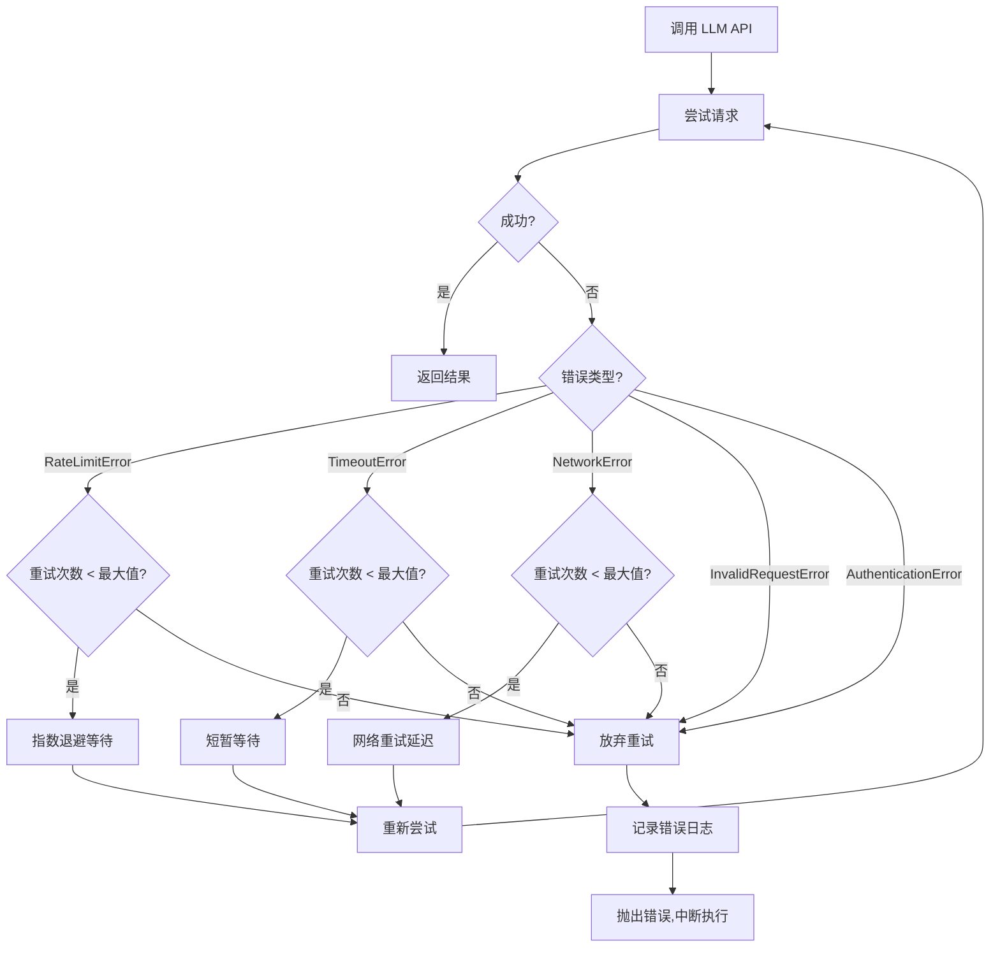

# 08 - 错误处理机制

> Result 类型与错误恢复策略：让 Agent 优雅地处理错误

---

## 一、设计目标

错误处理是 Agent 完整性的关键，需要：
- **明确的错误边界**：哪些错误继续，哪些中断
- **友好的错误传递**：工具错误返回给 LLM，让它自我修正
- **完整的错误信息**：记录详细日志，方便调试
- **优雅的降级**：部分失败不影响整体

**核心原则**：
- **工具错误不中断**：作为消息返回给 LLM
- **API 错误可重试**：rate_limit 等错误自动重试
- **系统错误要中断**：记录日志，返回错误给用户

---

## 二、错误分类体系

### 2.1 错误层次



### 2.2 错误分类表

| 错误类型 | 处理策略 | 是否中断 | 示例 |
|---------|---------|---------|------|
| **工具执行错误** | 返回错误消息给 LLM | ❌ 否 | 文件不存在、命令失败 |
| **权限拒绝错误** | 提示用户或返回错误 | ❌ 否 | 用户拒绝危险操作 |
| **参数验证错误** | 返回错误消息给 LLM | ❌ 否 | 参数类型错误 |
| **LLM API 错误** | 重试或中断 | ⚠️ 视情况 | rate_limit, timeout |
| **系统错误** | 记录日志并中断 | ✅ 是 | 内存不足、磁盘满 |

---

## 三、Result 类型设计

### 3.1 Result 类型模式

借鉴 Rust 的 Result 类型，提供类型安全的错误处理：

```python
from typing import TypeVar, Generic, Union
from dataclasses import dataclass

T = TypeVar('T')  # 成功值的类型
E = TypeVar('E')  # 错误值的类型

@dataclass
class Ok(Generic[T]):
    """成功结果"""
    value: T
    
    @property
    def is_ok(self) -> bool:
        return True
    
    @property
    def is_err(self) -> bool:
        return False
    
    def unwrap(self) -> T:
        """获取成功值"""
        return self.value
    
    def unwrap_or(self, default: T) -> T:
        """获取值或默认值"""
        return self.value

@dataclass
class Err(Generic[E]):
    """错误结果"""
    error: E
    
    @property
    def is_ok(self) -> bool:
        return False
    
    @property
    def is_err(self) -> bool:
        return True
    
    def unwrap(self):
        """尝试获取值（会抛异常）"""
        raise ValueError(f"Called unwrap on an Err: {self.error}")
    
    def unwrap_or(self, default):
        """获取值或默认值"""
        return default

# Result 类型别名
Result = Union[Ok[T], Err[E]]
```

### 3.2 使用示例

```python
def read_file(path: str) -> Result[str, str]:
    """读取文件"""
    try:
        with open(path, 'r') as f:
            content = f.read()
        return Ok(content)
    except FileNotFoundError:
        return Err(f"文件不存在: {path}")
    except PermissionError:
        return Err(f"无权限读取: {path}")

# 使用
result = read_file('test.txt')

if result.is_ok:
    print(f"内容: {result.unwrap()}")
else:
    print(f"错误: {result.error}")

# 或者使用 match（Python 3.10+）
match result:
    case Ok(content):
        print(f"内容: {content}")
    case Err(error):
        print(f"错误: {error}")
```

---

## 四、错误类定义

### 4.1 基础错误类

```python
from dataclasses import dataclass
from typing import Optional, List

@dataclass
class AgentError(Exception):
    """Agent 基础错误类"""
    message: str
    code: str
    details: dict = None
    suggestions: List[str] = None
    
    def __str__(self):
        return self.message

@dataclass
class ToolExecutionError(AgentError):
    """工具执行错误"""
    tool_name: str
    tool_args: dict
    
    def to_llm_message(self) -> str:
        """转换为返回给 LLM 的消息"""
        msg = f"工具 {self.tool_name} 执行失败: {self.message}"
        
        if self.suggestions:
            msg += "\n\n建议:"
            for i, suggestion in enumerate(self.suggestions, 1):
                msg += f"\n  {i}. {suggestion}"
        
        return msg

@dataclass
class PermissionDeniedError(AgentError):
    """权限拒绝错误"""
    tool_name: str
    permission_level: str
    reason: str

@dataclass
class ValidationError(AgentError):
    """参数验证错误"""
    tool_name: str
    validation_errors: List[str]

@dataclass
class LLMAPIError(AgentError):
    """LLM API 错误"""
    provider: str
    retryable: bool
    retry_after: Optional[int] = None  # 秒数

@dataclass
class SystemError(AgentError):
    """系统错误"""
    source: str  # 错误来源（文件、模块等）
    traceback: str  # 完整堆栈
```

### 4.2 错误转换

```python
def convert_exception_to_error(e: Exception) -> AgentError:
    """将标准异常转换为 AgentError"""
    
    if isinstance(e, FileNotFoundError):
        return ToolExecutionError(
            message=str(e),
            code='FILE_NOT_FOUND',
            tool_name='read_file',
            tool_args={},
            suggestions=[
                "检查文件路径拼写",
                "使用 glob 工具查找文件",
                "使用 bash 工具列出目录"
            ]
        )
    
    elif isinstance(e, PermissionError):
        return ToolExecutionError(
            message=str(e),
            code='PERMISSION_DENIED',
            tool_name='unknown',
            tool_args={},
            suggestions=[
                "检查文件权限",
                "以管理员权限运行"
            ]
        )
    
    elif isinstance(e, TimeoutError):
        return LLMAPIError(
            message="请求超时",
            code='TIMEOUT',
            provider='unknown',
            retryable=True
        )
    
    else:
        # 未知错误
        return SystemError(
            message=str(e),
            code='UNKNOWN_ERROR',
            source=e.__class__.__name__,
            traceback=traceback.format_exc()
        )
```

---

## 五、错误处理流程

### 5.1 工具执行错误处理



**实现代码**：

```python
async def execute_tool_with_error_handling(
    tool_name: str,
    args: dict
) -> Message:
    """执行工具并处理错误"""
    
    try:
        # 执行工具
        result = await tool_registry.execute(tool_name, args)
        
        # 成功
        return Message(
            role='tool',
            tool_call_id=tool_call_id,
            content=result.content
        )
    
    except ToolExecutionError as e:
        # 工具执行错误：转换为消息返回给 LLM
        logger.warning(
            'tool_execution_failed',
            tool=tool_name,
            error=str(e)
        )
        
        return Message(
            role='tool',
            tool_call_id=tool_call_id,
            content=e.to_llm_message(),
            is_error=True  # 标记为错误
        )
    
    except PermissionDeniedError as e:
        # 权限错误：同样返回给 LLM
        logger.info(
            'permission_denied',
            tool=tool_name,
            reason=e.reason
        )
        
        return Message(
            role='tool',
            tool_call_id=tool_call_id,
            content=f"权限不足: {e.reason}\n\n"
                   f"此操作需要用户确认。",
            is_error=True
        )
    
    except Exception as e:
        # 意外错误：记录详细信息
        logger.error(
            'tool_unexpected_error',
            tool=tool_name,
            error=str(e),
            traceback=traceback.format_exc()
        )
        
        return Message(
            role='tool',
            tool_call_id=tool_call_id,
            content=f"执行出错: {str(e)}",
            is_error=True
        )
```

### 5.2 LLM API 错误处理



**实现代码**：

```python
async def call_llm_with_retry(
    messages: List[Message],
    tools: List[dict],
    max_retries: int = 3
) -> AsyncIterator[LLMEvent]:
    """带重试的 LLM 调用"""
    
    attempt = 0
    
    while attempt <= max_retries:
        try:
            async for event in llm_client.chat(messages, tools):
                yield event
            
            # 成功完成
            return
        
        except LLMAPIError as e:
            if not e.retryable or attempt >= max_retries:
                # 不可重试或达到最大次数
                logger.error(
                    'llm_api_failed',
                    provider=e.provider,
                    error=e.message,
                    attempt=attempt
                )
                raise
            
            # 计算延迟
            delay = min(2 ** attempt, 60)  # 最多等待 60 秒
            
            logger.warning(
                'llm_api_retry',
                provider=e.provider,
                error=e.message,
                attempt=attempt,
                delay=delay
            )
            
            await asyncio.sleep(delay)
            attempt += 1
        
        except Exception as e:
            # 意外错误
            logger.error(
                'llm_unexpected_error',
                error=str(e),
                traceback=traceback.format_exc()
            )
            raise SystemError(
                message=f"LLM 调用失败: {str(e)}",
                code='LLM_ERROR',
                source='llm_client',
                traceback=traceback.format_exc()
            )
```

---

## 六、错误恢复策略

### 6.1 工具错误的 LLM 自我修正

LLM 看到工具错误后，可以尝试修正：

```
用户: 读取 main.py 文件

Agent: read_file(path="main.py")
→ 错误: 文件不存在: main.py
  建议:
    1. 检查路径拼写
    2. 使用 glob 工具查找: glob(pattern="**/*.py")

Agent (自我修正):
  "看起来文件路径不对，让我先搜索一下..."
  glob(pattern="**/*.py")
  
→ 找到: src/main.py

Agent:
  "找到了，应该是 src/main.py"
  read_file(path="src/main.py")
  
→ 成功读取
```

### 6.2 状态回滚

某些情况下需要回滚状态：

```python
class Agent:
    async def run_with_rollback(self, user_message: str) -> RunResult:
        """带回滚的执行"""
        
        # 保存当前状态
        checkpoint = self._create_checkpoint()
        
        try:
            # 执行
            result = await self.run(user_message)
            return result
        
        except SystemError as e:
            # 系统错误：回滚状态
            logger.error('run_failed_rollback', error=str(e))
            self._restore_checkpoint(checkpoint)
            
            return RunResult(
                status='error',
                error=str(e)
            )
    
    def _create_checkpoint(self) -> dict:
        """创建检查点"""
        return {
            'lane': self.current_lane,
            'leaf_id': self.lane_manager.get_lane(self.current_lane).leaf_id
        }
    
    def _restore_checkpoint(self, checkpoint: dict):
        """恢复到检查点"""
        self.current_lane = checkpoint['lane']
        # 注意：不修改历史，只是回到某个状态
```

---

## 七、错误日志记录

### 7.1 结构化错误日志

```python
def log_error(error: AgentError, context: dict = None):
    """记录错误日志"""
    
    log_data = {
        'timestamp': datetime.now().isoformat(),
        'level': 'ERROR',
        'event': 'error_occurred',
        'error_type': error.__class__.__name__,
        'error_code': error.code,
        'error_message': error.message
    }
    
    # 添加错误详情
    if hasattr(error, 'tool_name'):
        log_data['tool_name'] = error.tool_name
    
    if hasattr(error, 'traceback'):
        log_data['traceback'] = error.traceback
    
    # 添加上下文
    if context:
        log_data['context'] = context
    
    # 写入日志文件
    with open('logs/errors.jsonl', 'a') as f:
        f.write(json.dumps(log_data, ensure_ascii=False) + '\n')
    
    # 同时打印到控制台（开发模式）
    if config.DEBUG:
        print(f"❌ 错误: {error.message}")
        if error.suggestions:
            print("   建议:")
            for s in error.suggestions:
                print(f"     - {s}")
```

### 7.2 错误统计

```python
class ErrorMetrics:
    """错误统计"""
    
    def __init__(self):
        self.error_counts = defaultdict(int)  # error_code -> count
        self.last_errors = []  # 最近 10 个错误
    
    def record_error(self, error: AgentError):
        """记录错误"""
        self.error_counts[error.code] += 1
        
        # 保留最近 10 个
        self.last_errors.append({
            'timestamp': datetime.now().isoformat(),
            'code': error.code,
            'message': error.message
        })
        
        if len(self.last_errors) > 10:
            self.last_errors.pop(0)
    
    def get_stats(self) -> dict:
        """获取统计信息"""
        total = sum(self.error_counts.values())
        
        return {
            'total_errors': total,
            'error_breakdown': dict(self.error_counts),
            'top_errors': sorted(
                self.error_counts.items(),
                key=lambda x: x[1],
                reverse=True
            )[:5],
            'recent_errors': self.last_errors
        }
```

---

## 八、用户友好的错误提示

### 8.1 错误消息格式

```python
def format_user_error(error: AgentError) -> str:
    """格式化用户友好的错误消息"""
    
    # 基本消息
    msg = f"❌ {error.message}"
    
    # 添加详情（如果有）
    if error.details:
        msg += "\n\n详情:"
        for key, value in error.details.items():
            msg += f"\n  • {key}: {value}"
    
    # 添加建议（如果有）
    if error.suggestions:
        msg += "\n\n💡 建议:"
        for i, suggestion in enumerate(error.suggestions, 1):
            msg += f"\n  {i}. {suggestion}"
    
    return msg
```

**示例输出**：

```
❌ 文件不存在: src/main.py

详情:
  • 尝试的路径: src/main.py
  • 工作目录: /home/user/project

💡 建议:
  1. 检查路径拼写是否正确
  2. 使用 glob 工具查找文件: glob(pattern="**/*.py")
  3. 使用 bash 工具列出目录: bash(command="ls -la src/")
```

### 8.2 Web UI 错误展示

```typescript
// ErrorToast.tsx
interface ErrorToastProps {
  error: {
    message: string
    code: string
    suggestions?: string[]
  }
}

const ErrorToast = ({ error }: ErrorToastProps) => {
  return (
    <Toast variant="error">
      <ToastHeader>
        <AlertCircle className="h-5 w-5" />
        <ToastTitle>执行失败</ToastTitle>
      </ToastHeader>
      
      <ToastDescription>
        {error.message}
      </ToastDescription>
      
      {error.suggestions && (
        <div className="mt-3">
          <p className="text-sm font-medium">建议操作:</p>
          <ul className="mt-2 space-y-1">
            {error.suggestions.map((s, i) => (
              <li key={i} className="text-sm">
                • {s}
              </li>
            ))}
          </ul>
        </div>
      )}
      
      <ToastAction altText="关闭">关闭</ToastAction>
    </Toast>
  )
}
```

---

## 九、测试错误处理

### 9.1 单元测试

```python
@pytest.mark.asyncio
async def test_tool_error_handling():
    """测试工具错误处理"""
    
    # 模拟工具错误
    with patch('tool_registry.execute') as mock_execute:
        mock_execute.side_effect = ToolExecutionError(
            message="文件不存在",
            code="FILE_NOT_FOUND",
            tool_name="read_file",
            tool_args={"path": "test.txt"},
            suggestions=["检查路径"]
        )
        
        # 执行
        message = await execute_tool_with_error_handling(
            "read_file",
            {"path": "test.txt"}
        )
        
        # 验证：错误被转换为消息
        assert message.role == 'tool'
        assert message.is_error
        assert "文件不存在" in message.content
        assert "建议" in message.content

@pytest.mark.asyncio
async def test_llm_retry():
    """测试 LLM 重试"""
    
    # 模拟两次失败，第三次成功
    call_count = 0
    
    async def mock_chat(*args, **kwargs):
        nonlocal call_count
        call_count += 1
        
        if call_count < 3:
            raise LLMAPIError(
                message="Rate limit",
                code="RATE_LIMIT",
                provider="openai",
                retryable=True
            )
        else:
            yield LLMEvent(type='done', data={})
    
    with patch('llm_client.chat', mock_chat):
        # 执行
        events = []
        async for event in call_llm_with_retry([], []):
            events.append(event)
        
        # 验证：重试了 2 次，第 3 次成功
        assert call_count == 3
        assert len(events) == 1
        assert events[0].type == 'done'
```

---

## 十、最佳实践

### 10.1 错误处理原则

**DO（应该做）**：
- ✅ 明确区分可恢复和不可恢复的错误
- ✅ 提供有用的错误消息和建议
- ✅ 记录详细的错误日志
- ✅ 让 LLM 看到工具错误并自我修正

**DON'T（不应该做）**：
- ❌ 吞掉错误（silent fail）
- ❌ 用通用异常掩盖具体错误
- ❌ 在循环中无限重试
- ❌ 向用户展示堆栈信息

### 10.2 错误预防

**在工具层**：
- 参数验证（类型、范围、格式）
- 路径安全检查
- 资源限制（文件大小、超时）

**在 Agent 层**：
- 上下文窗口管理（避免 Token 溢出）
- 迭代次数限制（避免死循环）
- 权限预检查

**在 LLM 层**：
- 请求频率控制
- 超时设置
- 降级策略（主 API 失败切换备用）

---

**上次更新**: 2026-08-28  
**文档版本**: v0.1
