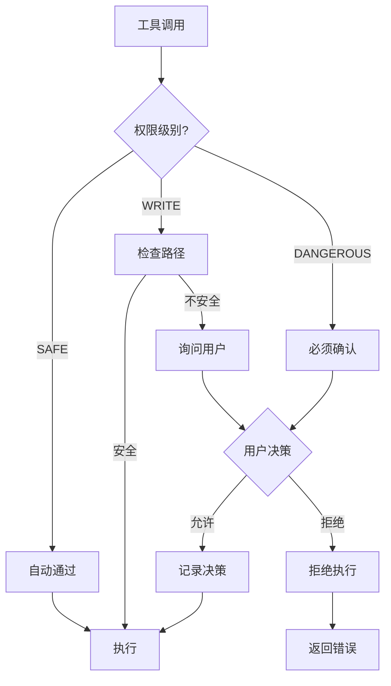
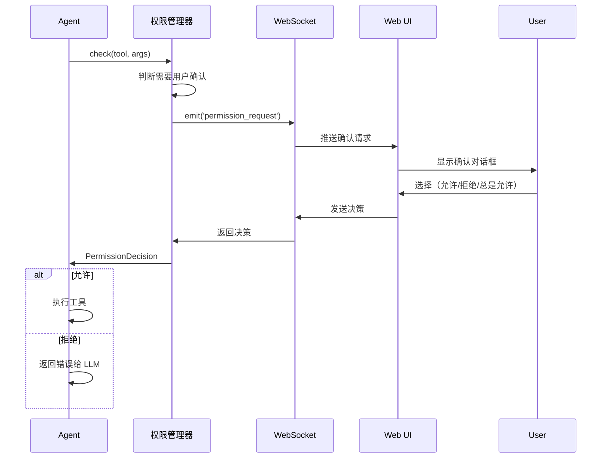

# 09 - 权限控制系统

> 3 级权限模型与用户确认流程：安全地执行工具操作

---

## 一、设计目标

权限控制系统保证 Agent 的操作在安全边界内：
- **分级控制**：根据操作风险分级（SAFE/WRITE/DANGEROUS）
- **用户确认**：危险操作需要用户明确同意
- **审计追踪**：记录所有权限决策
- **灵活配置**：支持自动批准规则

**核心原则**：
- **默认安全**：不确定的操作需要确认
- **最小权限**：只授予必需的权限
- **透明可控**：用户清楚知道 Agent 在做什么

---

## 二、权限分级体系

### 2.1 三级权限模型



### 2.2 权限级别定义

```python
from enum import Enum

class PermissionLevel(Enum):
    """权限级别"""
    
    SAFE = "safe"           # 安全操作（只读）
    WRITE = "write"         # 写入操作（修改文件）
    DANGEROUS = "dangerous" # 危险操作（执行命令）

# 工具权限映射
TOOL_PERMISSIONS = {
    # SAFE 级别：只读操作，自动通过
    'read_file': PermissionLevel.SAFE,
    'glob': PermissionLevel.SAFE,
    'grep': PermissionLevel.SAFE,
    
    # WRITE 级别：文件写入，需要路径检查
    'write_file': PermissionLevel.WRITE,
    'edit_file': PermissionLevel.WRITE,
    
    # DANGEROUS 级别：命令执行，必须确认
    'bash': PermissionLevel.DANGEROUS,
}
```

### 2.3 权限检查矩阵

| 工具 | 权限级别 | 自动通过 | 需要确认 | 额外检查 |
|------|---------|---------|---------|---------|
| **read_file** | SAFE | ✅ | ❌ | - |
| **glob** | SAFE | ✅ | ❌ | - |
| **grep** | SAFE | ✅ | ❌ | - |
| **write_file** | WRITE | ⚠️ | 路径在工作目录外 | 路径合法性 |
| **edit_file** | WRITE | ⚠️ | 路径在工作目录外 | 路径合法性 |
| **bash** | DANGEROUS | ❌ | ✅ 总是 | 敏感命令检测 |

---

## 三、权限管理器设计

### 3.1 核心类：PermissionManager

```python
from dataclasses import dataclass
from typing import Optional, Set, Callable
import os

@dataclass
class PermissionDecision:
    """权限决策结果"""
    allowed: bool           # 是否允许
    reason: str            # 原因
    user_confirmed: bool = False  # 是否用户确认
    auto_approved: bool = False   # 是否自动批准

class PermissionManager:
    """权限管理器"""
    
    def __init__(self, workspace: str, config: dict = None):
        """
        初始化权限管理器
        
        参数:
            workspace: 工作目录（安全边界）
            config: 配置（自动批准规则等）
        """
        self.workspace = os.path.abspath(workspace)
        self.config = config or {}
        
        # 自动批准的操作
        self.auto_approved: Set[str] = set()
        
        # 用户拒绝的操作
        self.denied: Set[str] = set()
        
        # 用户确认回调（在 Web UI 中实现）
        self.ask_user_callback: Optional[Callable] = None
    
    async def check(
        self,
        tool_name: str,
        args: dict
    ) -> PermissionDecision:
        """
        检查工具调用权限
        
        参数:
            tool_name: 工具名称
            args: 工具参数
        
        返回:
            PermissionDecision: 权限决策
        """
        
        # 获取工具权限级别
        level = TOOL_PERMISSIONS.get(tool_name, PermissionLevel.DANGEROUS)
        
        # 生成操作指纹（用于记忆用户决策）
        fingerprint = self._compute_fingerprint(tool_name, args)
        
        # 检查是否已被拒绝
        if fingerprint in self.denied:
            return PermissionDecision(
                allowed=False,
                reason="用户之前拒绝了此操作"
            )
        
        # 检查是否已自动批准
        if fingerprint in self.auto_approved:
            return PermissionDecision(
                allowed=True,
                reason="自动批准（用户之前允许）",
                auto_approved=True
            )
        
        # 根据权限级别检查
        if level == PermissionLevel.SAFE:
            return await self._check_safe(tool_name, args)
        
        elif level == PermissionLevel.WRITE:
            return await self._check_write(tool_name, args)
        
        elif level == PermissionLevel.DANGEROUS:
            return await self._check_dangerous(tool_name, args, fingerprint)
    
    async def _check_safe(self, tool_name: str, args: dict) -> PermissionDecision:
        """检查 SAFE 级别操作"""
        return PermissionDecision(
            allowed=True,
            reason="只读操作，自动允许",
            auto_approved=True
        )
    
    async def _check_write(self, tool_name: str, args: dict) -> PermissionDecision:
        """检查 WRITE 级别操作"""
        
        # 获取文件路径
        path = args.get('path', '')
        
        if not path:
            return PermissionDecision(
                allowed=False,
                reason="未提供文件路径"
            )
        
        # 检查路径是否在工作目录内
        abs_path = os.path.abspath(path)
        
        if not abs_path.startswith(self.workspace):
            # 路径在工作目录外，需要用户确认
            return await self._ask_user(
                tool_name=tool_name,
                args=args,
                risk_level="中等",
                warning=f"将写入工作目录外的文件: {path}"
            )
        
        # 检查是否是系统关键路径
        dangerous_patterns = [
            '/etc/', '/sys/', '/proc/',
            '~/.ssh/', '~/.bashrc', '~/.bash_profile'
        ]
        
        for pattern in dangerous_patterns:
            if pattern in path:
                return PermissionDecision(
                    allowed=False,
                    reason=f"不允许写入系统关键路径: {path}"
                )
        
        # 通过检查
        return PermissionDecision(
            allowed=True,
            reason="路径在工作目录内",
            auto_approved=True
        )
    
    async def _check_dangerous(
        self,
        tool_name: str,
        args: dict,
        fingerprint: str
    ) -> PermissionDecision:
        """检查 DANGEROUS 级别操作"""
        
        command = args.get('command', '')
        
        # 检查敏感命令
        dangerous_commands = [
            'rm -rf /',
            'mkfs',
            ':(){ :|:& };:',  # fork 炸弹
            'dd if=/dev/zero',
            'chmod -R 777'
        ]
        
        for dangerous in dangerous_commands:
            if dangerous in command:
                return PermissionDecision(
                    allowed=False,
                    reason=f"检测到危险命令: {dangerous}"
                )
        
        # 必须用户确认
        return await self._ask_user(
            tool_name=tool_name,
            args=args,
            risk_level="高",
            warning="此操作将执行 shell 命令",
            fingerprint=fingerprint
        )
    
    async def _ask_user(
        self,
        tool_name: str,
        args: dict,
        risk_level: str,
        warning: str,
        fingerprint: str = None
    ) -> PermissionDecision:
        """询问用户"""
        
        if not self.ask_user_callback:
            # 没有回调，默认拒绝
            return PermissionDecision(
                allowed=False,
                reason="需要用户确认但未配置确认机制"
            )
        
        # 调用回调（在 Web UI 中弹出确认对话框）
        response = await self.ask_user_callback({
            'tool_name': tool_name,
            'args': args,
            'risk_level': risk_level,
            'warning': warning
        })
        
        # 处理用户响应
        if response['action'] == 'allow_once':
            return PermissionDecision(
                allowed=True,
                reason="用户允许（本次）",
                user_confirmed=True
            )
        
        elif response['action'] == 'allow_always':
            # 记住决策
            if fingerprint:
                self.auto_approved.add(fingerprint)
            
            return PermissionDecision(
                allowed=True,
                reason="用户允许（总是）",
                user_confirmed=True,
                auto_approved=True
            )
        
        else:  # deny
            # 记住拒绝
            if fingerprint:
                self.denied.add(fingerprint)
            
            return PermissionDecision(
                allowed=False,
                reason="用户拒绝"
            )
    
    def _compute_fingerprint(self, tool_name: str, args: dict) -> str:
        """计算操作指纹"""
        # 简化版：tool_name + 关键参数
        key_args = {}
        
        if 'path' in args:
            key_args['path'] = args['path']
        
        if 'command' in args:
            # 命令只取前 50 个字符（避免参数不同被视为不同操作）
            key_args['command'] = args['command'][:50]
        
        fingerprint_str = f"{tool_name}:{json.dumps(key_args, sort_keys=True)}"
        return hashlib.md5(fingerprint_str.encode()).hexdigest()
    
    def reset(self):
        """重置所有决策记录"""
        self.auto_approved.clear()
        self.denied.clear()
```

---

## 四、权限确认流程

### 4.1 Web UI 确认对话框



### 4.2 前端对话框实现

```typescript
// PermissionDialog.tsx
interface PermissionRequest {
  requestId: string
  toolName: string
  args: Record<string, any>
  riskLevel: 'low' | 'medium' | 'high'
  warning: string
}

const PermissionDialog = () => {
  const [request, setRequest] = useState<PermissionRequest | null>(null)
  
  useEffect(() => {
    // 监听权限请求
    socket.on('permission_request', (data: PermissionRequest) => {
      setRequest(data)
    })
  }, [])
  
  const handleResponse = (action: 'allow_once' | 'allow_always' | 'deny') => {
    socket.emit('permission_response', {
      requestId: request.requestId,
      action
    })
    setRequest(null)
  }
  
  if (!request) return null
  
  return (
    <Dialog open={!!request} onOpenChange={() => setRequest(null)}>
      <DialogContent>
        <DialogHeader>
          <AlertTriangle 
            className={cn(
              'h-6 w-6',
              request.riskLevel === 'high' && 'text-red-500',
              request.riskLevel === 'medium' && 'text-yellow-500',
              request.riskLevel === 'low' && 'text-blue-500'
            )}
          />
          <DialogTitle>权限确认</DialogTitle>
          <DialogDescription>
            Agent 请求执行以下操作，是否允许？
          </DialogDescription>
        </DialogHeader>
        
        <div className="space-y-4">
          <div>
            <Label>工具</Label>
            <code className="text-sm">{request.toolName}</code>
          </div>
          
          <div>
            <Label>参数</Label>
            <pre className="text-xs bg-gray-100 p-2 rounded overflow-x-auto">
              {JSON.stringify(request.args, null, 2)}
            </pre>
          </div>
          
          <Alert variant={
            request.riskLevel === 'high' ? 'destructive' : 'default'
          }>
            <AlertDescription>{request.warning}</AlertDescription>
          </Alert>
          
          <div className="flex items-center space-x-2">
            <InfoIcon className="h-4 w-4 text-gray-500" />
            <span className="text-xs text-gray-600">
              选择"总是允许"将记住此决策，不再询问
            </span>
          </div>
        </div>
        
        <DialogFooter>
          <Button
            variant="outline"
            onClick={() => handleResponse('deny')}
          >
            拒绝
          </Button>
          
          <Button
            variant="secondary"
            onClick={() => handleResponse('allow_once')}
          >
            仅本次允许
          </Button>
          
          <Button
            variant="default"
            onClick={() => handleResponse('allow_always')}
          >
            总是允许
          </Button>
        </DialogFooter>
      </DialogContent>
    </Dialog>
  )
}
```

---

## 五、路径安全检查

### 5.1 路径遍历攻击防护

```python
def is_safe_path(path: str, workspace: str) -> bool:
    """
    检查路径是否安全（防止路径遍历攻击）
    
    示例攻击:
        path = "../../etc/passwd"  # 尝试访问系统文件
        path = "/etc/passwd"        # 绝对路径攻击
    """
    
    # 规范化路径（解析 .. 等）
    abs_path = os.path.abspath(os.path.join(workspace, path))
    abs_workspace = os.path.abspath(workspace)
    
    # 检查是否在工作目录内
    return abs_path.startswith(abs_workspace)

# 使用示例
workspace = "/home/user/project"

is_safe_path("src/main.py", workspace)  # ✅ True
is_safe_path("../other/file.py", workspace)  # ❌ False
is_safe_path("/etc/passwd", workspace)  # ❌ False
is_safe_path("../../etc/passwd", workspace)  # ❌ False
```

### 5.2 黑名单路径

```python
# 系统关键路径（不允许写入）
SYSTEM_CRITICAL_PATHS = [
    '/etc/',
    '/sys/',
    '/proc/',
    '/boot/',
    '/dev/',
    
    # 用户敏感文件
    '~/.ssh/',
    '~/.bashrc',
    '~/.bash_profile',
    '~/.zshrc',
    '~/.gitconfig',
    
    # 应用配置
    '/etc/passwd',
    '/etc/shadow',
    '/etc/sudoers'
]

def is_system_path(path: str) -> bool:
    """检查是否是系统关键路径"""
    expanded = os.path.expanduser(path)
    
    for critical in SYSTEM_CRITICAL_PATHS:
        if expanded.startswith(os.path.expanduser(critical)):
            return True
    
    return False
```

---

## 六、命令安全检查

### 6.1 危险命令检测

```python
# 危险命令模式
DANGEROUS_COMMANDS = [
    # 删除操作
    r'rm\s+-rf\s+/',
    r'rm\s+-rf\s+\*',
    
    # 格式化
    r'mkfs',
    r'dd\s+if=/dev/zero',
    
    # Fork 炸弹
    r':\(\)\{.*:\|:&.*\};:',
    
    # 权限修改
    r'chmod\s+-R\s+777',
    r'chown\s+-R',
    
    # 网络攻击
    r':(){ :|:& };:',
    
    # 系统关机
    r'shutdown',
    r'reboot',
    r'halt'
]

import re

def is_dangerous_command(command: str) -> tuple[bool, str]:
    """
    检查命令是否危险
    
    返回: (是否危险, 匹配的模式)
    """
    for pattern in DANGEROUS_COMMANDS:
        if re.search(pattern, command):
            return True, pattern
    
    return False, ""

# 使用示例
is_dangerous_command("ls -la")  # (False, "")
is_dangerous_command("rm -rf /")  # (True, "rm\\s+-rf\\s+/")
```

### 6.2 命令白名单（可选）

对于生产环境，可以使用白名单模式：

```python
# 允许的命令（仅示例）
ALLOWED_COMMANDS = [
    'ls', 'cat', 'grep', 'find',
    'python', 'node', 'npm',
    'git', 'pytest', 'npm test'
]

def is_allowed_command(command: str) -> bool:
    """检查命令是否在白名单中"""
    # 提取命令名（第一个词）
    cmd_name = command.split()[0] if command else ""
    
    return cmd_name in ALLOWED_COMMANDS
```

---

## 七、审计日志

### 7.1 记录权限决策

```python
def log_permission_decision(
    tool_name: str,
    args: dict,
    decision: PermissionDecision,
    user_id: str = None
):
    """记录权限决策"""
    
    log_entry = {
        'timestamp': datetime.now().isoformat(),
        'event': 'permission_decision',
        'tool': tool_name,
        'args': args,
        'allowed': decision.allowed,
        'reason': decision.reason,
        'user_confirmed': decision.user_confirmed,
        'auto_approved': decision.auto_approved
    }
    
    if user_id:
        log_entry['user_id'] = user_id
    
    # 写入审计日志
    with open('logs/permissions.jsonl', 'a') as f:
        f.write(json.dumps(log_entry, ensure_ascii=False) + '\n')
```

### 7.2 审计报告

```python
def generate_permission_report(session_id: str) -> dict:
    """生成权限审计报告"""
    
    decisions = []
    
    # 读取日志
    with open('logs/permissions.jsonl') as f:
        for line in f:
            entry = json.loads(line)
            decisions.append(entry)
    
    # 统计
    total = len(decisions)
    allowed = sum(1 for d in decisions if d['allowed'])
    denied = total - allowed
    user_confirmed = sum(1 for d in decisions if d['user_confirmed'])
    
    return {
        'session_id': session_id,
        'total_decisions': total,
        'allowed': allowed,
        'denied': denied,
        'user_confirmed': user_confirmed,
        'auto_approved': sum(1 for d in decisions if d['auto_approved']),
        
        # 工具使用统计
        'tool_breakdown': {
            tool: sum(1 for d in decisions if d['tool'] == tool)
            for tool in set(d['tool'] for d in decisions)
        },
        
        # 最近的拒绝
        'recent_denials': [
            d for d in decisions
            if not d['allowed']
        ][-10:]
    }
```

---

## 八、配置管理

### 8.1 权限配置文件

```yaml
# permissions.yaml
permissions:
  # 工作目录（安全边界）
  workspace: /home/user/project
  
  # 默认策略
  default_policy: strict  # strict | moderate | permissive
  
  # 自动批准规则
  auto_approve:
    # 读取操作总是允许
    - level: SAFE
      always: true
    
    # 写入工作目录内的文件自动允许
    - level: WRITE
      condition: "path.startswith(workspace)"
      always: true
  
  # 黑名单路径
  blacklist_paths:
    - /etc/
    - /sys/
    - ~/.ssh/
  
  # 危险命令检测
  dangerous_commands:
    enabled: true
    patterns:
      - "rm -rf /"
      - "mkfs"
  
  # 审计日志
  audit:
    enabled: true
    log_file: logs/permissions.jsonl
```

### 8.2 策略模式

```python
class PermissionPolicy:
    """权限策略"""
    
    STRICT = {
        'safe_auto_approve': True,
        'write_auto_approve': False,  # 总是询问
        'dangerous_auto_approve': False
    }
    
    MODERATE = {
        'safe_auto_approve': True,
        'write_auto_approve': True,   # 工作目录内自动允许
        'dangerous_auto_approve': False
    }
    
    PERMISSIVE = {
        'safe_auto_approve': True,
        'write_auto_approve': True,
        'dangerous_auto_approve': True  # 危险操作也自动允许（不推荐）
    }

# 使用
policy = PermissionPolicy.MODERATE
manager = PermissionManager(workspace, config={'policy': policy})
```

---

## 九、测试

### 9.1 单元测试

```python
@pytest.mark.asyncio
async def test_safe_permission():
    """测试 SAFE 级别自动通过"""
    manager = PermissionManager(workspace="/test")
    
    decision = await manager.check('read_file', {'path': 'test.txt'})
    
    assert decision.allowed
    assert decision.auto_approved

@pytest.mark.asyncio
async def test_write_outside_workspace():
    """测试写入工作目录外需要确认"""
    manager = PermissionManager(workspace="/home/user/project")
    
    # 模拟用户确认
    async def mock_ask_user(request):
        return {'action': 'allow_once'}
    
    manager.ask_user_callback = mock_ask_user
    
    decision = await manager.check(
        'write_file',
        {'path': '/tmp/test.txt'}
    )
    
    assert decision.allowed
    assert decision.user_confirmed

@pytest.mark.asyncio
async def test_dangerous_command_blocked():
    """测试危险命令被阻止"""
    manager = PermissionManager(workspace="/test")
    
    decision = await manager.check(
        'bash',
        {'command': 'rm -rf /'}
    )
    
    assert not decision.allowed
    assert "危险命令" in decision.reason
```

---

## 十、最佳实践

### 10.1 安全原则

**DO（应该做）**：
- ✅ 最小权限原则：只授予必需权限
- ✅ 透明原则：让用户知道 Agent 在做什么
- ✅ 审计原则：记录所有权限决策
- ✅ 纵深防御：多层安全检查

**DON'T（不应该做）**：
- ❌ 不要跳过权限检查
- ❌ 不要在生产环境使用 permissive 策略
- ❌ 不要信任用户输入的路径
- ❌ 不要自动批准危险操作

### 10.2 用户体验平衡

权限控制要在安全和体验之间平衡：

**过于严格**：
- 频繁弹窗，用户体验差
- 用户可能盲目点"允许"

**过于宽松**：
- 安全风险高
- 可能造成数据损失

**推荐策略**：
- 开发环境：moderate 策略（工作目录内自动允许）
- 生产环境：strict 策略（谨慎对待所有写操作）
- 演示环境：可以预先配置自动批准规则

---

**上次更新**: 2026-08-28  
**文档版本**: v0.1
