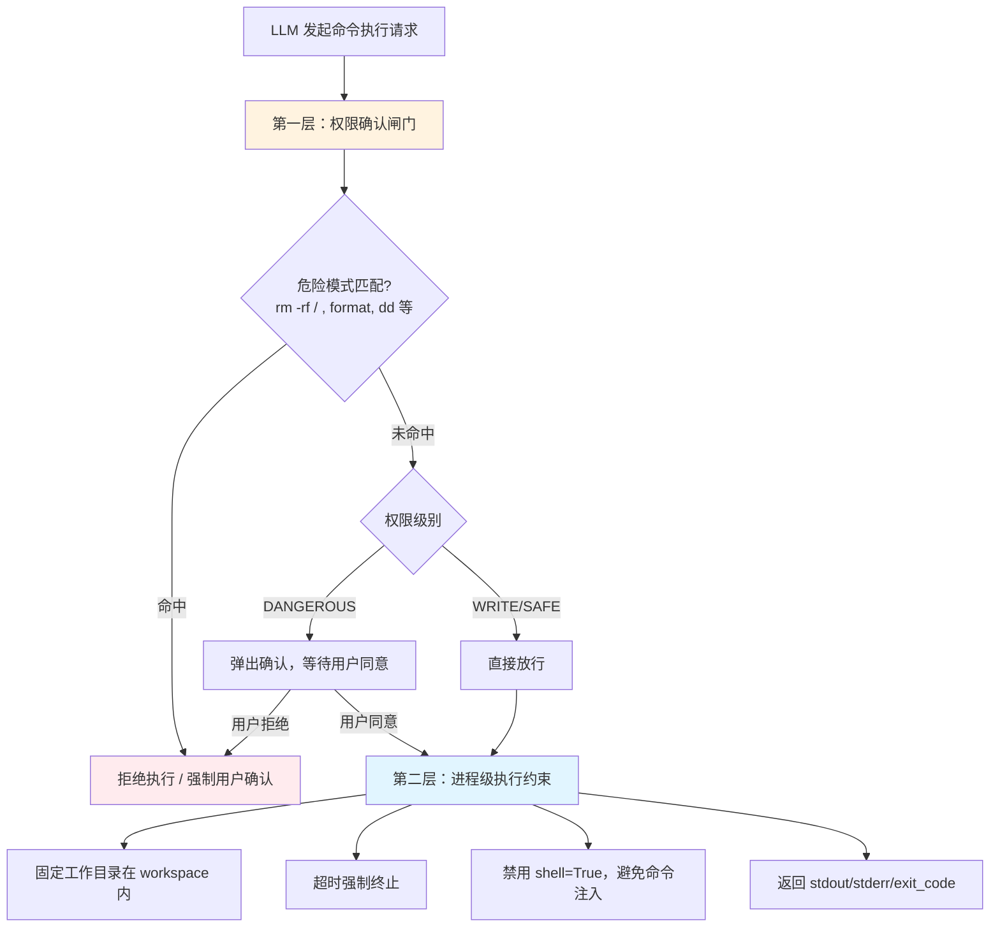
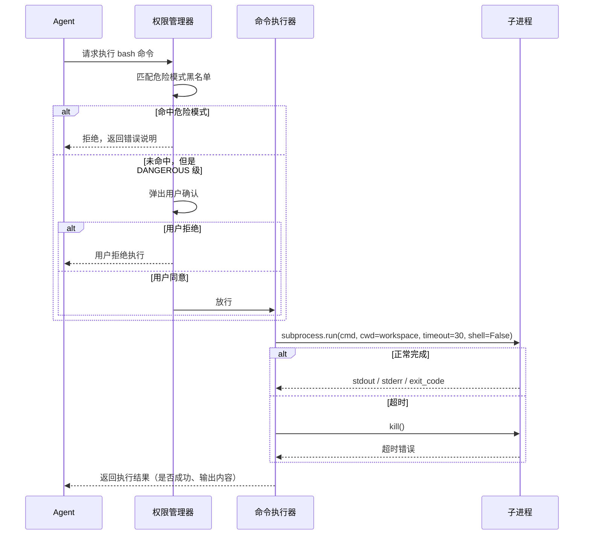

# 10 - 沙箱隔离

> 风险集中在哪，防线就设在哪：进程级约束 + 权限确认，不做容器化

---

## 一、先想清楚：风险到底在哪

"沙箱隔离"听起来像是要给所有工具加一层保护，但实际上先要回答一个问题：**核心工具里，哪个工具真的能伤到主机？**

逐个看一遍：

| 工具 | 风险类型 | 是否需要"隔离" |
|------|---------|----------------|
| read_file / write_file | 路径穿越（读写到 workspace 外，比如 `../../etc/passwd`） | ❌ 不需要，靠**路径校验**解决，这是输入验证，不是隔离 |
| 联网搜索 | 提示词注入（网页内容里混入"忽略之前指令"之类的文本） | ❌ 隔离解决不了这个问题，只能靠输出标记不可信 + 后续危险操作仍需确认兜底 |
| 执行命令/脚本 | 真正的破坏性操作：删文件、装东西、耗尽资源、外传数据 | ✅ **唯一需要重点防护的工具** |

结论很直接：不是"每个工具都要沙箱"，而是**风险从始至终只集中在 exec 类工具上**。文件读写靠路径校验，联网搜索靠内容标记和确认闸门,只有命令执行需要专门的执行环境防护。

**风险来源也要想清楚**：不是"防止恶意用户"——这是单人在自己机器上跑自己的 Agent，完成自己交给它的任务，威胁模型和 claude-code、claw-code 这类要防护大量陌生用户的产品完全不同。真正的风险来源是**LLM 自己判断失误**，或者被上一步读到的文件/网页内容误导，执行了破坏性命令。防护的目标是"兜住意外"，不是"防坏人"。

---

## 二、两层防线，都不依赖容器



**第一层：权限确认闸门**（详见 [09-权限控制系统](09-权限控制系统.md)）

命令执行统一归为 DANGEROUS 级别,执行前必须经过用户确认；确认之前先做一次危险命令模式匹配（黑名单：`rm -rf /`、`format`、`mkfs`、`dd if=`、反引号/管道到 `sh` 等常见破坏性模式），命中直接拒绝,不给用户"确认"的机会。

**第二层：执行时约束**（工具实现细节，不是独立模块）

命令真正执行时，用最基本的 `subprocess` 手段加约束：

- **固定工作目录**：`cwd` 锁定在 workspace 根目录，不允许命令自己 `cd` 出去外面的路径体现在文件读写权限上
- **超时终止**：设置合理超时（比如 30 秒），超时直接 `kill`，防止命令卡死或故意长跑耗资源
- **禁用 `shell=True`**：命令通过参数列表传递而不是拼接字符串交给 shell 解释，避免命令注入风险
- **capture 输出**：`stdout`/`stderr` 分别捕获，返回给 LLM 而不是直接打印到终端

这两层加起来，已经能覆盖"LLM 犯错"和"被注入误导"两类主要场景，而且总共只是几十行代码,不需要一个专门的"沙箱模块"。

---

## 三、执行流程



---

## 四、为什么不做 Docker 容器化

这是一个**主动放弃**的决定，不是能力不足。理由分三点：

**1. 风险场景不匹配**

Docker 隔离解决的是"执行完全不可信的第三方代码"这类场景（比如在线代码评测平台、多租户 SaaS）。而这里的威胁模型是"自己的 Agent 在自己的机器上，偶尔判断失误",权限确认闸门 + 进程约束已经能覆盖绝大多数意外场景，容器隔离防护的是一个发生概率很低的极端情况。

**2. 引入的不确定性比它解决的风险更大**

Windows 开发环境下接入 Docker，意味着新增 Docker Desktop / WSL2 依赖。这类依赖在演示录像、评委现场跑起来这些场景下,反而会变成新的失败点——容器起不来、镜像没预热好、演示卡在拉镜像上,这些问题比"万一命令跑飞"更可能真的发生。

**3. 性价比不成立**

真正做到位的容器加固（`cap_drop`、`seccomp`、`no-new-privileges`、网络命名空间隔离）本身工程量不小,而单人 6 天项目里，这部分时间投入到树形历史和 Lane 分支管理（本项目的核心差异化能力）上收益远高于把沙箱做到生产级。

**结论**：沙箱隔离在设计上保留"未来可以接入容器隔离"的可能性（执行器接口不和 subprocess 强绑定），但本项目**不实现、不依赖** Docker。

---

## 五、命令执行器的简化实现

```python
import subprocess

def run_command(command: list[str], workspace: str, timeout: int = 30) -> dict:
    """
    在进程级约束下执行命令
    调用前必须已经过权限确认闸门（危险模式匹配 + 用户确认）
    """
    try:
        result = subprocess.run(
            command,           # 参数列表，不是字符串 —— 避免 shell 注入
            cwd=workspace,      # 固定工作目录
            timeout=timeout,    # 超时终止
            shell=False,
            capture_output=True,
            text=True,
        )
        return {
            "stdout": result.stdout,
            "stderr": result.stderr,
            "exit_code": result.returncode,
            "timed_out": False,
        }
    except subprocess.TimeoutExpired:
        return {
            "stdout": "",
            "stderr": f"命令超时（{timeout}秒），已终止",
            "exit_code": -1,
            "timed_out": True,
        }
```

这就是执行层的全部核心逻辑。危险模式匹配和用户确认在权限模块里完成（见 [09-权限控制系统](09-权限控制系统.md)），这里只负责"已经放行的命令，怎么执行得安全一点"。

---

## 六、如果未来要扩展到容器隔离

不在本次范围内实现，但设计上预留了扩展路径：命令执行器对外只暴露 `run_command(command, workspace, timeout) -> dict` 这一个接口，内部实现可以从 `subprocess` 替换成 Docker SDK 调用而不影响调用方（Agent 主循环、工具系统）。这体现的是接口和实现分离的设计意识，而不是真的需要现在做。

---

**上次更新**: 2026-08-28
**文档版本**: v0.2 — 移除 Docker 主方案，改为进程约束 + 权限闸门两层防线
