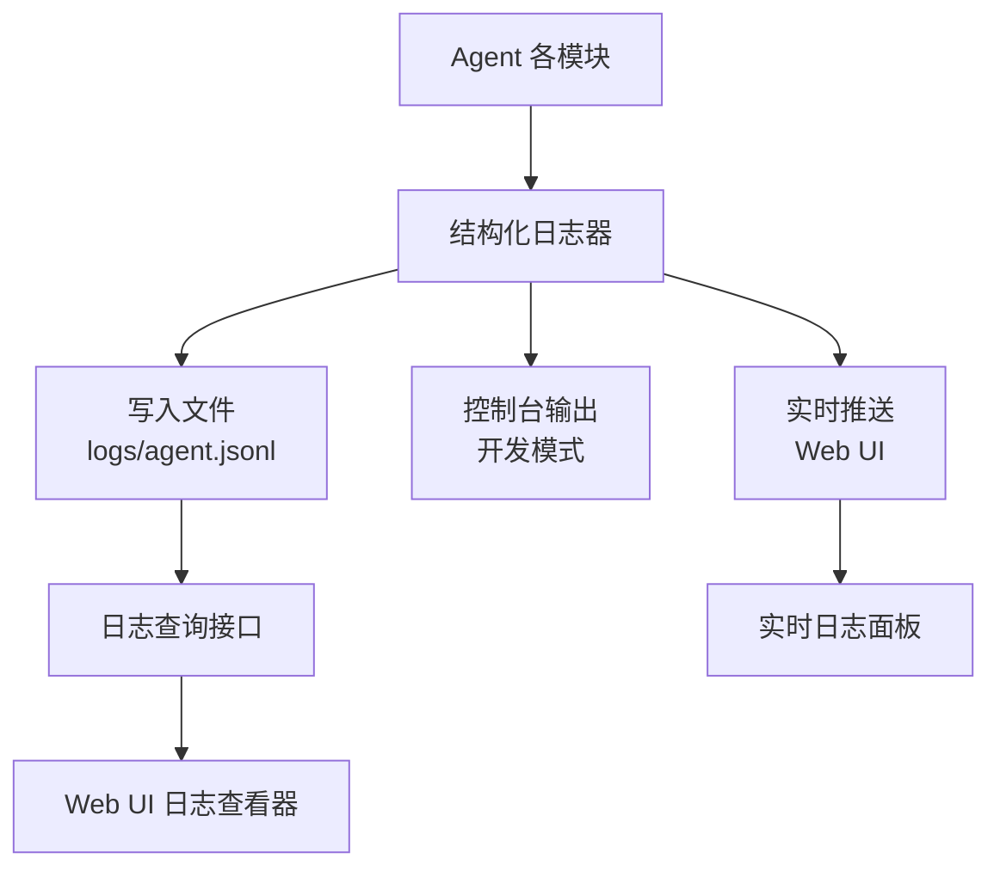
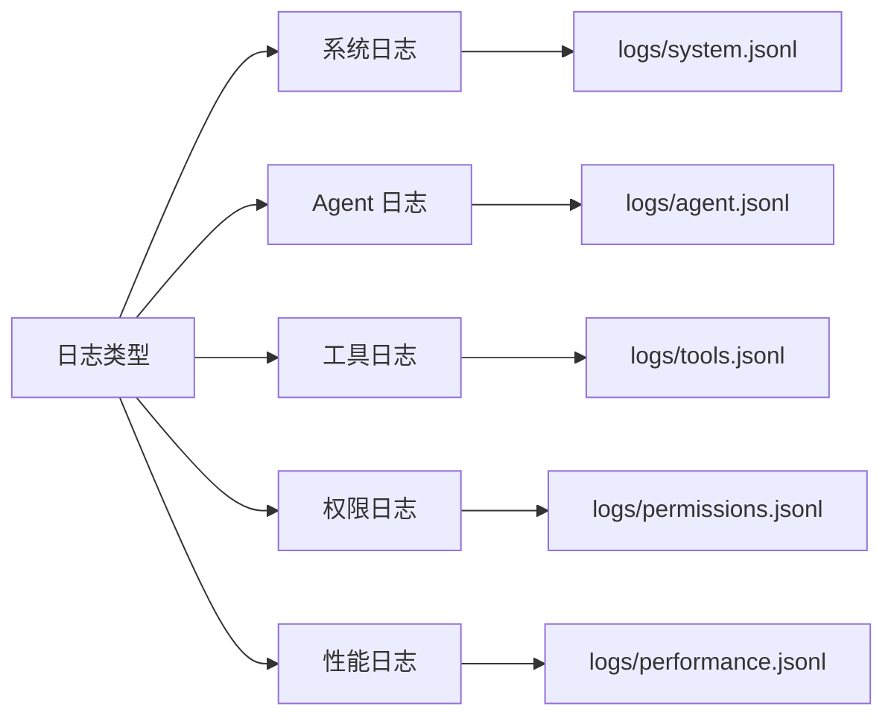
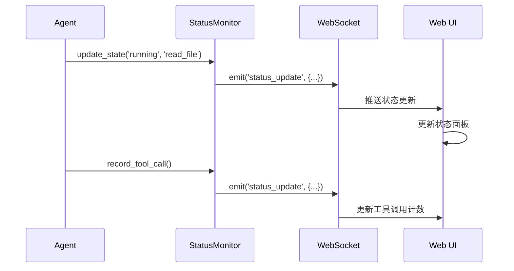

# 11 - 日志与可观测性

> 结构化日志与实时监控：让 Agent 的行为清晰可见

---

## 一、设计目标

日志与可观测性让开发者和用户能够：
- **了解执行过程**：Agent 正在做什么
- **追踪问题**：出错时快速定位
- **性能分析**：找到性能瓶颈
- **审计追溯**：记录所有关键操作

**核心原则**：
- **结构化记录**：使用 JSON Lines 格式
- **分级记录**：DEBUG/INFO/WARNING/ERROR
- **实时推送**：关键事件推送到 Web UI
- **可查询**：支持按时间、事件类型筛选

---

## 二、日志系统架构

### 2.1 整体架构



### 2.2 日志分类



---

## 三、结构化日志实现

### 3.1 核心日志器

```python
import json
import logging
from datetime import datetime
from pathlib import Path
from typing import Optional, Any
from enum import Enum

class LogLevel(Enum):
    """日志级别"""
    DEBUG = "DEBUG"
    INFO = "INFO"
    WARNING = "WARNING"
    ERROR = "ERROR"

class StructuredLogger:
    """结构化日志器"""
    
    def __init__(
        self,
        session_id: str,
        log_dir: str = 'logs',
        emit_to_ui: bool = True
    ):
        """
        初始化日志器
        
        参数:
            session_id: 会话 ID
            log_dir: 日志目录
            emit_to_ui: 是否推送到 UI
        """
        self.session_id = session_id
        self.log_dir = Path(log_dir)
        self.log_dir.mkdir(exist_ok=True)
        
        # 日志文件路径
        self.agent_log = self.log_dir / f'{session_id}_agent.jsonl'
        self.tools_log = self.log_dir / 'tools.jsonl'
        self.permissions_log = self.log_dir / 'permissions.jsonl'
        
        # UI 推送回调
        self.emit_to_ui = emit_to_ui
        self.ui_callback: Optional[callable] = None
    
    def log(
        self,
        level: LogLevel,
        event: str,
        **kwargs: Any
    ):
        """
        记录日志
        
        参数:
            level: 日志级别
            event: 事件名称
            **kwargs: 事件数据
        """
        
        # 构建日志条目
        entry = {
            'timestamp': datetime.now().isoformat(),
            'session_id': self.session_id,
            'level': level.value,
            'event': event,
            **kwargs
        }
        
        # 写入文件
        self._write_to_file(entry, self.agent_log)
        
        # 控制台输出（开发模式）
        if level in [LogLevel.WARNING, LogLevel.ERROR]:
            self._print_to_console(entry)
        
        # 推送到 UI
        if self.emit_to_ui and self.ui_callback:
            self.ui_callback(entry)
    
    def info(self, event: str, **kwargs):
        """INFO 级别日志"""
        self.log(LogLevel.INFO, event, **kwargs)
    
    def warning(self, event: str, **kwargs):
        """WARNING 级别日志"""
        self.log(LogLevel.WARNING, event, **kwargs)
    
    def error(self, event: str, **kwargs):
        """ERROR 级别日志"""
        self.log(LogLevel.ERROR, event, **kwargs)
    
    def debug(self, event: str, **kwargs):
        """DEBUG 级别日志"""
        self.log(LogLevel.DEBUG, event, **kwargs)
    
    def _write_to_file(self, entry: dict, file_path: Path):
        """写入文件"""
        with open(file_path, 'a', encoding='utf-8') as f:
            f.write(json.dumps(entry, ensure_ascii=False) + '\n')
    
    def _print_to_console(self, entry: dict):
        """打印到控制台"""
        level = entry['level']
        event = entry['event']
        
        # 颜色编码
        color_map = {
            'DEBUG': '\033[36m',    # 青色
            'INFO': '\033[32m',     # 绿色
            'WARNING': '\033[33m',  # 黄色
            'ERROR': '\033[31m'     # 红色
        }
        
        color = color_map.get(level, '')
        reset = '\033[0m'
        
        print(f"{color}[{level}]{reset} {event}")
        
        # 打印关键字段
        for key, value in entry.items():
            if key not in ['timestamp', 'session_id', 'level', 'event']:
                print(f"  {key}: {value}")
```

### 3.2 专用日志器

```python
class ToolLogger:
    """工具执行日志"""
    
    def __init__(self, logger: StructuredLogger):
        self.logger = logger
    
    def log_execution_start(
        self,
        tool_name: str,
        args: dict
    ):
        """记录工具开始执行"""
        self.logger.info('tool_execution_start', 
            tool=tool_name,
            args=args
        )
    
    def log_execution_end(
        self,
        tool_name: str,
        success: bool,
        duration: float,
        result_size: int = None
    ):
        """记录工具执行完成"""
        self.logger.info('tool_execution_end',
            tool=tool_name,
            success=success,
            duration_ms=duration * 1000,
            result_size=result_size
        )
    
    def log_execution_error(
        self,
        tool_name: str,
        error: str
    ):
        """记录工具执行错误"""
        self.logger.error('tool_execution_error',
            tool=tool_name,
            error=error
        )

class PermissionLogger:
    """权限决策日志"""
    
    def __init__(self, logger: StructuredLogger):
        self.logger = logger
    
    def log_decision(
        self,
        tool_name: str,
        args: dict,
        allowed: bool,
        reason: str,
        user_confirmed: bool = False
    ):
        """记录权限决策"""
        self.logger.info('permission_decision',
            tool=tool_name,
            args=args,
            allowed=allowed,
            reason=reason,
            user_confirmed=user_confirmed
        )
```

---

## 四、事件类型定义

### 4.1 Agent 事件

```python
# Agent 生命周期事件
AGENT_EVENTS = {
    'agent_started': {
        'description': 'Agent 启动',
        'fields': ['session_id', 'config']
    },
    
    'run_started': {
        'description': '开始执行用户请求',
        'fields': ['run_id', 'lane', 'user_message']
    },
    
    'context_loaded': {
        'description': '上下文加载完成',
        'fields': ['message_count', 'total_tokens']
    },
    
    'llm_request': {
        'description': 'LLM 请求',
        'fields': ['provider', 'model', 'input_tokens']
    },
    
    'llm_response': {
        'description': 'LLM 响应',
        'fields': ['stop_reason', 'output_tokens', 'duration_ms']
    },
    
    'run_completed': {
        'description': '执行完成',
        'fields': ['run_id', 'status', 'iterations', 'total_tokens', 'duration']
    },
    
    'run_error': {
        'description': '执行出错',
        'fields': ['run_id', 'error', 'traceback']
    }
}
```

### 4.2 日志示例

```json
// agent_started
{
  "timestamp": "2026-08-28T10:30:00.123456",
  "session_id": "sess_001",
  "level": "INFO",
  "event": "agent_started",
  "config": {
    "llm_provider": "openai",
    "model": "gpt-4"
  }
}

// run_started
{
  "timestamp": "2026-08-28T10:30:05.234567",
  "session_id": "sess_001",
  "level": "INFO",
  "event": "run_started",
  "run_id": "run_abc123",
  "lane": "main",
  "user_message": "优化这个函数"
}

// tool_execution_start
{
  "timestamp": "2026-08-28T10:30:06.345678",
  "session_id": "sess_001",
  "level": "INFO",
  "event": "tool_execution_start",
  "tool": "read_file",
  "args": {
    "path": "main.py"
  }
}

// tool_execution_end
{
  "timestamp": "2026-08-28T10:30:06.456789",
  "session_id": "sess_001",
  "level": "INFO",
  "event": "tool_execution_end",
  "tool": "read_file",
  "success": true,
  "duration_ms": 12.3,
  "result_size": 1024
}
```

---

## 五、日志查询接口

### 5.1 查询功能

```python
from typing import List, Optional
from datetime import datetime, timedelta

class LogQuery:
    """日志查询"""
    
    def __init__(self, log_file: Path):
        self.log_file = log_file
    
    def query(
        self,
        event: Optional[str] = None,
        level: Optional[str] = None,
        start_time: Optional[datetime] = None,
        end_time: Optional[datetime] = None,
        limit: int = 100
    ) -> List[dict]:
        """
        查询日志
        
        参数:
            event: 事件类型过滤
            level: 日志级别过滤
            start_time: 开始时间
            end_time: 结束时间
            limit: 最大返回数量
        
        返回:
            日志条目列表
        """
        
        results = []
        
        with open(self.log_file, 'r', encoding='utf-8') as f:
            for line in f:
                entry = json.loads(line)
                
                # 过滤条件
                if event and entry.get('event') != event:
                    continue
                
                if level and entry.get('level') != level:
                    continue
                
                if start_time:
                    entry_time = datetime.fromisoformat(entry['timestamp'])
                    if entry_time < start_time:
                        continue
                
                if end_time:
                    entry_time = datetime.fromisoformat(entry['timestamp'])
                    if entry_time > end_time:
                        continue
                
                results.append(entry)
                
                if len(results) >= limit:
                    break
        
        return results
    
    def get_errors(self, limit: int = 50) -> List[dict]:
        """获取错误日志"""
        return self.query(level='ERROR', limit=limit)
    
    def get_by_event(self, event: str, limit: int = 100) -> List[dict]:
        """按事件类型查询"""
        return self.query(event=event, limit=limit)
    
    def get_recent(self, minutes: int = 10) -> List[dict]:
        """获取最近的日志"""
        start_time = datetime.now() - timedelta(minutes=minutes)
        return self.query(start_time=start_time)
```

### 5.2 统计分析

```python
from collections import defaultdict

class LogAnalyzer:
    """日志分析器"""
    
    def __init__(self, log_file: Path):
        self.log_file = log_file
    
    def get_event_stats(self) -> dict:
        """事件统计"""
        event_counts = defaultdict(int)
        
        with open(self.log_file, 'r') as f:
            for line in f:
                entry = json.loads(line)
                event = entry.get('event', 'unknown')
                event_counts[event] += 1
        
        return dict(event_counts)
    
    def get_error_summary(self) -> dict:
        """错误摘要"""
        errors = []
        
        with open(self.log_file, 'r') as f:
            for line in f:
                entry = json.loads(line)
                if entry.get('level') == 'ERROR':
                    errors.append({
                        'timestamp': entry['timestamp'],
                        'event': entry['event'],
                        'error': entry.get('error', 'Unknown')
                    })
        
        return {
            'total_errors': len(errors),
            'recent_errors': errors[-10:],  # 最近 10 个
            'error_types': self._count_error_types(errors)
        }
    
    def _count_error_types(self, errors: List[dict]) -> dict:
        """统计错误类型"""
        types = defaultdict(int)
        for error in errors:
            event = error['event']
            types[event] += 1
        return dict(types)
    
    def get_performance_stats(self) -> dict:
        """性能统计"""
        durations = []
        
        with open(self.log_file, 'r') as f:
            for line in f:
                entry = json.loads(line)
                if 'duration_ms' in entry:
                    durations.append(entry['duration_ms'])
        
        if not durations:
            return {}
        
        return {
            'count': len(durations),
            'avg': sum(durations) / len(durations),
            'min': min(durations),
            'max': max(durations),
            'p50': self._percentile(durations, 50),
            'p95': self._percentile(durations, 95),
            'p99': self._percentile(durations, 99)
        }
    
    def _percentile(self, data: List[float], p: int) -> float:
        """计算百分位数"""
        sorted_data = sorted(data)
        index = int(len(sorted_data) * p / 100)
        return sorted_data[index]
```

---

## 六、实时状态监控

### 6.1 状态面板数据

```python
from dataclasses import dataclass

@dataclass
class AgentStatus:
    """Agent 实时状态"""
    state: str              # idle | running | error
    current_operation: Optional[str]  # 当前操作
    current_lane: str       # 当前分支
    
    # 统计信息
    total_runs: int
    total_tokens: int
    total_tool_calls: int
    
    # 性能指标
    avg_response_time: float  # 平均响应时间（秒）
    
    # 最近活动
    last_activity: Optional[datetime]
    last_error: Optional[str]

class StatusMonitor:
    """状态监控器"""
    
    def __init__(self):
        self.status = AgentStatus(
            state='idle',
            current_operation=None,
            current_lane='main',
            total_runs=0,
            total_tokens=0,
            total_tool_calls=0,
            avg_response_time=0.0,
            last_activity=None,
            last_error=None
        )
        
        self.response_times = []
    
    def update_state(self, state: str, operation: str = None):
        """更新状态"""
        self.status.state = state
        self.status.current_operation = operation
        self.status.last_activity = datetime.now()
    
    def record_run(self, tokens: int, duration: float):
        """记录一次执行"""
        self.status.total_runs += 1
        self.status.total_tokens += tokens
        
        # 更新平均响应时间
        self.response_times.append(duration)
        if len(self.response_times) > 100:
            self.response_times.pop(0)
        
        self.status.avg_response_time = (
            sum(self.response_times) / len(self.response_times)
        )
    
    def record_tool_call(self):
        """记录工具调用"""
        self.status.total_tool_calls += 1
    
    def record_error(self, error: str):
        """记录错误"""
        self.status.state = 'error'
        self.status.last_error = error
    
    def get_status(self) -> dict:
        """获取状态（用于 API）"""
        return {
            'state': self.status.state,
            'current_operation': self.status.current_operation,
            'current_lane': self.status.current_lane,
            'stats': {
                'total_runs': self.status.total_runs,
                'total_tokens': self.status.total_tokens,
                'total_tool_calls': self.status.total_tool_calls,
                'avg_response_time': self.status.avg_response_time
            },
            'last_activity': (
                self.status.last_activity.isoformat()
                if self.status.last_activity else None
            ),
            'last_error': self.status.last_error
        }
```

### 6.2 实时推送



---

## 七、Web UI 日志查看器

### 7.1 实时日志组件

```typescript
// LogViewer.tsx
interface LogEntry {
  timestamp: string
  level: 'DEBUG' | 'INFO' | 'WARNING' | 'ERROR'
  event: string
  [key: string]: any
}

const LogViewer = () => {
  const [logs, setLogs] = useState<LogEntry[]>([])
  const [filter, setFilter] = useState({
    level: 'all',
    event: 'all'
  })
  
  useEffect(() => {
    // 监听实时日志
    socket.on('log', (entry: LogEntry) => {
      setLogs(prev => [...prev, entry].slice(-1000))  // 保留最近 1000 条
    })
    
    return () => socket.off('log')
  }, [])
  
  const filteredLogs = logs.filter(log => {
    if (filter.level !== 'all' && log.level !== filter.level) {
      return false
    }
    if (filter.event !== 'all' && log.event !== filter.event) {
      return false
    }
    return true
  })
  
  return (
    <div className="log-viewer">
      <LogToolbar filter={filter} onFilterChange={setFilter} />
      
      <div className="log-list">
        {filteredLogs.map((log, i) => (
          <LogEntry key={i} entry={log} />
        ))}
      </div>
    </div>
  )
}

const LogEntry = ({ entry }: { entry: LogEntry }) => {
  const [expanded, setExpanded] = useState(false)
  
  return (
    <div className={cn(
      'log-entry',
      `level-${entry.level.toLowerCase()}`
    )}>
      <div className="log-header" onClick={() => setExpanded(!expanded)}>
        <Badge variant={getLevelVariant(entry.level)}>
          {entry.level}
        </Badge>
        
        <span className="timestamp">
          {formatTime(entry.timestamp)}
        </span>
        
        <span className="event">{entry.event}</span>
        
        <ChevronDown className={cn(
          'chevron',
          expanded && 'expanded'
        )} />
      </div>
      
      {expanded && (
        <div className="log-details">
          <pre>{JSON.stringify(entry, null, 2)}</pre>
        </div>
      )}
    </div>
  )
}
```

### 7.2 状态面板

```typescript
// StatusPanel.tsx
const StatusPanel = () => {
  const [status, setStatus] = useState<AgentStatus | null>(null)
  
  useEffect(() => {
    // 监听状态更新
    socket.on('status_update', (data: AgentStatus) => {
      setStatus(data)
    })
    
    // 定期拉取
    const interval = setInterval(() => {
      socket.emit('get_status')
    }, 5000)
    
    return () => {
      socket.off('status_update')
      clearInterval(interval)
    }
  }, [])
  
  if (!status) return <Skeleton />
  
  return (
    <Card>
      <CardHeader>
        <CardTitle>Agent 状态</CardTitle>
      </CardHeader>
      
      <CardContent className="space-y-4">
        <div>
          <Label>当前状态</Label>
          <Badge variant={getStateVariant(status.state)}>
            {getStateLabel(status.state)}
          </Badge>
        </div>
        
        {status.current_operation && (
          <div>
            <Label>当前操作</Label>
            <p className="text-sm">{status.current_operation}</p>
          </div>
        )}
        
        <div>
          <Label>当前分支</Label>
          <code className="text-sm">{status.current_lane}</code>
        </div>
        
        <Separator />
        
        <div className="grid grid-cols-2 gap-4">
          <Stat label="总执行次数" value={status.stats.total_runs} />
          <Stat label="Token 使用" value={status.stats.total_tokens.toLocaleString()} />
          <Stat label="工具调用" value={status.stats.total_tool_calls} />
          <Stat 
            label="平均响应时间" 
            value={`${status.stats.avg_response_time.toFixed(2)}s`} 
          />
        </div>
        
        {status.last_error && (
          <Alert variant="destructive">
            <AlertCircle className="h-4 w-4" />
            <AlertDescription>{status.last_error}</AlertDescription>
          </Alert>
        )}
      </CardContent>
    </Card>
  )
}
```

---

## 八、性能日志

### 8.1 性能追踪

```python
import time
from functools import wraps

def track_performance(logger: StructuredLogger):
    """性能追踪装饰器"""
    
    def decorator(func):
        @wraps(func)
        async def wrapper(*args, **kwargs):
            start_time = time.time()
            
            try:
                result = await func(*args, **kwargs)
                duration = time.time() - start_time
                
                # 记录性能日志
                logger.info('performance',
                    function=func.__name__,
                    duration_ms=duration * 1000,
                    success=True
                )
                
                return result
            
            except Exception as e:
                duration = time.time() - start_time
                
                logger.warning('performance',
                    function=func.__name__,
                    duration_ms=duration * 1000,
                    success=False,
                    error=str(e)
                )
                
                raise
        
        return wrapper
    return decorator

# 使用
@track_performance(logger)
async def execute_tool(tool_name: str, args: dict):
    # 工具执行逻辑
    pass
```

---

## 九、日志轮转与清理

### 9.1 日志轮转

```python
import gzip
import shutil
from datetime import datetime, timedelta

class LogRotator:
    """日志轮转"""
    
    def __init__(
        self,
        log_dir: Path,
        max_size_mb: int = 100,
        max_age_days: int = 7
    ):
        self.log_dir = log_dir
        self.max_size_mb = max_size_mb
        self.max_age_days = max_age_days
    
    def rotate_if_needed(self, log_file: Path):
        """检查并轮转日志"""
        if not log_file.exists():
            return
        
        # 检查文件大小
        size_mb = log_file.stat().st_size / (1024 * 1024)
        
        if size_mb > self.max_size_mb:
            self._rotate(log_file)
    
    def _rotate(self, log_file: Path):
        """轮转日志文件"""
        # 生成新文件名
        timestamp = datetime.now().strftime('%Y%m%d_%H%M%S')
        rotated_name = f"{log_file.stem}_{timestamp}.jsonl.gz"
        rotated_path = self.log_dir / rotated_name
        
        # 压缩并移动
        with open(log_file, 'rb') as f_in:
            with gzip.open(rotated_path, 'wb') as f_out:
                shutil.copyfileobj(f_in, f_out)
        
        # 清空原文件
        log_file.write_text('')
        
        print(f"✅ 日志已轮转: {rotated_path}")
    
    def clean_old_logs(self):
        """清理过期日志"""
        cutoff_date = datetime.now() - timedelta(days=self.max_age_days)
        
        for log_file in self.log_dir.glob('*.jsonl.gz'):
            # 从文件名提取日期
            try:
                date_str = log_file.stem.split('_')[1]
                file_date = datetime.strptime(date_str, '%Y%m%d')
                
                if file_date < cutoff_date:
                    log_file.unlink()
                    print(f"🗑️  删除过期日志: {log_file}")
            except Exception:
                pass
```

---

## 十、最佳实践

### 10.1 日志记录原则

**DO（应该做）**：
- ✅ 记录关键事件（启动、完成、错误）
- ✅ 记录性能指标（耗时、Token 数）
- ✅ 记录用户操作（权限确认）
- ✅ 使用结构化格式（JSON）

**DON'T（不应该做）**：
- ❌ 记录敏感信息（API Key、密码）
- ❌ 记录过于详细的内容（避免日志爆炸）
- ❌ 在循环中频繁记录日志
- ❌ 使用难以解析的格式

### 10.2 性能考虑

**异步写入**：
```python
import asyncio
from queue import Queue

class AsyncLogger:
    """异步日志器"""
    
    def __init__(self, log_file: Path):
        self.log_file = log_file
        self.queue = asyncio.Queue()
        self.task = asyncio.create_task(self._writer())
    
    async def log(self, entry: dict):
        """异步记录日志"""
        await self.queue.put(entry)
    
    async def _writer(self):
        """后台写入任务"""
        with open(self.log_file, 'a') as f:
            while True:
                entry = await self.queue.get()
                f.write(json.dumps(entry) + '\n')
                f.flush()
```

---

**上次更新**: 2026-08-28  
**文档版本**: v0.1
